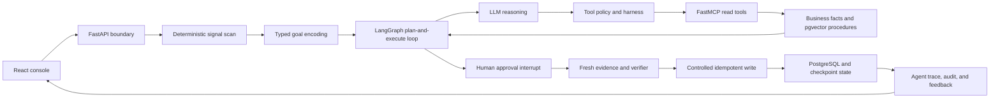

# OperCerta

**English** | [简体中文](README.zh-CN.md)

[](https://github.com/KXHXK/opercerta/actions/workflows/ci.yml)


OperCerta is a controlled, auditable operations agent for inventory shortages,
equipment incidents, and blocked operational tasks. It combines bounded LLM
reasoning with deterministic policy, human approval, durable workflow state,
and idempotent business writes.

[Read-only project page](https://opercerta-kxh.netlify.app) ·
[Release `v0.1.0-showcase.1`](https://github.com/KXHXK/opercerta/releases/tag/v0.1.0-showcase.1)

> **Development status:** the complete three-business workflow runs locally in
> a single-node Docker Compose environment. The public project page is static
> and does not expose the API or database. **Not production-ready:** production
> identity, public ingress, rate limiting, backups, high availability, and
> automated deployment are not implemented.

## Why OperCerta

Operational systems often detect an exception before an operator knows how to
resolve it. The evidence may be spread across inventory, equipment, task, and
procedure systems; it may also change while approval is pending. An unrestricted
agent that writes directly to those systems would create unacceptable safety and
audit risks.

OperCerta separates responsibilities:

- deterministic detectors discover bounded operational signals;
- an LLM-assisted agent gathers evidence and explains a proposed action;
- policy code decides whether approval is required and validates parameters;
- a human approves a binding of facts, rules, and the proposed plan;
- the system fetches fresh evidence before execution;
- PostgreSQL transactions and unique constraints make retries safe.

The result is an agent that can assist with investigation and planning without
becoming the authority for high-risk writes.

## Supported Workflows

| Workflow | Trigger | Agent investigation | Controlled outcome |
| --- | --- | --- | --- |
| Inventory replenishment | Available stock falls below the reorder point | Read inventory and policy evidence, calculate a bounded recommendation, retrieve the relevant procedure | Create one replenishment work order after approval and fresh-fact validation |
| Equipment maintenance | Equipment is offline or reports an alert | Read equipment status and maintenance policy, retrieve an isolation/repair procedure | Create one maintenance work order, or stop safely when facts no longer match |
| Task recovery | An operational task remains blocked | Read task state and recovery policy, retrieve a recovery procedure | Create one recovery work order, or escalate when automatic recovery is not allowed |

## Agent Loop



The model is not the source of truth for quantities, permissions, or state
transitions. LangGraph owns the durable execution flow; MCP exposes a small
allowlist of typed tools; deterministic code and the database enforce the write
boundary.

## Architecture

| Area | Implementation | Responsibility |
| --- | --- | --- |
| Web console | React 19, TypeScript, Vite | Signal inbox, case workspace, approvals, results, trace, and audit views |
| API boundary | FastAPI, Pydantic | Authentication, strict request validation, RBAC, stable errors, health endpoints, SSE audit replay |
| Agent runtime | LangGraph, minimal LangChain Tool Calling | Bounded planning, tool observation loop, interrupt/resume, revalidation, and recovery |
| Tool protocol | FastMCP | Typed inventory, equipment, task, policy, knowledge, and work-order tools |
| Persistence | PostgreSQL 18, pgvector, Alembic | Business truth, approval locks, unique work orders, checkpoints, trace, and procedure retrieval |
| Cache | Redis | Read-only evidence caching; approval-time validation bypasses the cache |
| Model adapter | OpenAI-compatible API | Mock mode by default; explicit timeout and fail-closed behavior in real mode |
| Runtime | Docker Compose | Reproducible PostgreSQL, Redis, MCP, bootstrap, and API services |
| Delivery | GitHub Actions | Repository safety, Python quality, backend tests, frontend tests, and main-branch Compose recovery smoke |

## Quick Start

### Prerequisites

- Linux or WSL2
- Docker Engine with Docker Compose v2
- Node.js 24 and npm 11 for the local web console
- `uv` 0.11 and Python 3.12 for source-level tests

### 1. Configure local-only credentials

```bash
cp .env.compose.example .env.compose
```

Replace every `CHANGE_ME` placeholder in `.env.compose`. Use the same strong
database password in `POSTGRES_PASSWORD` and `OPERCERTA_DATABASE_URL`, generate
a separate signing key, and set the Mock-only model values to a non-secret name
such as `mock` and `not-used-in-mock-mode`. The file is ignored by Git. Mock
model mode is enabled by default and does not require a real API key.

### 2. Start the backend stack

```bash
OPERCERTA_HF_HUB_OFFLINE=false docker compose up --build -d --wait
curl http://127.0.0.1:8080/health/ready
```

The first run downloads the embedding model. Later runs can set
`OPERCERTA_HF_HUB_OFFLINE=true` when the FastEmbed cache is already populated.
A ready response reports `database`, `checkpoint`, and `mcp` as `ready`.

### 3. Start the web console

```bash
cd web
npm ci
npm run dev
```

Open <http://127.0.0.1:5173/console>. Vite proxies `/api` to the local FastAPI
service, so no browser-side CORS configuration is required.

## Use the Application

1. Select the `operator` demo account and scan operational signals.
2. Open an inventory, equipment, or task case and start the Agent investigation.
3. Inspect the typed goal, tool plan, MCP observations, procedure citations, and Agent Trace.
4. Switch to `approver` and approve or reject the bound proposal.
5. Switch to `auditor` to inspect fresh-fact verification, the resulting work order, and the audit sequence.
6. Repeat or restart services to observe idempotency and durable recovery.

The demo JWT issuer is local-only and is not a production identity system.

## Model Modes

- **Mock mode** is deterministic, credential-free, and used for repeatable
  contract, safety, and recovery tests.
- **Real mode** uses an OpenAI-compatible endpoint and fails closed when the
  provider, output contract, or tool loop is invalid. Secrets stay in ignored
  local environment files.

Representative Moonshot/Kimi K2.6 validation passed for three read-only
business paths, an approved inventory write, and invalid-provider fail-closed.
This limited sample verifies provider compatibility; it is not a model accuracy,
latency, cost, or SLA claim.

## Verification

| Gate | Current verified result |
| --- | ---: |
| Backend suite | 667 tests passed |
| Frontend suite | 19 test files, 60 tests passed |
| Three-business fixed contracts | 42/42 passed |
| Frozen Agent safety and recovery evaluation | 9/9 passed |
| Main Compose smoke | Build, business database effects, API/MCP restart, recovery, and cleanup passed |

Run the local gates:

```bash
uv sync --frozen --all-groups
uv run ruff check .
uv run ruff format --check .
uv run mypy src
uv run pytest -q
uv run python scripts/run_opercerta_evaluation.py
uv run python scripts/run_agent_evaluation.py

cd web
npm ci
npm run test:run
npm run build
```

With a fresh Compose database, `python3 scripts/verify_agent_compose.py` also
asserts Agent trajectories and the resulting PostgreSQL facts. Fixed synthetic
cases verify declared contracts; they do not represent production traffic or an
independent accuracy benchmark.

## Reliability and Safety Properties

- strict input schemas and stable safe error envelopes;
- tool allowlists, typed arguments, bounded retries, and explicit timeouts;
- human approval bound to evidence, rule, fact, and plan hashes;
- approval-time cache bypass and fresh-fact revalidation;
- PostgreSQL row locking for approval races;
- deterministic idempotency keys, unique constraints, and write-after-read verification;
- durable LangGraph checkpoints and business-table-led restart recovery;
- request IDs, trace context, safe structured logs, and low-cardinality metrics;
- synthetic data only; no customer records or confidential company material.

## Repository Layout

```text
src/opercerta/     API, Agent runtime, policies, persistence, MCP, and observability
web/               React console and static project page
tests/             Unit, integration, database, API, Agent, and runtime tests
data/              Versioned synthetic evaluation cases and procedure knowledge
migrations/        Alembic database migrations
scripts/           Bootstrap, evaluation, safety, and Compose verification tools
docs/              Technical guides, development records, and release evidence
```

## Documentation

- [Core technical guide](docs/learning/opercerta-core-technical-guide.md)
- [Manual experiment guide](docs/learning/opercerta-manual-experiment-guide.md)
- [Current implementation state](docs/development-log/current-state.md)
- [Single-root Agent loop evidence](docs/release-evidence/single-root-agent-loop-case-workspace.md)
- [GitHub Actions evidence](docs/release-evidence/github-actions-ci.md)

## Development Status and Roadmap

Completed locally:

- three bounded business workflows and the shared Agent loop;
- approval binding, revalidation, idempotent writes, and restart recovery;
- real PostgreSQL/pgvector, Redis, FastMCP, FastEmbed retrieval, and React console;
- fixed contract/evaluation suites and main-branch Compose recovery evidence;
- read-only public project page and a reproducible pre-release.

Open work before a production deployment:

- production identity and authorization lifecycle;
- public HTTPS API ingress, exact-origin CORS, rate limiting, and abuse controls;
- managed secrets, backups, restore drills, and high-availability coordination;
- automated deployment, migration orchestration, and operational alerting;
- broader independent model and business-quality evaluation.

## Contributing

See [CONTRIBUTING.md](CONTRIBUTING.md) for development setup, quality gates,
pull-request expectations, and Agent safety rules.
