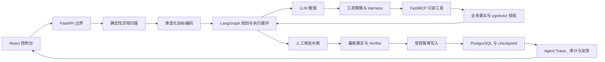

# OperCerta

[English](README.md)｜**简体中文**

[](https://github.com/KXHXK/opercerta/actions/workflows/ci.yml)


[https://opercerta-kxh.netlify.app/](https://opercerta-kxh.netlify.app/)

OperCerta 是一个面向库存短缺、设备异常和作业阻塞的受控、可审计运营处置
Agent。它把有边界的大模型推理与确定性规则、人工审批、持久化工作流状态和
幂等业务写入组合成完整闭环。

> **开发状态：** 三业务完整流程可以在本地单节点 Docker Compose 环境中运行。
> 公开项目页面为纯静态页面，不连接 API 或数据库。项目**尚未达到生产就绪**：
> 生产身份、公网入口、限流、备份、高可用和自动部署仍未实现。

## 项目背景

运营系统通常可以先检测到异常，但操作人员还需要从库存、设备、任务和操作规程
等多个系统收集证据，才能决定如何处置；审批等待期间，业务事实还可能变化。
如果让开放式 Agent 直接写业务系统，会产生不可接受的安全和审计风险。

OperCerta 对职责进行了拆分：

- 确定性检测器发现边界明确的运营异常信号；
- LLM 辅助的 Agent 收集证据并解释建议动作；
- 规则代码判断是否需要审批并校验业务参数；
- 人工审批绑定事实、规则和计划快照；
- 执行前重新获取最新事实；
- PostgreSQL 事务与唯一约束保证重试不会重复写入。

因此，Agent 可以辅助调查和规划，但不会成为高风险业务写入的最终权威。

## 支持的业务流程

| 业务 | 触发条件 | Agent 调查 | 受控结果 |
| --- | --- | --- | --- |
| 库存补货 | 可用库存低于补货点 | 读取库存与规则证据、计算有边界的建议数量、检索相关操作规程 | 审批并完成最新事实复核后，只创建一张补货工单 |
| 设备维修 | 设备离线或产生告警 | 读取设备状态与维修规则、检索隔离和维修规程 | 创建一张维修工单；事实不再匹配时安全终止 |
| 作业恢复 | 运营任务持续阻塞 | 读取任务状态与恢复规则、检索恢复规程 | 创建一张恢复工单；不允许自动恢复时升级处理 |

## Agent 闭环



模型不是业务数量、权限或状态转换的事实来源。LangGraph 负责持久化执行流程，
MCP 只开放少量类型化白名单工具，确定性代码和数据库共同守住写入边界。

## 技术架构

| 区域 | 实现 | 职责 |
| --- | --- | --- |
| Web 控制台 | React 19、TypeScript、Vite | 异常收件箱、Case 工作区、审批、结果、Trace 和审计展示 |
| API 边界 | FastAPI、Pydantic | 身份校验、严格输入、RBAC、稳定错误、健康检查、SSE 审计回放 |
| Agent 运行时 | LangGraph、最小 LangChain Tool Calling | 有界规划、工具观察循环、中断恢复、重新取证和重启恢复 |
| 工具协议 | FastMCP | 类型化库存、设备、任务、规则、知识和工单工具 |
| 持久化 | PostgreSQL 18、pgvector、Alembic | 业务事实、审批锁、唯一工单、checkpoint、Trace 和规程检索 |
| 缓存 | Redis | 只读证据缓存；审批后复核绕过缓存 |
| 模型适配 | OpenAI-compatible API | 默认 Mock；真实模式具有显式超时和 fail-closed 行为 |
| 运行环境 | Docker Compose | 可复现的 PostgreSQL、Redis、MCP、bootstrap 和 API 服务 |
| 持续集成 | GitHub Actions | 仓库安全、Python 质量、后端、前端和 main 分支 Compose 恢复门禁 |

## 快速启动

### 环境要求

- Linux 或 WSL2
- Docker Engine 与 Docker Compose v2
- 本地控制台需要 Node.js 24 和 npm 11
- 源码测试需要 `uv` 0.11 和 Python 3.12

### 1. 配置仅本地使用的凭据

```bash
cp .env.compose.example .env.compose
```

替换 `.env.compose` 中的所有 `CHANGE_ME` 占位符：`POSTGRES_PASSWORD` 和
`OPERCERTA_DATABASE_URL` 必须使用同一个高强度数据库密码，JWT 使用独立签名密钥；
Mock 模式的模型名和 key 可以分别使用 `mock` 与 `not-used-in-mock-mode` 等非敏感值。
该文件已被 Git 忽略，默认 Mock 模式不需要真实模型 API key。

### 2. 启动后端服务

```bash
OPERCERTA_HF_HUB_OFFLINE=false docker compose up --build -d --wait
curl http://127.0.0.1:8080/health/ready
```

首次运行会下载 embedding 模型。FastEmbed 缓存准备完成后，后续可以设置
`OPERCERTA_HF_HUB_OFFLINE=true`。就绪响应中的 `database`、`checkpoint` 和
`mcp` 应全部为 `ready`。

### 3. 启动 Web 控制台

```bash
cd web
npm ci
npm run dev
```

打开 <http://127.0.0.1:5173/console>。Vite 会把 `/api` 代理到本机 FastAPI，
因此不需要额外配置浏览器跨域。

## 功能用法

1. 选择 `operator` 演示账号并扫描业务异常。
2. 打开库存、设备或作业 Case，启动 Agent 调查。
3. 查看类型化 Goal、工具计划、MCP Observation、规程引用和 Agent Trace。
4. 切换到 `approver`，批准或拒绝已绑定的处置建议。
5. 切换到 `auditor`，查看最新事实复核、工单结果和审计序列。
6. 重复请求或重启服务，观察幂等写入与持久化恢复。

演示 JWT 只用于本地流程，不是生产身份系统。

## 模型模式

- **Mock 模式**确定、无需凭据，用于可复现的契约、安全和恢复测试。
- **Real 模式**连接 OpenAI-compatible endpoint；provider、输出契约或工具循环
  不合法时会 fail closed。密钥只保存在被忽略的本地环境文件中。

Moonshot/Kimi K2.6 的少量代表验证已覆盖三业务只读、库存批准写入和无效
provider fail-closed。该小样本只证明 provider 兼容性，不代表模型准确率、
延迟、成本或 SLA。

## 测试结果

| 门禁 | 当前已验证结果 |
| --- | ---: |
| 后端测试 | 667 条通过 |
| 前端测试 | 19 个测试文件、60 条用例通过 |
| 三业务固定契约 | 42/42 通过 |
| 冻结 Agent 安全与恢复评测 | 9/9 通过 |
| main Compose smoke | 构建、业务数据库副作用、API/MCP 重启、恢复和清理通过 |

运行本地门禁：

```bash
uv sync --frozen --all-groups
uv run ruff check .
uv run ruff format --check .
uv run mypy src
uv run pytest -q
uv run python scripts/run_opercerta_evaluation.py
uv run python scripts/run_agent_evaluation.py

cd web
npm ci
npm run test:run
npm run build
```

在全新 Compose 数据库上执行 `python3 scripts/verify_agent_compose.py`，还会断言
Agent 轨迹和 PostgreSQL 最终事实。固定合成用例只验证已声明契约，不代表生产
流量或独立准确率评测。

## 可靠性与安全属性

- 严格输入 Schema 和稳定的安全错误 envelope；
- 工具白名单、类型化参数、有限重试和显式 timeout；
- 审批绑定证据、规则、事实和计划哈希；
- 审批后绕过缓存并重新读取最新事实；
- PostgreSQL 行锁解决审批竞态；
- 确定性幂等键、唯一约束和写后读验证；
- 持久化 LangGraph checkpoint 与业务表主导的重启恢复；
- request ID、trace context、安全结构化日志和低基数指标；
- 只使用合成数据，不包含客户记录或原单位机密材料。

## 仓库结构

```text
src/opercerta/     API、Agent、规则、持久化、MCP 和可观测性
web/               React 控制台与静态项目页面
tests/             单元、集成、数据库、API、Agent 和运行时测试
data/              版本化合成评测用例与规程知识
migrations/        Alembic 数据库迁移
scripts/           启动、评测、安全和 Compose 验证工具
docs/              技术指南、开发记录和发布证据
```

## 项目文档

- [核心技术手册](docs/learning/opercerta-core-technical-guide.md)
- [手动实验手册](docs/learning/opercerta-manual-experiment-guide.md)
- [当前实施状态](docs/development-log/current-state.md)
- [单根 Agent Loop 实施证据](docs/release-evidence/single-root-agent-loop-case-workspace.md)
- [GitHub Actions 证据](docs/release-evidence/github-actions-ci.md)

## 开发状态与路线图

本地已经完成：

- 三条受控业务流程和共享 Agent Loop；
- 审批绑定、重新取证、幂等写入和重启恢复；
- 真实 PostgreSQL/pgvector、Redis、FastMCP、FastEmbed 检索和 React 控制台；
- 固定契约/评测以及 main 分支 Compose 恢复证据；
- 只读公开项目页面和可复现预发布版本。

生产部署前仍需完成：

- 生产身份和授权生命周期；
- 公网 HTTPS API、精确 CORS、限流和防滥用；
- 托管密钥、备份、恢复演练和高可用协调；
- 自动部署、迁移编排和运营告警；
- 更广泛的独立模型和业务质量评测。

## 参与贡献

开发环境、质量门禁、Pull Request 要求和 Agent 安全规则见
[CONTRIBUTING.md](CONTRIBUTING.md)。
