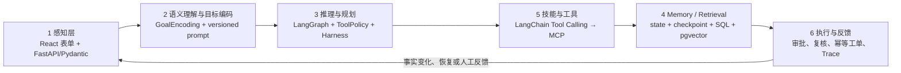

# OperCerta 核心技术手册

## 1. 项目解决什么问题

OperCerta 把“发现运营异常”到“生成可审计工单”做成受控 Agent 后端。三条合成业务是：

- 库存补货：库存低于规则阈值 → 人工批准 → 补货工单；
- 设备维修：设备离线或严重告警 → 人工批准 → 维修工单；
- 作业异常恢复：作业阻塞或超时 → 人工批准 → 恢复工单。

Agent 可以收集证据、执行确定性规则、生成解释和编排步骤，但不能自行绕过审批、修改规则或直接写数据库。所有展示数据均为仓库内公开合成数据。

## 2. 一次请求如何穿过系统

```text
React 页面
  → FastAPI：认证、严格输入、统一错误
  → OperationRunner：创建业务 operation
  → LangGraph：按场景执行取证、评估、报告、审批中断、复核、写入、验证
  → MCP Gateway：只调用六个白名单工具
  → FastMCP Server：校验工具参数并访问合成目录/工单仓储
  → PostgreSQL：operation、证据、审批、工单、审计和 checkpoint
  → Redis：只缓存初次/查询阶段的只读证据
  → SSE：把已持久化审计事件回放给页面
```

OpenTelemetry 用同一 trace 关联 API、LangGraph node、MCP、Redis 和 PostgreSQL；span 只记录 allowlist 属性，不保存 JWT、Prompt、证据正文、SQL 参数或异常堆栈。

## 3. 各技术栈为什么存在

### React 与 ReAct 不是一回事

React 是本项目的浏览器 UI library，负责组件、状态和调用 API。ReAct（Reason + Act）是让模型交替推理和调用工具的 Agent 模式。OperCerta 前端使用 React，但写操作不采用开放式 ReAct 自由决策；可靠性关键路径由类型化 LangGraph 和确定性规则控制。

### FastAPI

FastAPI 是 HTTP 边界：Pydantic 严格校验请求，JWT/RBAC 决定 operator、approver、auditor 能做什么，lifespan 打开和释放数据库/checkpointer，health endpoint 区分进程存活与依赖就绪。API 从 JWT `sub` 取得审批人，拒绝客户端伪造 actor。

### LangGraph

LangGraph 表达可暂停、可恢复的状态机。首次执行在 `awaiting_approval` 中断；批准后从 checkpoint 恢复，但先重新读取真实 MCP 事实并比较审批绑定。节点可以重放，所以副作用必须由数据库幂等约束保护。

### MCP 与 FastMCP

MCP（Model Context Protocol）是工具发现和调用协议；FastMCP 是 Python 侧快速定义 MCP server/tool 的框架。类比：HTTP 是协议，FastAPI 是实现 HTTP 服务的框架。OperCerta 只允许六个固定工具：三种状态读取、规则读取、工单创建、工单读取。

### PostgreSQL

PostgreSQL 是业务真相。选择它是因为事务、行级锁、唯一约束、JSONB、成熟的并发语义和 LangGraph PostgreSQL checkpointer 都适合审批竞态与幂等写入。审批用 `SELECT ... FOR UPDATE` 形成一个原子胜者；工单用 operation/idempotency 唯一约束保证重放不会多写。

### Redis

Redis 只是可删除的读优化，不是事实源。缓存失败会旁路到 MCP；批准后的复核刻意绕过缓存，以免等待期间的旧证据触发错误工单。本机矩阵证明缓存命中改变 MCP 调用次数，但小样本延迟不是生产 SLA。

### Docker 与 Docker Compose

Docker 构建和运行单个隔离镜像；Docker Compose 声明 PostgreSQL、Redis、bootstrap、MCP、API、Caddy 之间的网络、依赖、健康检查和 volume。开发 Compose 只把 API 绑定到本机；release Compose 只有 Caddy 暴露 80/443，内部服务无宿主端口。

### GitHub Actions

GitHub Actions 不是业务运行时架构，而是交付/质量架构。它在 PR/main 上复跑锁文件、静态检查、后端、前端和 Compose smoke，防止“只在开发者电脑能运行”。可以省去平台本身，但不能省去等价的自动化门禁。

## 4. 两类状态为什么都要有

LangGraph checkpoint 回答“图执行到哪个节点、恢复时带什么状态”；PostgreSQL 业务表回答“用户看到的 operation、审批、工单和审计事实是什么”。checkpoint 不能替代业务数据库：它不是稳定查询模型，也不能独立承担审批唯一性、工单唯一性和审计序列约束。

启动恢复时，RecoveryCoordinator 先扫描非终态业务 operation，再用相同 UUID 作为 LangGraph `thread_id` 恢复。业务表与 checkpoint 不一致时安全失败，不猜测成功。

## 5. 审批绑定与复核

审批不是一个孤立布尔值。绑定快照包含场景、主体证据 ID、规则证据 ID、规则版本、事实哈希、计划哈希和类型化参数。批准提交必须带回这份 expected binding。事务内只能有一个审批胜者；图恢复后直连 MCP 重读事实，任何关键变化都返回 `approval_snapshot_mismatch` 且不写工单。

## 6. 幂等和 exactly-once 的正确说法

分布式系统通常无法轻易承诺端到端 exactly-once。OperCerta 提供的是“节点至少可能重放，但业务副作用 effectively-once”：确定性 idempotency key、数据库唯一约束、原子事务、写后读验证共同保证一个 operation 最终只有一张有效工单。面试时不要把它夸大成所有网络和外部系统都 exactly-once。

## 7. 三业务共用与隔离

共享的是 API、Runner、审批仓储、恢复协调、审计、幂等工单和受控图入口；隔离的是每个场景的证据模型、规则、评估、计划、审批参数和工单 payload。这样避免复制可靠性内核，又不把所有业务塞进无类型字典。

## 8. 失败时系统如何安全

- 非法输入：FastAPI/Pydantic 返回固定 422，不创建 operation。
- MCP 不可用：dependency 失败，错误响应不泄露连接串或 traceback。
- Redis 不可用：只读缓存退化为 MCP 直读，不改变审批安全。
- 模型失败：真实模式不回退 Mock 后继续写；模型也无权决定动作参数。
- 重复审批：数据库返回 409，只有一个审批记录。
- 重启：从业务表和 checkpoint 恢复；终态不重复写。
- 事实变化：批准后复核失败，零工单。

## 9. Agent Trace 为什么不是“思维链展示”

OperCerta 的 Agent Trace 是业务可解释轨迹，不是模型隐藏思维链。它按真实执行记录九类事件：感知、模型建议、工具、RAG、规则、人工审批、执行、反馈和护栏。每条事件绑定 operation、run、递增 sequence 与 semantic key；LangGraph 因重启而重放节点时，数据库唯一约束会返回原事件，避免页面出现重复轨迹。

Trace、审计日志和 OpenTelemetry 解决不同问题：Trace 回答“Agent 为什么建议并执行这一步”；审计日志回答“谁在何时改变了业务状态”；OpenTelemetry 回答“请求在哪个组件耗时或失败”。三者不能互相冒充。Trace API 只返回脱敏摘要和 citation reference，不返回完整 prompt、reasoning content、原始工具/SOP 正文、JWT、API key、密码或 stack trace。

角色权限也在服务端执行：operator 只能读取本人 operation，approver 只读取当前需要其处理的 operation，auditor 可跨场景只读脱敏轨迹，demo-admin 只允许在显式本地模式开启。当前 SSE 是持久化快照回放，不应夸大成实时消息总线。

批准路径会把 `verify_current_facts` 与 `verify_approval_binding` 作为两个独立 Trace 事件投影到前端：前者说明 Verifier 已基于绕过缓存的新证据给出 `proceed/abort/escalate`，后者说明确定性绑定护栏是否允许写入。它们必须出现在 `execute_controlled_action` 之前，避免把“模型复核、确定性授权、幂等写入”误画成一个黑盒步骤。拒绝、过期和 Verifier abort 也是已完成的安全业务终态，不能让 Agent run 永久停在 `running`。

## 10. 当前诚实边界

三业务、冻结评测、WSL2 Compose、React 控制台、Redis、OpenTelemetry 适配器、真实 FastEmbed/pgvector RAG 都已有本地证据。2026-07-20 的 Kimi 证据属于旧的“解释字段”路径；2026-07-22 新 Plan-and-Execute Agent 的真实 Kimi Tool Calling 端到端代表验证**未通过**，不能把旧证据移植成新架构通过。Mock 与 Real 报告必须分开。

真实模型兼容要逐层验证：OpenAI-compatible 不保证 Tool Calling、structured output、thinking 扩展和响应字段完全相同。低层工具探针曾成功，但集成路径在严格规划阶段失败；系统没有回退 Mock 冒充成功，安全报告也不保存模型原文。当前 adapter 未返回 usage，所以不能声称 token 或费用数字。

公开交互 HTTPS 后端、生产 IAM/SSO、限流/防滥用、高可用、备份恢复、自动部署和 Release Tag 仍未上线。静态 Netlify 页面不是公开业务后端，生产发布门禁保持 `CLOSED`。

建议按“读代码入口 → 预测测试 → 手动运行 → 制造单变量故障 → 用自己的话讲解”的顺序掌握，而不是只复制命令。

## 11. 为什么是 LangGraph + 最小 LangChain

LangGraph 负责状态、分支、循环、人工中断、checkpoint 和恢复，是主编排框架。LangChain 只承担两项适配：把 OpenAI-compatible chat model 接成结构化输出，以及把允许的工具 schema 绑定为 Tool Calling。项目不再套一层 `create_agent`，避免出现两个调度器、两套 Memory 和不清楚的重试边界。

这也解释了为什么不是聊天框：仓储处置的目标、场景和对象是有限枚举，用户通过表单表达意图；模型负责受控语义编码、只读调查建议和解释，不负责把任意自然语言直接变成写操作。

## 12. 六层 Agent 如何映射代码



- **感知层：** `OperationRequest` 只接受受控表单字段；当前没有图像、语音或真实传感器接入。
- **语义理解与目标编码：** `GoalContext → GoalEncoding` 把可信表单编码为严格目标，Harness 防止模型改对象或动作。
- **推理与规划：** `agent_controlled_action_graph.py` 做有界 Plan-and-Execute；缺证据最多重规划一次。
- **Memory / Retrieval：** 图状态保存本轮上下文，PostgreSQL checkpointer 保存执行位置，业务表保存长期事实，pgvector 保存合成 SOP 知识。
- **技能与工具：** `ToolPolicy` 暴露场景白名单，只读 MCP 调用由 `ToolExecutor` 执行；写工具不交给模型自由选择。
- **执行与反馈：** 人工审批后重新取证，确定性规则决定动作，唯一约束保护工单，Trace 将结果反馈给 UI 和下一角色。

这里的 Harness 是模块组合，不是一个万能类：`AgentHarness` 固定可信 Goal 和计划预算，`ToolPolicy` 负责工具白名单、对象绑定与重复调用，`ToolExecutor` 负责类型化执行，模型适配器负责 timeout/retry/结构化输出，Pydantic 负责 schema validator，确定性场景图负责审批与写入 guardrail，`TraceRecorder` 负责脱敏和语义去重。面试时应讲清这一职责拆分，不要因为其中有一个 `harness.py` 就声称所有能力都集中在单个类里。

## 13. Memory 的四种含义

1. **短期运行状态：** LangGraph state，保存本轮 goal、plan、observations、analysis 与计数器。
2. **恢复记忆：** PostgreSQL checkpointer，回答线程停在哪个节点；它不是业务真相。
3. **业务长期记忆：** `operations/evidence/approvals/work_orders/audit_events`，提供事务、查询和审计。
4. **知识记忆：** `knowledge_documents/knowledge_chunks/vector(512)`，保存版本化合成 SOP embedding，供 RAG 检索。

聊天历史不是当前业务所需的第五种 Memory；无目的地保存用户对话会增加隐私和提示注入面。

## 14. RAG 与 SQL/MCP 的边界

RAG 回答“适用 SOP 怎么描述”，返回带 `document_id/chunk_id/version/score` 的引用；SQL/MCP 回答“SKU、设备或作业现在是什么状态，以及规则值是什么”。SOP 不能覆盖库存数量、设备告警或审批状态，模型摘要也不能写回成业务事实。RAG 可选失败时可降级，规则明确要求 SOP 时必须失败关闭。

## 15. Tool Calling 如何校验

模型只看到 `ToolPolicy` 生成的当前场景只读 schema；provider 安全名会映射回领域工具名。随后依次校验：工具是否在白名单、参数 JSON Schema、对象是否与可信 Goal 绑定、是否重复、调用预算、返回值是否能解析为类型化 Observation。任一步失败都在 MCP 写入前终止。`tool_choice="required"` 只约束 provider 必须返回工具调用，不能替代本地白名单与 Harness。

## 16. 批准后为什么重新取证

审批等待期间库存、告警、作业状态或规则都可能变化。批准只对当时绑定的证据 ID、规则版本、事实哈希、计划哈希和参数有效；恢复后绕过 Redis 重读 MCP，再由 Verifier 给出 `proceed/abort/escalate`。不重取证会产生典型 TOCTOU（检查时与使用时不一致）风险。

## 17. Agent Trace、audit 与 OpenTelemetry

- **Agent Trace：** 面向业务解释，展示 Goal、工具、RAG 引用、Observation 摘要、规则、人工节点、执行和反馈；不展示隐藏思维链。
- **audit：** 面向合规，记录谁在何时改变了 operation、审批和工单状态。
- **OpenTelemetry：** 面向运维，定位一次请求跨 API、图、MCP、Redis、SQL 的耗时和错误。

三者使用不同数据模型和保留目的。把 audit 时间线改名为 Agent Trace，或把 span 当业务审计，都会形成误导。

前端错误同样属于可解释链路：API 的 401/403/409/422/503 安全 envelope 会保留 HTTP 状态、固定错误码和安全 message，再映射成可操作中文提示。前端不能把 `approval_expired`、权限不足、非法输入和依赖故障全部吞成同一句“请重试”，否则既不利于用户恢复，也掩盖了后端已经实现的安全边界。

## 18. 重启恢复与仍未上线

启动时 `RecoveryCoordinator` 从业务表找非终态 operation，以同一 UUID 作为 LangGraph `thread_id` 读取 checkpoint；恢复节点重新校验业务状态。若两者冲突，系统失败关闭而不是猜测成功。Compose 门禁已经验证 API/MCP 重启后等待审批 operation 仍可恢复。

仍未上线的能力包括：公网可写 HTTPS API、生产身份与租户隔离、速率限制和防滥用、秘密托管、备份/恢复演练、多副本协调、高可用、生产监控告警、自动发布与 Release Tag，以及新 Agent 核心对真实 Kimi Tool Calling 的端到端兼容修复。
