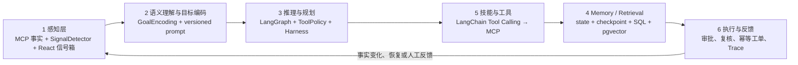
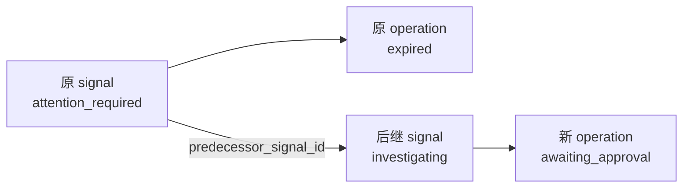
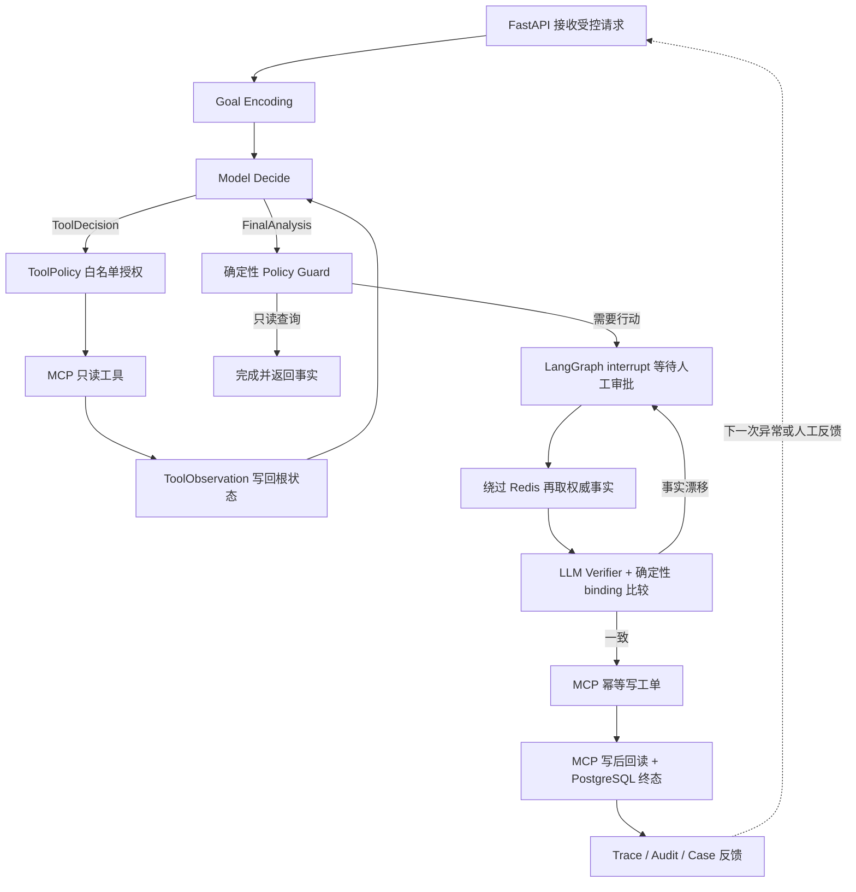

# OperCerta 核心技术手册

## 1. 项目解决什么问题

OperCerta 把“发现运营异常”到“生成可审计工单”做成受控 Agent 后端。三条合成业务是：

- 库存补货：库存低于规则阈值 → 人工批准 → 补货工单；
- 设备维修：设备离线或严重告警 → 人工批准 → 维修工单；
- 作业异常恢复：作业阻塞或超时 → 人工批准 → 恢复工单。

Agent 可以收集证据、执行确定性规则、生成解释和编排步骤，但不能自行绕过审批、修改规则或直接写数据库。所有展示数据均为仓库内公开合成数据。

## 2. 一次请求如何穿过系统

```text
FastMCP 只读工具 + 确定性规则
  → SignalDetector：扫描受控对象并生成去重 operational_signal
  → React 异常信号箱：operator 选择一条真实异常启动调查
  → FastAPI：认证、严格输入、信号与对象绑定、统一错误
  → OperationRunner：原子认领 signal 并创建业务 operation
  → LangGraph：按场景执行取证、评估、报告、审批中断、复核、写入、验证
  → MCP Gateway：只调用六个白名单工具
  → FastMCP Server：校验工具参数并访问合成目录/工单仓储
  → PostgreSQL：signal、operation、证据、审批、工单、审计和 checkpoint
  → Redis：只缓存初次/查询阶段的只读证据
  → SSE：把已持久化审计事件回放给页面
```

OpenTelemetry 用同一 trace 关联 API、LangGraph node、MCP、Redis 和 PostgreSQL；span 只记录 allowlist 属性，不保存 JWT、Prompt、证据正文、SQL 参数或异常堆栈。

## 3. 各技术栈为什么存在

### React 与 ReAct 不是一回事

React 是本项目的浏览器 UI library，负责组件、状态和调用 API。ReAct（Reason + Act）是让模型交替推理和调用工具的 Agent 模式。OperCerta 前端使用 React，但写操作不采用开放式 ReAct 自由决策；可靠性关键路径由类型化 LangGraph 和确定性规则控制。

### FastAPI

FastAPI 是 HTTP 边界：Pydantic 严格校验请求，JWT/RBAC 决定 operator、approver、auditor 能做什么，lifespan 打开和释放数据库/checkpointer，health endpoint 区分进程存活与依赖就绪。API 从 JWT `sub` 取得审批人，拒绝客户端伪造 actor。

### LangGraph

LangGraph 表达可暂停、可恢复的状态机。首次执行在 `awaiting_approval` 中断；批准后从 checkpoint 恢复，但先重新读取真实 MCP 事实并比较审批绑定。节点可以重放，所以副作用必须由数据库幂等约束保护。

### MCP 与 FastMCP

MCP（Model Context Protocol）是工具发现和调用协议；FastMCP 是 Python 侧快速定义 MCP server/tool 的框架。类比：HTTP 是协议，FastAPI 是实现 HTTP 服务的框架。OperCerta 只允许六个固定工具：三种状态读取、规则读取、工单创建、工单读取。

### PostgreSQL

PostgreSQL 是业务真相。选择它是因为事务、行级锁、唯一约束、JSONB、成熟的并发语义和 LangGraph PostgreSQL checkpointer 都适合审批竞态与幂等写入。审批用 `SELECT ... FOR UPDATE` 形成一个原子胜者；工单用 operation/idempotency 唯一约束保证重放不会多写。

### Redis

Redis 只是可删除的读优化，不是事实源。缓存失败会旁路到 MCP；批准后的复核刻意绕过缓存，以免等待期间的旧证据触发错误工单。本机矩阵证明缓存命中改变 MCP 调用次数，但小样本延迟不是生产 SLA。

### Docker 与 Docker Compose

Docker 构建和运行单个隔离镜像；Docker Compose 声明 PostgreSQL、Redis、bootstrap、MCP、API、Caddy 之间的网络、依赖、健康检查和 volume。开发 Compose 只把 API 绑定到本机；release Compose 只有 Caddy 暴露 80/443，内部服务无宿主端口。

### GitHub Actions

GitHub Actions 不是业务运行时架构，而是交付/质量架构。它在 PR/main 上复跑锁文件、静态检查、后端、前端和 Compose smoke，防止“只在开发者电脑能运行”。可以省去平台本身，但不能省去等价的自动化门禁。

## 4. 两类状态为什么都要有

LangGraph checkpoint 回答“图执行到哪个节点、恢复时带什么状态”；PostgreSQL 业务表回答“用户看到的 operation、审批、工单和审计事实是什么”。checkpoint 不能替代业务数据库：它不是稳定查询模型，也不能独立承担审批唯一性、工单唯一性和审计序列约束。

启动恢复时，RecoveryCoordinator 先扫描非终态业务 operation，再用相同 UUID 作为 LangGraph `thread_id` 恢复。业务表与 checkpoint 不一致时安全失败，不猜测成功。

## 5. 审批绑定与复核

审批不是一个孤立布尔值。绑定快照包含场景、主体证据 ID、规则证据 ID、规则版本、事实哈希、计划哈希和类型化参数。批准提交必须带回这份 expected binding。事务内只能有一个审批胜者；图恢复后直连 MCP 重读事实，任何关键变化都返回 `approval_snapshot_mismatch` 且不写工单。

## 6. 幂等和 exactly-once 的正确说法

分布式系统通常无法轻易承诺端到端 exactly-once。OperCerta 提供的是“节点至少可能重放，但业务副作用 effectively-once”：确定性 idempotency key、数据库唯一约束、原子事务、写后读验证共同保证一个 operation 最终只有一张有效工单。面试时不要把它夸大成所有网络和外部系统都 exactly-once。

## 7. 三业务共用与隔离

共享的是 API、Runner、审批仓储、恢复协调、审计、幂等工单和受控图入口；隔离的是每个场景的证据模型、规则、评估、计划、审批参数和工单 payload。这样避免复制可靠性内核，又不把所有业务塞进无类型字典。

## 8. 失败时系统如何安全

- 非法输入：FastAPI/Pydantic 返回固定 422，不创建 operation。
- MCP 不可用：dependency 失败，错误响应不泄露连接串或 traceback。
- Redis 不可用：只读缓存退化为 MCP 直读，不改变审批安全。
- 模型失败：真实模式不回退 Mock 后继续写；模型也无权决定动作参数。
- 重复审批：数据库返回 409，只有一个审批记录。
- 重启：从业务表和 checkpoint 恢复；终态不重复写。
- 事实变化：批准后复核失败，零工单。

## 9. Agent Trace 为什么不是“思维链展示”

OperCerta 的 Agent Trace 是业务可解释轨迹，不是模型隐藏思维链。它按真实执行记录九类事件：感知、模型建议、工具、RAG、规则、人工审批、执行、反馈和护栏。每条事件绑定 operation、run、递增 sequence 与 semantic key；LangGraph 因重启而重放节点时，数据库唯一约束会返回原事件，避免页面出现重复轨迹。

Trace、审计日志和 OpenTelemetry 解决不同问题：Trace 回答“Agent 为什么建议并执行这一步”；审计日志回答“谁在何时改变了业务状态”；OpenTelemetry 回答“请求在哪个组件耗时或失败”。三者不能互相冒充。Trace API 只返回脱敏摘要和 citation reference，不返回完整 prompt、reasoning content、原始工具/SOP 正文、JWT、API key、密码或 stack trace。

角色权限也在服务端执行：operator 只能读取本人 operation，approver 只读取当前需要其处理的 operation，auditor 可跨场景只读脱敏轨迹，demo-admin 只允许在显式本地模式开启。当前 SSE 是持久化快照回放，不应夸大成实时消息总线。

批准路径会把 `verify_current_facts` 与 `verify_approval_binding` 作为两个独立 Trace 事件投影到前端：前者说明 Verifier 已基于绕过缓存的新证据给出 `proceed/abort/escalate`，后者说明确定性绑定护栏是否允许写入。它们必须出现在 `execute_controlled_action` 之前，避免把“模型复核、确定性授权、幂等写入”误画成一个黑盒步骤。拒绝、过期和 Verifier abort 也是已完成的安全业务终态，不能让 Agent run 永久停在 `running`。

## 10. 当前诚实边界

三业务、冻结评测、WSL2 Compose、React 控制台、Redis、OpenTelemetry 适配器、真实 FastEmbed/pgvector RAG 都已有本地证据。2026-07-22 的旧 Plan-and-Execute 路径曾真实验证失败；2026-07-26 单根 Agent 在修复 provider 兼容问题后，已完成三业务各一次只读 Kimi 调用、库存一次批准写入和一次 provider 故障零写入验证。修复前失败证据继续保留，Mock 与 Real 报告仍必须分开。

真实模型兼容要逐层验证：OpenAI-compatible 不保证 Tool Calling、structured output、thinking 扩展和响应字段完全相同。当前通过依赖独立模型 timeout、Kimi thinking 配置和原生内部提交工具；系统没有回退 Mock 冒充成功，安全报告也不保存模型原文。adapter 未返回 usage，所以不能声称 token 或费用数字；少量调用也不能解释为准确率、SLA 或生产稳定性。

公开交互 HTTPS 后端、生产 IAM/SSO、限流/防滥用、高可用、备份恢复、自动部署和 Release Tag 仍未上线。静态 Netlify 页面不是公开业务后端，生产发布门禁保持 `CLOSED`。

建议按“读代码入口 → 预测测试 → 手动运行 → 制造单变量故障 → 用自己的话讲解”的顺序掌握，而不是只复制命令。

## 11. 为什么是 LangGraph + 最小 LangChain

LangGraph 负责状态、分支、循环、人工中断、checkpoint 和恢复，是主编排框架。LangChain 只承担两项适配：把 OpenAI-compatible chat model 接成结构化输出，以及把允许的工具 schema 绑定为 Tool Calling。项目不再套一层 `create_agent`，避免出现两个调度器、两套 Memory 和不清楚的重试边界。

这也解释了为什么不是聊天框：仓储处置的目标、场景和对象是有限枚举。系统先用确定性规则发现业务异常，用户从异常信号箱表达“调查这条异常”的意图；模型负责受控语义编码、只读调查建议和解释，不负责把任意自然语言直接变成写操作。

## 12. 六层 Agent 如何映射代码



- **感知层：** `SignalDetector` 经 MCP 读取库存、设备、任务事实，复用确定性领域评估生成 `operational_signals`；React 只允许从信号启动调查。当前没有图像、语音或真实传感器接入。
- **语义理解与目标编码：** `GoalContext → GoalEncoding` 把可信表单编码为严格目标，Harness 防止模型改对象或动作。
- **推理与规划：** `inventory_agent_root_graph.py` 中的通用根图实现有界 Model↔Tool Observation 循环；文件名来自首个库存切片，三业务实际共用一份拓扑与预算。
- **Memory / Retrieval：** 图状态保存本轮上下文，PostgreSQL checkpointer 保存执行位置，业务表保存长期事实，pgvector 保存合成 SOP 知识。
- **技能与工具：** `ToolPolicy` 暴露场景白名单，只读 MCP 调用由 `ToolExecutor` 执行；写工具不交给模型自由选择。
- **执行与反馈：** 人工审批后重新取证，确定性规则决定动作，唯一约束保护工单，Trace 将结果反馈给 UI 和下一角色。

这里的 Harness 是模块组合，不是一个万能类：`AgentHarness` 固定可信 Goal 和计划预算，`ToolPolicy` 负责工具白名单、对象绑定与重复调用，`ToolExecutor` 负责类型化执行，模型适配器负责 timeout/retry/结构化输出，Pydantic 负责 schema validator，确定性场景图负责审批与写入 guardrail，`TraceRecorder` 负责脱敏和语义去重。面试时应讲清这一职责拆分，不要因为其中有一个 `harness.py` 就声称所有能力都集中在单个类里。

## 13. Memory 的四种含义

1. **短期运行状态：** LangGraph state，保存本轮 goal、plan、observations、analysis 与计数器。
2. **恢复记忆：** PostgreSQL checkpointer，回答线程停在哪个节点；它不是业务真相。
3. **业务长期记忆：** `operational_signals/operations/evidence/approvals/work_orders/audit_events`，提供异常来源、事务、查询和审计。
4. **知识记忆：** `knowledge_documents/knowledge_chunks/vector(512)`，保存版本化合成 SOP embedding，供 RAG 检索。

聊天历史不是当前业务所需的第五种 Memory；无目的地保存用户对话会增加隐私和提示注入面。

## 14. RAG 与 SQL/MCP 的边界

RAG 回答“适用 SOP 怎么描述”，返回带 `document_id/chunk_id/version/score` 的引用；SQL/MCP 回答“SKU、设备或作业现在是什么状态，以及规则值是什么”。SOP 不能覆盖库存数量、设备告警或审批状态，模型摘要也不能写回成业务事实。RAG 可选失败时可降级，规则明确要求 SOP 时必须失败关闭。

## 15. Tool Calling 如何校验

模型只看到 `ToolPolicy` 生成的当前场景只读 schema；provider 安全名会映射回领域工具名。随后依次校验：工具是否在白名单、参数 JSON Schema、对象是否与可信 Goal 绑定、是否重复、调用预算、返回值是否能解析为类型化 Observation。任一步失败都在 MCP 写入前终止。`tool_choice="required"` 只约束 provider 必须返回工具调用，不能替代本地白名单与 Harness。

## 16. 批准后为什么重新取证

审批等待期间库存、告警、作业状态或规则都可能变化。批准只对当时绑定的证据 ID、规则版本、事实哈希、计划哈希和参数有效；恢复后绕过 Redis 重读 MCP，再由 Verifier 给出 `proceed/abort/escalate`。不重取证会产生典型 TOCTOU（检查时与使用时不一致）风险。

## 17. Agent Trace、audit 与 OpenTelemetry

- **Agent Trace：** 面向业务解释，展示 Goal、工具、RAG 引用、Observation 摘要、规则、人工节点、执行和反馈；不展示隐藏思维链。
- **audit：** 面向合规，记录谁在何时改变了 operation、审批和工单状态。
- **OpenTelemetry：** 面向运维，定位一次请求跨 API、图、MCP、Redis、SQL 的耗时和错误。

三者使用不同数据模型和保留目的。把 audit 时间线改名为 Agent Trace，或把 span 当业务审计，都会形成误导。

前端错误同样属于可解释链路：API 的 401/403/409/422/503 安全 envelope 会保留 HTTP 状态、固定错误码和安全 message，再映射成可操作中文提示。前端不能把 `approval_expired`、权限不足、非法输入和依赖故障全部吞成同一句“请重试”，否则既不利于用户恢复，也掩盖了后端已经实现的安全边界。

## 18. 重启恢复与仍未上线

启动时 `RecoveryCoordinator` 从业务表找非终态 operation，以同一 UUID 作为 LangGraph `thread_id` 读取 checkpoint；恢复节点重新校验业务状态。若两者冲突，系统失败关闭而不是猜测成功。Compose 门禁已经验证 API/MCP 重启后等待审批 operation 仍可恢复。

仍未上线的能力包括：公网可写 HTTPS API、生产身份与租户隔离、速率限制和防滥用、秘密托管、备份/恢复演练、多副本协调、高可用、生产监控告警、自动发布与 Release Tag。真实 Kimi 目前只有受控代表调用证据，尚无长期稳定性、负载、成本或生产运维证据。

## 19. 为什么必须先有异常信号，再启动 Agent

旧控制台把 `SKU-LOW-001` 直接放在“创建处置”按钮旁，后端虽然会重新取证，但页面没有回答“用户为什么此时要补货”，产品上容易被误解为先知道结论再调用 Agent。修订后的职责如下：

1. `SignalDetector` 调用现有 MCP 只读工具取得事实；库存阈值、设备告警和任务阻塞仍由可测试的领域规则判断，LLM 不参与检测。
2. `operational_signals` 保存来源、时间、事实哈希和严重级别；`dedup_key` 唯一约束使并发扫描不会制造重复待办。
3. operator 从信号箱点击“启动 Agent 调查”；`trigger_signal_id`、对象类型和对象 ID 在同一 PostgreSQL 事务中校验并绑定 operation。
4. 同一信号只有一个认领胜者；重复点击返回 `signal_already_claimed`，不能创建第二个处置。
5. 进入 operation 后，Agent 才使用 Goal、Plan-and-Execute、Tool Calling、RAG 和模型解释完成深入调查；审批、复核和幂等写入边界保持不变。

为什么不让用户先点“查询状态”再点“创建处置”：写路径本来就必须重新取证，拆成两次人工操作既重复调用，又会让第一次查询结果在第二次提交前过期，形成 TOCTOU。为什么不让 LLM 负责发现 `12 < 15`：这是稳定、可审计、可单测的数值规则，用模型只会增加成本、延迟和不确定性。真正适合 Agent 的部分是多来源取证、SOP 检索、受控规划、解释、人机协作和恢复。

## 20. 三类异常具体怎样被发现，又怎样被 Agent 调查

必须区分两个阶段：**SignalDetector 发现异常**不是 **Agent 调查异常**。

点击“扫描业务异常”时，前端如果还没有 token，会先在内存中签发 operator 演示 JWT，然后只调用 `POST /api/v1/signals/scan`。当前本地作品集版本诚实地限定为固定 `demo_watchlist.v1` 三对象，不是全仓库实时监控：`SKU-LOW-001`、`EQ-PUMP-001`、`TASK-BLOCKED-001`。每次扫描对每个对象读取一份业务事实和一份策略，共执行 6 次只读 MCP 调用；返回值记录 `scanned_at`，页面只有在请求完成后才展示本次信号。生产系统应把固定清单替换为 WMS/EAM/调度库查询、CDC/消息事件或定时任务，但不应在作品集中虚构这些尚未接入的能力。

三类当前合成事实和规则如下：

1. **库存短缺：** `inventory.get_snapshot` 返回在库 20、预留 8；`policy.list_constraints` 返回补货点 15、目标库存 30。领域代码计算 `available = 20 - 8 = 12`，因为 `12 < 15`，生成短缺信号并给出建议补货 `30 - 12 = 18`。
2. **设备异常：** `equipment.get_status` 返回设备 `offline`、告警 `MOTOR_OVERHEAT`、等级 `critical` 和最后心跳；维修策略允许 `warning/critical`，最大心跳年龄 300 秒。允许级别告警或心跳超时任一成立就生成信号；当前对象的 critical 告警已足够触发，优先级为 `urgent`。
3. **任务阻塞：** `task.get_status` 返回状态 `blocked`、阻塞码 `UPSTREAM_TIMEOUT`、重试 1 次；恢复策略把 `blocked` 列为异常状态、重试上限为 3、恢复动作是 `manual_requeue`。状态阻塞或超过截止宽限期任一成立，且没有超过重试上限，才生成可恢复信号。

`facts_hash` 把本次判定事实固定下来，`dedup_key = signal 类型 + 对象 + facts_hash`。相同事实再次扫描会复用 PostgreSQL 中的旧 signal，所以已经被认领的信号仍显示 `investigating`；这表示“本次重新取证命中了同一异常”，不是本次扫描偷偷创建了新处置。前端现在显示本次扫描时间、对象数、命中数、规则事实和来源，角色切换不再自动加载数据库信号。

operator 点击“启动 Agent 调查”后才进入第二阶段：FastAPI 在同一事务认领 signal，LangGraph 编码 Goal，Plan-and-Execute 通过受控 Tool Calling 再取业务事实并检索对应 SOP，模型只负责综合解释，确定性场景规则生成候选计划，然后停在人工审批。批准后 Verifier 绕过缓存再次取证，绑定一致才允许幂等写工单。因此整个链路是“规则发现 → Agent 深入调查 → 人工批准 → 重新验证 → 受控执行”，而不是让模型猜测是否异常。

## 21. 历史对账和后继调查为什么不能直接“重开”

旧持久卷可能在新终态映射上线前留下 `operation=expired`、`signal=investigating` 的不一致。production 启动顺序因此是：先由 `RecoveryCoordinator` 恢复或终结 operation，再由 `SignalRepository.reconcile_terminal_links()` 锁定仍在调查的 signal，按最终 operation 状态幂等对账。对账不删除、不伪造审计，也不改变已经终结的 operation。

失败后不能简单把原 signal 的 `operation_id` 清空再重开。那会让旧审批看起来仍可能作用于新调查，并破坏“某次异常由哪次 operation 处理”的审计关系。OperCerta 采用 successor lineage：



- 原 signal 和原 operation 永久保留。
- operator 调用 retry API，服务端为原 signal 加行锁并生成稳定 retry 去重键。
- `predecessor_signal_id` 唯一约束保证同一 predecessor 最多一个 successor；十路并发也只能有一个胜者。
- successor 再走现有原子认领路径创建新 operation，旧审批绑定不会被复制。
- 前端同时提供“查看原处置”“查看关联处置”和后继提示，使失败、恢复与新审批在页面上可解释。

这里体现了 Agent 工程与普通“再试一次按钮”的区别：恢复的是受控调查目标，不是复用旧执行上下文；Memory 必须保存历史，却不能让历史审批越权影响新行动。对应实现证据见 `docs/release-evidence/signal-reconciliation-successor.md`。

## 22. 2026-07-26 单根 Agent 闭环：从代码逐节点理解

生产入口现在只构建一个 `ControlledAgentRootGraph`。FastAPI 仍然先接收 HTTP，这是所有 Web Agent 的正常边界；它负责认证、参数校验、限流入口和安全错误响应，不替代大模型决策。`src/opercerta/api/app.py` 将请求交给 `ControlledAgentRootRunner`，后者创建 operation 并以同一个 `operation_id = thread_id` 启动 `src/opercerta/workflow/inventory_agent_root_graph.py`。文件名保留了首个库存纵向切片的历史，但图已经通过 `ScenarioRegistry` 同时承载库存、设备和任务三种策略。



关键代码按执行顺序阅读：

1. `build_controlled_agent_root_initial_state()` 只把 FastAPI 已校验的场景、对象和动作编码为可信 `IntentEnvelope`，不让自由文本决定写权限。
2. `AgentLoopModelGateway.encode_goal()` 让 LLM 做语义理解，但 `AgentHarness.validate_goal()` 必须确认模型没有改变场景、对象或目标。
3. `model_decide` 每轮只给模型当前仍可用的只读工具和已有 Observation。模型返回 `ToolDecision` 或 `FinalAnalysis`；不能返回任意 Python 代码，也看不到写工具。
4. `ToolPolicy.authorize()` 校验工具白名单、严格参数、对象绑定、重复调用和预算。`ToolExecutor` 才通过 `McpToolGateway` 调 FastMCP 服务，并把结果变成带 evidence id、参数哈希和 cache status 的 `ToolObservation`。
5. `CachedReadToolGateway` 使用 Redis 做 cache-aside。Redis miss/hit 只影响读取成本；Redis 故障时仍以 MCP/PostgreSQL 权威事实为准。审批后 `bypass_cache=True`，防止用旧缓存批准新行动。
6. `knowledge.search_sop` 是 RAG 工具。pgvector 保存合成 SOP chunk 和 embedding；模型得到 citation，但 SOP 只提供解释性知识，不能覆盖数量规则、审批绑定或写权限。
7. `ScenarioRegistry.evaluate_agent_result()` 把 Observation 解析成严格领域模型，并由普通 Python 规则计算 assessment、plan 和 hash。这就是“LLM 负责不确定语义，Policy Guard 负责确定性裁决”。
8. `approval_interrupt` 把整个根图 checkpoint 保存在 PostgreSQL。审批只提交 decision 与绑定快照；批准后重新取证、模型 Verifier、`binding_facts` 比较全部通过，才进入 `create_work_order`。
9. 工单写入仍由数据库唯一约束和 `create_or_get` 保证幂等，随后 `get_work_order` 回读核对 id、operation、payload 和 payload hash。模型不能宣称写入成功来替代数据库事实。
10. `ControlledAgentRootRecoveryCoordinator` 以业务状态和根 checkpoint 双事实恢复：缺失的 `received` checkpoint 可以重建；审批中断保持等待；已有审批恢复同一节点；终态不再次执行。

## 23. LangChain、LangGraph、FastMCP、Redis 与 PostgreSQL各自为什么存在

| 技术 | 本项目中的实际职责 | 不负责什么 |
| --- | --- | --- |
| LangChain | OpenAI-compatible 模型适配、消息和原生 function tool schema | 不拥有业务生命周期和审批状态 |
| LangGraph | 单根状态机、循环、interrupt、checkpoint 和恢复 | 不替代业务数据库事务 |
| FastMCP / MCP | 统一暴露库存、设备、任务、规则、SOP 和工单工具协议 | 不决定该不该调用、该不该写 |
| Redis | 只读证据 cache-aside 与 hit/miss/bypass 可观测语义 | 不是事实源，审批后不能命中旧缓存 |
| PostgreSQL / pgvector | operation、signal、审批、工单、审计、checkpoint、SOP 向量和事务约束 | 不承担开放式语义推理 |
| React | 一对象一 case 主卡、角色操作、业务事实和 Agent Trace 展示 | 不拼装 lineage，不在浏览器决定业务规则 |

## 24. 真实 Kimi 兼容性与一次重要故障

真实模型验证暴露了两个 Mock 无法发现的问题。第一，生产工厂曾把 `OPERCERTA_MCP_TIMEOUT_SECONDS=2` 同时传给 LLM；Kimi 正常工具调用约需数秒，导致统一 503。现已拆分 `OPERCERTA_MODEL_TIMEOUT_SECONDS=90`。第二，Kimi K2.6 的强制工具调用在当前 Moonshot 配置下需要 `OPERCERTA_MODEL_THINKING_MODE=disabled`；否则首个 `model_decide` 返回供应商 BadRequest。最终分析和审批 Verifier 也改为单一内部提交工具的原生 tool calling，避免供应商 structured-output 解析波动。

这不是把供应商特例散落进业务代码：通用 gateway 默认仍为 `thinking=default`，Moonshot 部署配置显式选择 `disabled`；业务图只依赖严格 `AgentLoopModelGateway` 契约。三个真实只读场景、一个库存批准写入和一个不可用端点闭锁均已有独立脱敏证据。发布门禁仍为 `CLOSED`，因为尚未 commit/push/merge、复跑远程 CI、公开交互后端和完成人工掌握验收。
