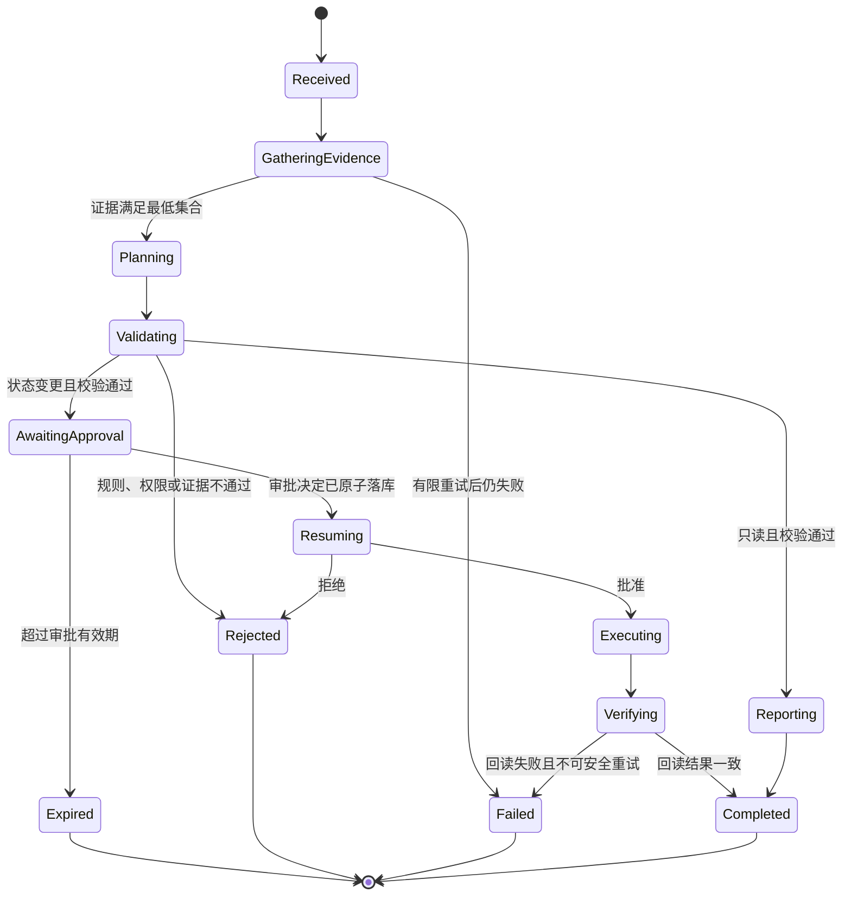
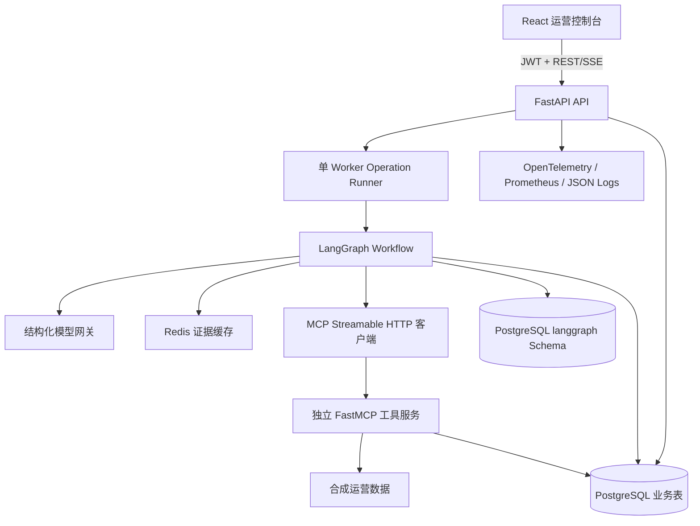

# FlowOps 智能运营处置 Agent 详细设计

**文档状态：** 书面总审通过，作为后续实施基线  
**设计日期：** 2026-07-14  
**项目阶段：** 第一个顺序实施项目；发布复盘后再开始 SecEvidence  
**核心框架：** LangGraph  
**主要技术栈：** Python、FastAPI/Pydantic、LangGraph、MCP/FastMCP、PostgreSQL、Redis、React/SSE、OpenTelemetry、Docker/Caddy  
**数据边界：** 全部使用合成的库存、设备、规则和工单数据

## 1. 一句话定位

FlowOps 将运营人员的自然语言查询或处置请求转换为有证据、可校验、可审批、可恢复的业务流程，并在批准后创建幂等的模拟工单，最终返回可审计结果。

它解决的不是“让模型回答得像专家”，而是“如何让模型参与一个不会绕过规则、不会重复执行、失败后能恢复的企业流程”。

## 2. 用户、问题和价值

### 2.1 角色

- `operator`：查询库存/设备状态，发起补货或维修工单请求。
- `approver`：查看证据、风险和计划，批准或拒绝状态变更动作。
- `auditor`：只读查看状态历史、模型/工具调用和失败原因。
- `demo-admin`：管理合成种子和运行评测，不参与业务审批。

### 2.2 核心问题

传统页面要求用户知道对象编号、规则入口和操作顺序；直接使用聊天模型又容易缺少证据、臆造状态或绕过审批。FlowOps 在两者之间增加一个受控 Agent 层：模型理解语言并组织说明，确定性服务掌握业务事实、风险和执行权限。

### 2.3 首版范围

首版支持两类只读查询和一种模拟写操作：

1. 查询物料可用量、预留量和采集时间；
2. 查询设备状态、告警和最后心跳；
3. 基于规则和人工审批创建补货或维修模拟工单。

不做采购、财务、排班、真实 ERP/WMS 对接、多租户计费和自动执行物理设备命令。

### 2.4 输入

- 运营人员的自然语言查询或模拟工单请求；
- 可选的物料/设备标识和类型化表单字段；
- MCP 工具返回的合成库存、设备、规则和工单事实；
- 审批人的批准、拒绝及原因；
- 版本化的规则、Prompt、工具契约和演示数据。

### 2.5 输出

- 带证据编号和采集时间的只读查询报告；
- 结构化风险、一步动作计划、校验错误和审批要求；
- 批准后创建并回读验证的模拟工单，或拒绝/过期/失败终态；
- 状态迁移、工具调用、模型用量、人工决定和恢复记录；
- 可复现的固定评测与性能/成本报告。

## 3. 为什么使用 LangGraph

本项目的主问题是显式状态、条件路由、人工中断和重启恢复，LangGraph 与这一控制面直接匹配。模型只存在于意图解析和计划解释节点，业务流程由图和状态决定。

备选方案：

- 普通 FastAPI Service：能够实现，但暂停/恢复、状态回放和图级调试需要自行搭建，无法集中展示 Agent 状态编排能力。
- CrewAI：更适合角色协作；本项目没有必要让多个“岗位角色”自由讨论，反而会增加 Token 和不可预测路径。
- PydanticAI：适合强类型单 Agent，但首版的人审中断、检查点和复杂恢复仍需要额外编排器。

因此选择 LangGraph，但领域模型、仓储接口和工具端口不依赖 LangGraph，避免框架锁定。

## 4. 业务闭环

### 4.1 状态机

`Resuming` 是必要的中间态：审批决定写入数据库后、图恢复前若进程崩溃，批准和拒绝都能在启动恢复时完成，SSE 不会因为提前进入终态而漏掉最终结果。

### 4.2 四条必须演示的路径

1. **只读查询**：请求 → 取证 → 低风险报告 → 完成，无审批、无写工具。
2. **批准执行**：请求 → 取证 → 校验 → 等待 → 批准 → 幂等工单 → 回读 → 完成。
3. **拒绝/过期**：等待审批后拒绝或超时，写入原因并进入终态，工单数为零。
4. **故障恢复**：在首次检查点前、等待审批时、审批落库后、工单写入后分别重启，流程恢复或安全失败，不产生重复工单。

## 5. 总体架构

首版为一个 API Worker 的单节点作品集系统。它能证明进程重启恢复，不能宣称多节点任务调度或跨区域高可用。生产演进时将 `OperationRunner` 替换为持久任务队列/工作节点，领域端口保持不变。

## 6. 模块边界

| 模块 | 职责 | 不负责 |
|---|---|---|
| API | 认证、RBAC、请求校验、SSE、错误映射 | 风险计算、直接写工单 |
| Workflow | 节点顺序、路由、检查点、暂停恢复 | 保存业务事实的唯一真相 |
| Domain | 意图/证据/风险/计划/审批契约与规则 | 调模型、网络请求 |
| Model Gateway | 结构化意图和计划解释、Token/延迟记录 | 数值计算、权限决定、数据库写入 |
| Tool Gateway | MCP 会话、超时、有限重试、结构校验 | 任意工具发现后自动授权 |
| Tool Service | 查询合成事实、创建/回读模拟工单 | 解释自然语言 |
| Repository | 事务、幂等、审计序列、恢复查询 | 流程路由 |
| Observability | Trace、Metric、结构化日志 | 保存敏感 Prompt/密钥 |

## 7. LangGraph 节点

| 节点 | 输入 | 输出 | 关键约束 |
|---|---|---|---|
| `parse_request` | 用户消息 | `IntentResult` | 只允许 query/create_work_order 和已知对象类型 |
| `gather_evidence` | 结构化意图 | 证据集合、工具错误 | 只读工具可并行；失败不伪造结果 |
| `calculate_risk` | 意图、证据 | `RiskAssessment` | 纯 Python 规则；考虑新鲜度和动作类型 |
| `build_plan` | 意图、证据、风险 | `DecisionPlan` | 模型只能从 allowlist 选择一步动作 |
| `validate_plan` | 计划和全部事实 | 校验错误、下一状态 | 覆盖 Schema、引用、权限、数量和时效 |
| `request_approval` | 风险和计划 | `ApprovalDecision` | 中断前不产生外部副作用 |
| `execute_work_order` | 已记录批准 | `WorkOrder` | 不经缓存，必须携带唯一幂等键 |
| `verify_execution` | 工单编号 | 回读工单 | 写后读一致才视为完成 |
| `build_report` | 全部结构化结果 | 终态报告 | 每个结论引用证据 ID |

状态中只保存 JSON 可序列化内容；数据库会话、HTTP 客户端、密钥和异常对象不进入检查点。

### 7.1 状态与 Context Engineering

工作流状态只代表当前 `operation_id` 的任务级记忆，包含原始请求、结构化意图、证据引用、风险、计划、审批、预算和执行结果。原始业务事实与完整审计留在 PostgreSQL，检查点保存引用和通过校验的紧凑摘要；每个节点由 Context Builder 按角色、节点和 Token 预算选择必要字段，不把全量工具结果、历史操作或其他用户对话塞入 Prompt。首版不提供跨操作的长期人格记忆，避免过期事实、权限泄漏和无法解释的行为迁移。

## 8. MCP 工具设计

| 工具 | 风险 | 输入 | 输出 | 失败语义 |
|---|---|---|---|---|
| `inventory.get_snapshot` | 只读 | `sku` | 数量、预留、时间、证据 ID | 不存在、超时、Schema 错误 |
| `equipment.get_status` | 只读 | `equipment_id` | 状态、告警、心跳、证据 ID | 不存在、超时、Schema 错误 |
| `policy.list_constraints` | 只读 | `action` | 适用规则和审批要求 | 不可用时写动作失败关闭 |
| `work_order.create` | 写入模拟 | 请求 ID、幂等键、受控参数 | 原有或新建工单 | 未批准、冲突、存储失败 |
| `work_order.get` | 只读 | 工单 ID | 当前工单事实 | 不存在或存储失败 |

服务端固定注册五个工具，客户端再做一次名称 allowlist。LLM 不接触 MCP 工具列表，也不能构造任意工具名。工具返回值在 Agent 进程中重新经过 Pydantic 校验。

## 9. 数据与一致性

### 9.1 业务表

- `operations`：请求、用户、thread_id、状态、结构化意图/风险/计划/结果。
- `evidence`：代理主键、operation_id、evidence_id、来源、采集时间、内容；`(operation_id, evidence_id)` 唯一。
- `approvals`：每个 operation 只允许一条决定。
- `work_orders`：operation_id、幂等键、参数、状态；幂等键唯一。
- `audit_events`：每个 operation 内序号唯一，只追加。

证据采用组合唯一约束，因为同一缓存快照可以被两个操作引用，不能把 evidence_id 设成跨操作全局主键。

### 9.2 检查点与业务事实

LangGraph 检查点位于独立 `langgraph` Schema，用于恢复控制流；业务表位于 `public` Schema，用于 API、审计和报表。两者不做跨库原子事务，因此恢复逻辑必须以业务状态与图快照共同判断：

- 业务行存在但无图快照：从原始请求重建初始状态；
- 图在 interrupt 且无决定：保持等待，不自动批准；
- 图在 interrupt 且决定已记录：用原决定恢复；
- 执行节点可能重放：数据库幂等键保证最多一个业务工单。

运行语义是“节点可能至少执行一次、业务写入有效一次”，不是虚假的 exactly-once。

## 10. API 与前端

### 10.1 API 契约

- `POST /api/v1/auth/demo-token`：生成短期 operator/approver 演示令牌。
- `POST /api/v1/operations`：持久化请求后返回 `202` 和 operation_id。
- `GET /api/v1/operations/{id}`：返回当前业务事实、证据、审批和结果。
- `GET /api/v1/operations/{id}/events`：SSE 审计流，支持 `Last-Event-ID`。
- `POST /api/v1/operations/{id}/approval`：approver 原子提交一次决定。

公开演示中的数据全为合成数据，允许演示用户查看全部演示操作；生产多租户的数据隔离不在首版范围，必须列入限制，不能把演示 RBAC 表述为完整租户权限系统。

### 10.2 前端页面

1. 任务输入与示例；
2. 节点时间线和当前状态；
3. 证据来源、新鲜度和内容；
4. 风险、计划与审批面板；
5. 模拟工单结果；
6. Trace/评测摘要和已知限制。

批准按钮提交后立即禁用；重复决定显示冲突而不是再次执行。事件流按 sequence 去重并使用 `Last-Event-ID` 最多重连三次。

## 11. 模型边界和降级

模型只生成 `IntentResult`、`DecisionPlan` 和短文本解释。风险等级、证据是否过期、审批要求、动作 allowlist、数量上限、权限和写入均由确定性代码决定。模型输出中的风险和 evidence_ids 会被可信值覆盖。

运行模式：

- `Mock`：仅用于本地开发、CI 和明确标识的离线演示，启动时固定，不能在真实请求处理中动态切入；
- `Real`：结构化输出调用真实模型；单一供应商超时/限流时可切换经过同一契约评测的备用模型；
- 全部真实模型失败时，只读请求可以回到用户已填写的类型化表单和确定性查询，无法可靠解析的请求安全失败；写请求绝不使用 Mock 计划继续；
- 审计事件记录 provider、model、Token、延迟、retry、fallback_provider 和最终降级原因，界面明确区分模型解释与确定性结果。

## 12. 失败、安全与恢复

| 故障 | 系统行为 | 业务结果 |
|---|---|---|
| 只读工具超时 | 最多两次传输尝试，记录安全错误码 | 证据不足则拒绝或失败 |
| 规则工具不可用 | 禁止写动作 | 只读请求可按已有事实报告并标注限制 |
| 模型超时/格式错误 | 有限重试并切换等价备用模型；仍失败则确定性只读或安全失败 | 不使用 Mock 生成写计划 |
| 审批重复提交 | 行锁/唯一约束只接受一次 | 第二次返回 409 |
| 审批后进程重启 | `resuming` 状态加检查点恢复 | 原决定继续，不要求重复审批 |
| 写后进程重启 | 执行节点可重放 | 幂等键返回原工单 |
| SSE 断线 | 客户端从最后序号重连 | 不丢审计展示 |
| Redis 不可用 | 缓存旁路；限流失败策略单独配置 | 核心事实仍来自数据库/工具 |

安全控制包含短期 JWT、角色校验、确切 CORS、速率限制、模型每日调用预算、Prompt Injection 回归集、工具白名单、受控参数、非 root 容器、公开入口屏蔽 MCP/数据库/Redis/Prometheus，以及日志脱敏。

## 13. 评测与性能设计

### 13.1 固定数据集

至少 30 个用例，覆盖只读查询、合法写请求、数量冲突、未知对象、过期证据、工具超时、模型失败、注入、批准、拒绝和重复提交。每条包含期望动作、工具集合、终态、错误码和审批决定。

### 13.2 质量指标

- `task_success_rate`：动作、终态和错误码全部符合预期的用例占比；发布阈值 90%。
- `evidence_completeness`：必需证据实际返回数/必需证据总数；发布阈值 95%。
- `approval_bypass_count`：批准前产生写入的次数；必须为 0。
- `duplicate_work_order_count`：重复请求产生的额外行数；必须为 0。
- `terminal_audit_coverage`：具有终态审计事件的终态操作占比；必须为 100%。

### 13.3 性能实验

使用同一数据集和环境形成 2×2 矩阵：串行/并行工具 × 禁用/启用缓存，输出 P50、P95、错误率和工具次数。这样可以分别解释并行和缓存贡献，再用 baseline 与 optimized 说明组合收益。

真实模型另外记录输入/输出 Token、费用、首事件时间和总完成时间；不把 Mock 性能包装成真实模型性能。

## 14. 测试策略

- 单元测试：意图/计划 Schema、风险规则、状态路由、幂等键、权限、证据新鲜度和审计序号；
- 契约测试：五个 MCP 工具、模型结构化输出、错误码和 SSE 事件；
- 集成测试：LangGraph 检查点、业务事务、Redis 旁路、审批中断/恢复和工具服务；
- 端到端测试：四条核心路径、四个重启点、重复审批和重复写请求；
- 安全测试：Prompt Injection、未知工具、参数越权、审批绕过、跨角色访问和预算耗尽；
- 评测回归：固定 30 例、2×2 性能矩阵、真实模型代表性样本和成本记录。

## 15. 部署与可观测性

生产演示拓扑为 Caddy、React 静态站点、单 Worker FastAPI、独立 MCP 服务、PostgreSQL、Redis 和内部 Prometheus。只有 HTTPS 入口公开，MCP 仅 Docker 内网可达；本地/CI 可通过只绑定 `127.0.0.1` 的覆盖配置做传输测试。

健康检查区分：

- liveness：进程可响应；
- readiness：数据库、Redis、MCP 和检查点可用；
- dependency status：Mock 环境不依赖外部模型；Real 环境在模型不可用时显示降级，只保留确定性只读能力或安全失败。

可观测性统一关联 `request_id`、`operation_id`、`thread_id`、`tool_call_id` 和 `trace_id`；技术指标覆盖 API/SSE 时延、节点耗时、MCP 错误、检查点、Redis 命中和模型 Token/成本，业务指标覆盖状态漏斗、审批等待、拒绝/失败原因、重复写入和终态审计覆盖率。日志只保存结构化摘要与对象引用，不记录密钥或隐藏思维链。

## 16. 验收门禁

- 四条核心业务路径和四个重启点均通过；
- 高风险/写动作无审批执行次数为 0；
- 并发十次相同幂等请求只产生一个工单；
- 每个终态有完整有序审计；
- Mock 30 例达到阈值，真实模型完成代表性查询和批准路径；
- API、SSE、RBAC、注入、Compose、前端和恢复测试通过；
- 公网 URL、GitHub、Release、原始报告、ADR 和限制说明齐全；
- 面试者可以不看文档解释状态机、检查点/业务表差异和至少一次故障诊断。

阈值是发布条件，不是当前成绩。

## 17. 简历与证据口径

完成后可从以下事实中形成简历句子，但只能填写实测数字：

- 基于 LangGraph 构建证据收集、规则校验、HITL 和幂等工单的可恢复流程；
- 通过并行工具调用和证据缓存优化端到端延迟；
- 通过 PostgreSQL 检查点、原子审批和唯一幂等键保障重启恢复与写入一致性；
- 建立固定评测、安全回归、Trace 和成本报告。

每句话必须登记源码、测试、报告字段、在线页面和面试解释五类证据；没有 Release 前不写“已上线”。

## 18. 面试必答

### 为什么不是多个 Agent？

业务复杂度来自状态和权限，不来自角色讨论。增加库存 Agent、规则 Agent 等人格只会增加 Token 和协作不确定性；并行只读工具加确定性节点更简单、更可测试。

### LangGraph 检查点为什么不能代替业务数据库？

检查点是编排内部快照，Schema 会随图变化，也不适合作为审批、审计和工单的业务真相。业务表支持稳定查询、事务和合规留痕；恢复时两者共同使用。

### 如何防止 LLM 幻觉导致错误执行？

LLM 不掌握事实和权限。所有事实来自工具，所有引用必须存在，风险和规则由代码计算，计划只能选 allowlist，写操作必须经过 RBAC、人审和幂等服务。

### 是否保证 exactly-once？

不保证节点 exactly-once。崩溃恢复时节点可能重放；通过唯一幂等键、原子审批和可重入节点让业务效果有效一次，这是更诚实也更可实现的语义。

### 当前最明显的生产限制是什么？

单 API Worker 的进程内 runner 只证明单节点恢复，不证明多 Worker 调度。生产化会引入持久任务队列、租约/心跳和独立 Worker，同时保持领域服务和幂等边界。

## 19. 已知限制与生产演进

- 合成库存、设备和规则不能代表真实企业数据质量、权限模型和峰值负载；
- 单 API Worker 只验证单节点重启恢复，不验证多 Worker 抢占、租约和跨区域容灾；
- 演示 RBAC 不是完整多租户隔离，未对接企业 SSO、组织层级和细粒度数据权限；
- 模拟工单没有连接真实 ERP/WMS/CMMS，生产接入还需审批回执、补偿和接口版本治理；
- Redis、PostgreSQL 和 MCP 服务均为作品集部署，不宣称高可用或生产 SLA；
- 生产演进优先增加持久任务队列、独立 Worker、企业身份和真实接口沙箱，而不是增加更多 Agent 角色。

## 20. 后续实施对话输入

新的实施对话应读取本规格、组合设计和已保留的 FlowOps 实施计划，然后重新核对依赖版本，按 TDD 建仓。实施过程中若发现设计需要修改，应先回写 ADR/规格再编码；不得用代码悄悄改变业务边界。

## 21. 官方参考

- LangGraph persistence: <https://docs.langchain.com/oss/python/langgraph/persistence>
- LangGraph interrupts: <https://docs.langchain.com/oss/python/langgraph/interrupts>
- LangGraph streaming: <https://docs.langchain.com/oss/python/langgraph/streaming>
- MCP Python SDK: <https://github.com/modelcontextprotocol/python-sdk>
