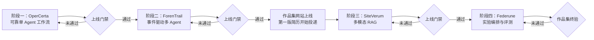
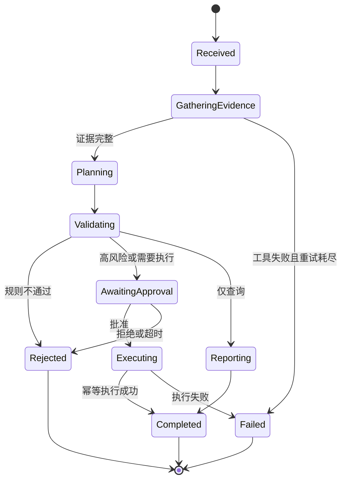
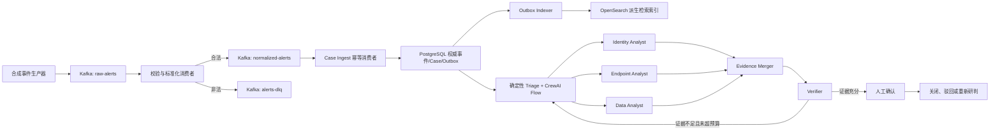
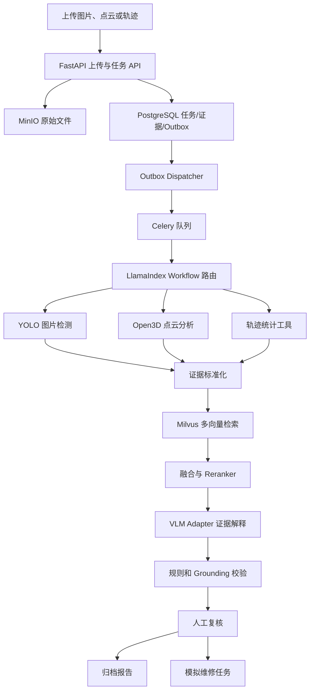
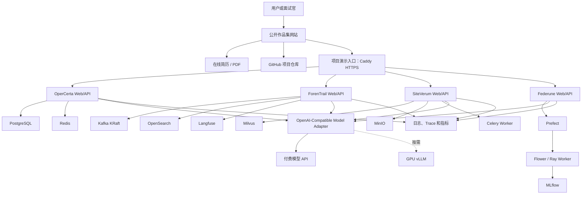

# AI Agent 四项目总体设计规格

> 文档状态：四项目设计书面总审通过，实施基线 v1.4  
> 编制日期：2026-07-14  
> 目标岗位：Python AI Agent / 大模型应用开发工程师  
> 实施方式：一个项目完成、上线、评测和复盘后，再开始下一个项目
> 投递基调：2026年7月底完成前两个项目和作品集网站并开始投递；8月边面试复盘边完成后两个项目

## 1. 文档目的

本规格用于指导四个公开 AI Agent 项目从设计、开发、测试、评测、部署到面试材料沉淀的全过程。项目来源于既有联邦学习、仓储管理、网络安全和无人探测方面的通用经验，但不复用原单位名称、项目名称、专有数据、界面、源码或业务标识。

四个项目不是框架演示，而是分别解决四类不同的企业问题：

1. 有状态业务流程中的工具调用、人工审批与可靠执行。
2. 流式安全事件中的多角色研判、证据验证与处置闭环。
3. 图片、点云、轨迹与规程知识的多模态联合巡检。
4. 机器学习实验中的结构化配置、隔离执行、评测与复现。

除四个业务项目外，还需要上线一个公开作品集网站，作为简历、项目演示、GitHub 源码、技术文章和阶段状态的统一入口。

## 2. 真实性和投递约束

### 2.1 可以使用的内容

- 可以使用个人已经掌握的通用开发经验、公开算法知识和公开数据集。
- 可以重新实现库存、设备、事件、点云、轨迹、联邦实验等通用业务模型。
- 可以根据招聘要求选择新的 Agent 框架、向量数据库、消息队列和模型服务。
- 可以把尚未掌握的技术列入学习和实现计划。

### 2.2 禁止使用的内容

- 不复制原单位源码、数据库、界面、文档、截图、IP 地址或内部数据。
- 不使用能够反向识别原项目的名称、设备编号、组织结构或专有业务规则。
- 不把计划指标写成已经取得的结果。
- 不把未部署项目写成已上线，也不人为修改 Git 提交和项目日期。
- 不把单节点演示部署描述为生产高可用集群。

### 2.3 正式简历准入规则

项目必须同时具备以下证据，才能进入不带“开发中”字样的正式投递简历：

- 可访问的公开 GitHub 仓库。
- 可执行的发布版本标签和清晰的提交历史。
- 可访问的在线演示地址。
- 固定评测集、评测脚本和原始评测结果。
- 基线版本与优化版本的同条件对照报告。
- README、架构图、ADR、部署说明和已知限制。
- 一段可重复演示的业务流程和对应测试用例。

## 3. 总体策略

### 3.1 顺序开发路线



建议节奏：

| 阶段 | 目标时间 | 交付物 | 预计投入 | 投递策略 |
|---|---|---|---:|---|
| 1 | 2026-07-14～07-20 | OperCerta 完成、上线和复盘 | 约30～35小时 | 完成第一个旗舰项目，不单独急投 |
| 2 | 2026-07-21～07-29 | ForenTrail 完成、上线和复盘 | 约40～45小时 | 两个项目均通过门禁后制作投递版简历 |
| 2.5 | 2026-07-30～07-31 | 作品集网站、简历、双项目演示材料上线 | 约8～12小时 | 7月底开始第一轮投递 |
| 3 | 2026-08-01～08-12 | SiteVerum 完成、上线和复盘 | 约45～55小时 | 边投递、面试和复盘，边完成第三项目 |
| 4 | 2026-08-13～08-24 | Federune 完成、上线和复盘 | 约40～50小时 | 更新作品集和简历，挑战更高要求岗位 |
| 复盘 | 2026-08-25～08-31 | 面试问题库、薄弱知识和作品集修订 | 按实际面试安排 | 根据反馈进行定向补强 |

具体日期允许因门禁结果顺延，但顺序不变。7月底的核心目标是前两个项目和作品集网站上线，并达到可以开始投递的知识、技能和讲解水平；8月份每天在4～6小时总预算内分配约1小时用于投递/面试复盘、其余时间用于后两个项目开发。

### 3.2 四个框架的选择原则

框架不是项目目标，而是根据主要约束选择的可替换编排层：

| 项目 | 主要约束 | 框架 | 选择原因 |
|---|---|---|---|
| OperCerta | 长状态、暂停恢复、人工审批 | LangGraph | 状态图、持久化检查点和中断恢复符合可靠业务流程 |
| ForenTrail | 多角色分工、并行研判、有限反证循环 | CrewAI Flows | 用固定 Flow 管理多个专职 Agent，限制自由对话和循环 |
| SiteVerum | 多模态数据、检索、异步事件 | LlamaIndex Workflows | 适合围绕文档、索引、事件和异步步骤组织多模态流程 |
| Federune | 强类型配置、工具轨迹评测 | PydanticAI | 结构化输入输出和 Pydantic Evals 适合实验配置与轨迹验证 |

在真实公司中应优先统一一到两个框架。本作品集使用不同框架，是为了验证其适用边界；公共领域模型、工具协议、状态契约、评测方法和可观测性原则保持一致。每个仓库必须编写 ADR，记录采用方案、拒绝方案和迁移方案。

## 4. 共同工程基线

### 4.1 共同技术

- Python 3.12、FastAPI、Pydantic v2 和 OpenAPI 用于后端接口与数据契约。
- React、TypeScript 和 Vite 用于最小但完整的企业 Web 操作界面。
- SSE 用于长任务进度、Agent 节点和结果流式展示。
- PostgreSQL 用于事务状态、审批、审计和业务记录。
- Docker Compose 用于本地及单节点在线部署。
- GitHub Actions 用于代码检查、测试、镜像构建和部署门禁。
- Pytest、pytest-asyncio、Ruff 和类型检查用于质量控制。
- JSON 结构化日志、Trace ID、Prometheus 指标和 OpenTelemetry 用于排障。
- Caddy 用于 HTTPS、反向代理和四个项目的独立子域名。

基础技术允许重复。项目差异体现在 Agent 编排、业务闭环、数据系统和优化方式，而不是为了显得不同而重复造基础设施。

### 4.2 推荐仓库结构

```text
project-root/
├── apps/
│   ├── api/                 # FastAPI 接口
│   └── web/                 # React 前端
├── src/
│   ├── domain/              # 领域实体和确定性规则
│   ├── agents/              # Agent/Workflow 编排
│   ├── tools/               # 工具及工具契约
│   ├── infrastructure/      # DB、缓存、队列、模型客户端
│   └── observability/       # 日志、Trace、指标
├── evals/
│   ├── datasets/            # 固定评测集
│   ├── evaluators/          # 规则和模型评测器
│   └── reports/             # 原始结果和对照报告
├── tests/
│   ├── unit/
│   ├── integration/
│   ├── e2e/
│   └── security/
├── docs/
│   ├── architecture.md
│   ├── interview-guide.md
│   └── adr/
├── deploy/
├── compose.yaml
├── .env.example
└── README.md
```

### 4.3 Agent 共同约束

- LLM 不直接写数据库，只能提出结构化意图，由确定性服务校验并执行。
- LLM 不负责权威数值计算，库存数量、风险分数、检测框、训练指标均由工具产生。
- 工具必须有 Pydantic 输入输出、超时、重试、权限和错误分类。
- 所有重要结论必须关联 `evidence_id`、`tool_call_id` 或 `run_id`。
- 所有循环必须有最大次数、时间预算和 Token 预算。
- 原始日志、全文档和无关历史不直接塞入上下文。
- 高风险动作必须进入人工审批，公开演示只执行模拟动作。
- 每次运行记录模型、Prompt 版本、工具版本、Token、成本和延迟。

### 4.4 共同安全要求

- 仅使用公开数据、合成数据或用户自行上传的非敏感数据。
- 环境变量和密钥不进入 Git；仓库提供 `.env.example`。
- 上传文件校验类型、大小、扩展名、内容签名和存储路径。
- 外部 URL 默认拒绝；确需使用时采用域名白名单和超时限制。
- RAG 文档和安全日志始终被标记为不可信数据，不得覆盖系统指令。
- 工具使用 allowlist，禁止任意 Shell、任意 SQL、任意 Python 和任意镜像执行。
- 审批、拒绝、重试、降级和异常均写入不可变审计事件。

## 5. 项目一：OperCerta｜智能运营处置 Agent

### 5.1 项目定位

面向设备、库存和作业异常的运营人员。系统将自然语言请求转换成证据化处置方案，在规则校验和人工审批后创建模拟工单，并跟踪最终结果。

### 5.2 核心技术栈

LangGraph、FastAPI、MCP Python SDK、PostgreSQL、Redis、SQLAlchemy、Alembic、OpenTelemetry、React、SSE、Docker Compose。

### 5.3 业务闭环



### 5.4 Agent 节点

1. `parse_request`：输出结构化意图、目标对象和期望动作。
2. `gather_evidence`：并行调用库存、设备、规则和历史工单工具。
3. `calculate_risk`：确定性规则计算风险等级，LLM 不参与数值计算。
4. `build_plan`：根据证据生成结构化步骤和解释。
5. `validate_plan`：校验字段、权限、证据完整性和业务规则。
6. `request_approval`：LangGraph 中断并持久化状态。
7. `execute_work_order`：使用幂等键创建模拟工单。
8. `verify_execution`：回读工单状态，确认写入结果。
9. `build_report`：输出证据、决策、审批和执行结果。

### 5.5 MCP 工具

| 工具 | 输入 | 输出 | 失败处理 |
|---|---|---|---|
| `inventory.get_snapshot` | 物料/库位 | 可用量、预留量、更新时间 | 超时重试；过期数据拒绝执行 |
| `equipment.get_status` | 设备编号 | 状态、告警、最后心跳 | 找不到设备时返回结构化错误 |
| `policy.list_constraints` | 动作、对象 | 规则、风险条件、审批要求 | 规则服务不可用时只允许查询 |
| `work_order.create` | 校验后命令、幂等键 | 工单编号和状态 | 重复请求返回原工单 |
| `work_order.get` | 工单编号 | 当前状态和执行日志 | 不存在时进入补偿或失败终态 |

### 5.6 数据模型

- `operation_request`：请求、用户、意图、当前状态。
- `evidence`：来源、内容摘要、采集时间、校验结果。
- `decision_plan`：结构化计划、风险、模型和 Prompt 版本。
- `approval`：审批人、决定、原因和时间。
- `work_order`：幂等键、执行参数和最终状态。
- `audit_event`：只追加的状态变更和调用记录。

LangGraph 检查点与业务表分开 Schema，避免将编排内部状态当作业务事实。

### 5.7 性能与可靠性实验

- 串行工具调用对比并行工具调用。
- 无 Redis 对比热点证据缓存。
- 全量历史对比会话摘要和上下文预算。
- 单一大模型对比按任务复杂度路由模型。
- 无幂等写入对比唯一键与幂等服务。

固定评测集至少包含30条正常、冲突、证据缺失、高风险、重复和超时场景。

### 5.8 上线门禁

- 证据完整率不低于95%。
- 未审批高风险动作执行次数为0。
- 重复请求产生重复工单数为0。
- 服务重启后待审批流程可以恢复。
- 所有终态均存在审计记录。
- 基线和优化报告可由脚本重复生成。

## 6. 项目二：ForenTrail｜安全事件证据研判平台

### 6.1 项目定位

面向安全运营分析人员，将合成告警和日志转化为可追溯事件，按需调度专职 Agent 收集证据、反证结论并生成人工可审核的处置建议。

### 6.2 核心技术栈

CrewAI Flows、FastAPI、Kafka KRaft、OpenSearch、LiteLLM、Langfuse、PostgreSQL、Pydantic、React、SSE、Prometheus、Docker Compose。

### 6.3 数据流和业务闭环



### 6.4 事件接入与持久化设计

| Topic | 用途 | Key |
|---|---|---|
| `raw-alerts` | 原始合成告警 | `correlation_key`（演示租户 + 主体） |
| `normalized-alerts` | 标准化事件 | `correlation_key`（保留主体内顺序） |
| `alerts-dlq` | Schema、字段和处理失败事件 | `event_id` |
| `investigation-commands` | 调查任务分发 | `run_id` |
| `investigation-results` | 研判完成通知 | `run_id` |

交付语义采用 at-least-once：

- 标准化消费者发布 `normalized-alerts` 成功后再提交原始 Topic Offset。
- `event_id` 是业务幂等键；Kafka Key 只保证同一主体的 Partition 内顺序，跨 Partition 使用事件时间和迟到事件策略处理。
- Case Ingest 在一个 PostgreSQL 事务中幂等写事件、案件关联和 Outbox，事务成功后再提交 Offset。
- OpenSearch 由 Outbox 异步构建可重建派生索引，不与 PostgreSQL 做请求内双写。
- 使用 `event_id`、案件关联和证据唯一约束实现业务幂等。
- 调查 API 原子写 `investigation_run + dispatch_outbox`，Worker 通过 `run_id/attempt` 租约消除重复命令。
- 消费者组负责水平扩展；单节点演示不声称高可用。
- DLQ 保留失败原因、原 Topic、Partition、Offset 和重放次数。
- 提供受控重放接口，不直接修改历史事件。

### 6.5 Agent 角色

- `Triage Router`：由规则判断事件类型和需要调用的专家，不使用 LLM 做权限或最终定性。
- `Identity Analyst`：分析登录、账号、权限和地理异常证据。
- `Endpoint Analyst`：分析主机、进程、文件和网络证据。
- `Data Analyst`：分析访问量、下载、外传和时间序列证据。
- `Evidence Merger`：去重、排序并建立结论到证据的映射。
- `Verifier`：寻找缺失证据、矛盾证据和注入内容。
- `Recommendation Builder`：在证据验证后生成模拟处置建议，不能直接封禁账号或资产。

CrewAI 仅在固定 Flow 内运行；最大反证循环为2次，每个角色有独立 Token 和工具预算。

### 6.6 数据与检索

- PostgreSQL 保存权威事件、Case、证据、人工决定、处置建议、Outbox 和审计记录。
- OpenSearch 保存从 Outbox 构建的可检索事件文档；索引可以重建，不作为业务真相。
- 搜索查询由模板和参数生成，不允许模型拼接任意 DSL。
- 每条证据包含 `evidence_id`、时间、来源索引和原文摘要。
- 安全日志中的“忽略系统指令”等内容按不可信数据处理。

### 6.7 性能与质量实验

- 同步处理对比 Kafka 异步解耦。
- 逐条写入对比 OpenSearch 批量写入。
- 所有专家全量运行对比按需路由。
- 单一模型对比 LiteLLM 的分类小模型与分析模型路由。
- 无 Verifier 对比证据反证流程。

固定评测集至少包含120条合成事件、4类事件标签和20条直接/间接 Prompt Injection 样本。

### 6.8 上线门禁

- 以设定速率发送评测事件时，持久化数据丢失数为0。
- 幂等处理后的净重复事件数为0。
- DLQ 测试事件可100%重放或给出不可重放原因。
- 关键结论证据覆盖率为100%。
- Prompt Injection 样本不得触发越权工具或改变系统规则。
- Macro-F1 目标为0.85；若未达到，只记录实测值和错误分析。

## 7. 项目三：SiteVerum｜多模态现场巡检与证据检索平台

### 7.1 项目定位

面向设备和现场巡检人员，接收图片、点云和轨迹文件，通过确定性视觉/几何工具与多模态知识检索形成证据，生成可人工复核的巡检报告，并归档或创建模拟维修任务。

### 7.2 核心技术栈

LlamaIndex Workflows、FastAPI、Milvus、BGE-M3、OpenCLIP、BM25、文本 Reranker、多模态模型 API/vLLM、YOLO 类兼容检测模型、Open3D、Celery、Redis、MinIO、PostgreSQL、React、SSE、Docker Compose。

### 7.3 总体架构



### 7.4 输入类型

| 类型 | 首版格式 | 确定性工具输出 |
|---|---|---|
| 图片 | JPEG、PNG | 检测类别、置信度、框、裁剪图、图像质量 |
| 点云 | PLY、PCD | 点数、包围盒、密度、平面/聚类、异常区域 |
| 轨迹 | CSV、GeoJSON | 点数、速度、停留、越界和缺失段 |

所有样例使用公开或合成数据，并在仓库中记录来源和许可证。

### 7.5 多模态证据检索设计

主集合 `knowledge_chunks` 只保存版本化规程与公开案例的检索字段；现场原始文件、工具结果和报告证据保存在 PostgreSQL/MinIO：

| 字段 | 类型 | 用途 |
|---|---|---|
| `chunk_id` | 主键 | 知识分块唯一标识 |
| `document_id/version` | Scalar | 文档和不可变版本引用 |
| `text_dense` | Dense Vector | BGE-M3 语义召回 |
| `text_sparse` | Sparse Vector | BM25 编号、名称和术语召回 |
| `image_dense` | Dense Vector | 有示例图时的 OpenCLIP 图片召回 |
| `equipment_type` | Scalar | 设备类别过滤 |
| `source_type` | Scalar | 规程、案例、FAQ |
| `permission_tags` | Scalar/Array | 数据权限过滤 |
| `license_id` | Scalar | 来源与许可追踪 |
| `search_text` | Text | 返回给 Reranker 和报告的原文块 |
| `checksum` | Scalar | 去重和完整性校验 |

首版检索策略：

1. 先执行权限、设备、来源和时间标量过滤。
2. 文本 Dense、BM25 Sparse 和图片向量并行召回 Top-20。
3. 无可靠权重时使用 RRF；完成标注后比较 WeightedRanker。
4. 文本候选经 Reranker 精排，保留 Top-5。
5. VLM 只接收裁剪图、Top-5 证据和结构化工具输出。
6. 输出结论必须带现场 `evidence_id` 和/或知识 `chunk_id + document_version`，否则被 Grounding 校验器阻断。

Milvus 官方参考：

- <https://milvus.io/docs/llamaindex_milvus_hybrid_search.md>
- <https://milvus.io/docs/reranking.md>
- <https://milvus.io/docs/bm25-function.md>

### 7.6 模型服务

- Qwen2.5-VL 3B/7B 可作为候选，但最终模型、量化和上下文长度必须在实施时用同一固定评测集选择并锁定，不能在设计阶段宣称最优。
- 实现 OpenAI-Compatible Adapter，可切换付费 API 和 vLLM。
- vLLM GPU 服务按需启动；公开演示可默认使用付费 API 控制持续成本。
- 后端从 MinIO 读取并校验对象后，以受控字节或内部白名单地址交给模型。
- 模型不能读取任意 URL，禁止通过重定向访问内网资源。

vLLM 官方参考：

- <https://docs.vllm.ai/en/latest/features/multimodal_inputs/>
- <https://docs.vllm.ai/en/latest/models/supported_models/>

### 7.7 性能与质量实验

- 整图 VLM 对比 YOLO 定位后裁剪图 VLM。
- 顺序执行对比 YOLO、Open3D、轨迹工具按文件类型并行执行。
- 单一 Dense 检索对比 Dense + BM25 + Image 混合检索。
- 无缓存对比基于文件 SHA、分析器/模型版本和参数哈希的 lineage 缓存；pHash 只用于近似重复提示，不直接复用结果。
- VLM 直接总结对比证据约束与 Grounding 校验。

固定评测集至少包含60份混合文件和30个带相关性标注的查询。

### 7.8 上线门禁

- 文件类型和任务路由准确率不低于95%。
- 检索 Recall@5 目标不低于0.85。
- 缺少证据的关键结论释放数为0。
- 人工复核可以归档或创建模拟维修任务，不存在无终态流程。
- API/vLLM 两种模型适配至少各完成一次可复现测试。
- 对照实验记录 VLM 输入图片数、视觉 Token、延迟和成本。

## 8. 项目四：Federune｜受控联邦学习实验工程平台

### 8.1 项目定位

面向算法和实验人员，将自然语言实验目标转换为受约束的联邦学习配置，在隔离 Worker 中运行 Flower/PyTorch 仿真，通过 MLflow 记录实验血缘，并生成可复现的对比报告。

### 8.2 核心技术栈

PydanticAI、Pydantic Evals、FastAPI、Prefect、Flower、Ray、PyTorch、MLflow、PostgreSQL、MinIO、受控 Docker Worker、React、SSE、Docker Compose。

### 8.3 业务闭环


### 8.4 ExperimentSpec

首版只允许以下字段：

- `dataset`：MNIST、Fashion-MNIST。
- `model`：仓库预置的 MLP 或轻量 CNN。
- `strategy`：FedAvg。
- `num_clients`：5～10。
- `rounds`：2～5。
- `local_epochs`：1～3。
- `partition`：IID 或 Dirichlet Non-IID。
- `dirichlet_alpha`：受限数值范围。
- `seed`：显式固定。
- `cpu_limit`、`gpu_fraction`、`timeout_seconds`：受限资源配置。

LLM 只能生成 ExperimentSpec，不能生成或执行 Python 代码。

### 8.5 Prefect 与执行隔离

Prefect Flow 包含：

1. `validate_spec`：二次校验 Schema、白名单和资源。
2. `prepare_dataset`：下载校验、缓存和划分数据。
3. `create_mlflow_run`：生成 `run_id` 并记录环境信息。
4. `run_flower_simulation`：提交给私有 Worker。
5. `collect_metrics`：写入准确率、Loss、轮次时间和通信量估算。
6. `compare_runs`：确定性比较，不让 LLM计算指标。
7. `review_result`：模型解释异常和差异，引用 `run_id`。
8. `archive_result`：保存报告、配置和哈希。

安全边界：

- 公共 FastAPI 服务不挂载 Docker Socket。
- 私有 Worker 只接受签名后的 ExperimentSpec。
- 只允许预构建镜像、预置入口和固定参数。
- 禁止自定义命令、挂载主机目录、特权容器和任意网络访问。
- 容器设置 CPU、内存、GPU、运行时间和输出大小限制。

### 8.6 Flower 与 MLflow

- Flower Simulation Runtime 使用 Ray 管理客户端并行资源。
- 首版完成 IID、Dirichlet Non-IID 和 FedAvg，不增加新算法堆砌。
- MLflow 使用 PostgreSQL 保存元数据、MinIO 保存模型和报告制品。
- 每个运行保存 Git Commit、依赖锁文件哈希、数据集哈希、随机种子和配置。

Flower 官方参考：

- <https://flower.ai/docs/framework/how-to-run-simulations.html>
- <https://flower.ai/docs/framework/index.html>

### 8.7 Pydantic Evals

至少评测：

- 自然语言目标能否生成合法 ExperimentSpec。
- 非法参数是否在工具执行前被拦截。
- Agent 是否调用正确工具并遵循轨迹顺序。
- 最终解释是否引用正确 `run_id` 和指标。
- 缺失实验结果时是否拒绝给出确定性结论。

固定评测集至少包含20个合法请求和20个非法/越权请求。

### 8.8 性能与质量实验

- 串行客户端对比 Flower/Ray 并行客户端。
- 重复实验完整执行对比基于配置哈希的缓存复用。
- 全量运行历史上下文对比仅检索相关 MLflow Run。
- 单一大模型对比小模型生成配置、大模型解释复杂异常。

### 8.9 上线门禁

- 非法和越权配置拦截率为100%。
- 每个成功实验的配置、指标和制品可追溯率为100%。
- 固定 CPU 和随机种子下，两次实验准确率差不超过0.001。
- 任意代码、任意镜像和任意命令执行测试全部失败关闭。
- 失败任务具有明确错误类型，可安全重试或终止。

## 9. 统一部署设计



### 9.1 演示环境

- 建议使用约8核、32GB内存、200GB SSD 的 CPU 云主机作为低并发演示环境。
- PostgreSQL 和 Redis 可共享实例，但四个项目使用独立数据库和命名空间。
- Kafka、OpenSearch 和 Milvus 采用单节点演示部署，并明确说明不是高可用生产架构。
- 32GB 是初始估算而不是容量承诺；若压测时内存持续超过80%，优先将 Milvus/OpenSearch 拆到第二台主机或使用托管服务。
- GPU 服务按需租用，模型大小、量化和上下文长度通过显存实测确定。
- 每个项目拥有独立子域名、健康检查、演示账号和数据重置任务。

### 9.2 CI/CD

1. Pull Request 运行格式、类型、单元和安全测试。
2. 主分支通过后构建带 Commit SHA 的容器镜像。
3. 镜像推送到 GHCR。
4. 服务器拉取固定 SHA，不使用不确定的 `latest` 作为发布依据。
5. 运行数据库迁移、健康检查和关键 Smoke Test。
6. 失败时保留上一版本并回滚。

## 10. 作品集网站

### 10.1 定位

作品集网站是面试官和普通用户了解个人经历及项目能力的统一入口，不作为第五个 Agent 项目。网站在 OperCerta、ForenTrail 均通过门禁后，于2026年7月底同步公开。

当前 `D:\CODEX\resume\portfolio` 已有 Next.js、React、TypeScript 和 Tailwind 工程基础，首版沿用现有工程，不额外引入数据库、登录或后台管理系统。项目内容使用类型化配置或 MDX 管理，避免为了展示网站扩张非核心开发范围。

### 10.2 页面结构

| 页面 | 核心内容 |
|---|---|
| 首页 | 目标岗位、个人简介、核心能力、当前可用项目和联系方式 |
| 在线简历 | 与投递版一致的经历、技能、项目摘要及 PDF 下载 |
| 项目列表 | 四个项目的状态、简介、核心能力、在线演示和 GitHub 入口 |
| 项目详情 | 业务问题、架构图、操作演示、真实指标、技术取舍和已知边界 |
| 学习/复盘 | 阶段总结、问题复盘和公开技术文章，不公开敏感面试信息 |

### 10.3 项目状态规则

7月底首次上线时：

- OperCerta：标记“已上线”，展示在线演示、GitHub、架构和实测报告。
- ForenTrail：标记“已上线”，展示在线演示、GitHub、架构和实测报告。
- SiteVerum：保留名称和简短目标，标记“开发中”；不展示虚构指标，不提供无效在线按钮。
- Federune：保留名称和简短目标，标记“开发中”；不展示虚构指标，不提供无效在线按钮。

后两个项目通过各自上线门禁后，将状态切换为“已上线”，补充真实链接、演示、指标和复盘内容。可以提前公开路线图仓库，但必须明确其当前状态，不能让路线图链接看起来像已经完成的源码。

### 10.4 链接和简历规则

第一版投递简历只列 OperCerta、ForenTrail 两个已完成项目，每个项目同时显示可复制的完整 URL：

```text
在线演示：https://opercerta.<个人域名>    GitHub：https://github.com/<用户名>/opercerta
在线演示：https://forentrail.<个人域名>   GitHub：https://github.com/<用户名>/forentrail
```

SiteVerum、Federune 在开发期间只出现在作品集网站的“开发中”卡片中，不进入正式投递简历。项目完成后加入简历时，同样必须同时提供在线演示 URL 和 GitHub URL。PDF 中的链接需要可点击，同时保留明文地址以兼容 ATS 和纸面查看。

### 10.5 作品集上线门禁

- 桌面端和移动端均可正常浏览。
- 在线简历、PDF 下载、GitHub 和项目演示链接全部通过自动化链接检查。
- 两个已上线项目均可从首页三次点击以内进入实际演示。
- 两个开发中项目状态醒目，不出现完成度和性能数字。
- 页面包含项目架构图、3分钟演示视频或动图、数据来源和已知限制。
- Lighthouse Performance、Accessibility、Best Practices 和 SEO 以90分为目标；未达标则保存实际结果并修复阻塞问题。
- 网站不公开手机号、家庭住址、密钥、服务器后台和未脱敏数据。
- 作品集网站本身设置访问监控、错误页和失效链接检查。

## 11. 评测和性能报告规范

### 11.1 对照实验规则

- 基线与优化版本使用相同评测数据、模型、Prompt、服务器和并发。
- 每项延迟实验至少预热，并进行多次运行；报告 P50、P95 和错误率。
- 成本报告记录输入/输出 Token、模型单价快照和总调用次数。
- 检索报告记录 Recall@K、MRR/NDCG 或人工相关性标注。
- 准确率报告必须保留逐样本输出，不能只保留汇总百分比。
- 原始结果以 JSON/CSV 保存，图表由脚本生成，避免手工改数。

### 11.2 指标措辞

未达到目标时，简历只写真实结果。例如：

- 可以写：“通过并行工具调用与 Redis 缓存优化固定评测集 P95”，但必须同时给出报告中的真实基线、优化值和运行条件。
- 不可以写：“大幅提升系统性能”但无法提供基线、数据和脚本。
- 可以写：“关键结论强制关联证据，20条注入测试未出现越权工具调用。”
- 不可以把模型评审分数等同于真实生产准确率。

## 12. 面试叙事设计

### 12.1 为什么按顺序完成四个项目

标准回答：

> 我先解决有状态工作流、工具调用和人工审批问题；完成并复盘后，第二个项目扩展到事件驱动和多 Agent 证据协作；第三个项目进一步处理图片、点云和多模态证据检索；第四个项目聚焦强类型实验配置、隔离执行和轨迹评测。每个项目都继承前一阶段的工程规范，但解决不同约束，不是同时套四个框架。

### 12.2 为什么使用不同框架

标准回答：

> 我不是先选框架再找业务。OperCerta 的主要约束是状态和 HITL，因此使用 LangGraph；ForenTrail 是有限角色的并行假设与反证，因此用 CrewAI Flows；SiteVerum 的核心是多模态数据、索引和事件流，因此用 LlamaIndex Workflows；Federune 需要强类型配置和轨迹评测，因此用 PydanticAI。领域规则、工具契约、评测和可观测性都与框架解耦。在公司内我会根据维护成本统一到一到两个框架。

### 12.3 企业级水平如何表述

准确表述为：

> 按企业级约束设计并完成的可部署 MVP，覆盖权限、审计、幂等、重试、降级、评测、可观测性和 CI/CD；在线环境是单节点作品集部署，不声称已经验证大规模生产高可用。

## 13. 招聘能力覆盖

| 招聘能力 | 项目证据 |
|---|---|
| Python/FastAPI/异步接口 | 四个项目共同覆盖 |
| LLM API、Prompt 版本、结构化输出与模型路由 | 四个项目共同覆盖 |
| Function Calling/MCP | OperCerta |
| LangGraph 状态与 HITL | OperCerta |
| Context Engineering、任务级记忆与 Checkpoint/Replay | OperCerta 主证据，ForenTrail/SiteVerum 补充 |
| 多 Agent 协作 | ForenTrail |
| 事件驱动、消息队列和日志检索 | ForenTrail |
| 多模态 RAG、混合检索和 Reranker | SiteVerum |
| 多模态/VLM/视觉工具 | SiteVerum |
| vLLM 本地模型服务 | SiteVerum 的按需 GPU 验证 |
| 强类型 Agent 和轨迹评测 | Federune |
| Prefect/Flower/MLflow | Federune |
| 受控执行、资源隔离和 Sandbox 思路 | Federune |
| LLM 可观测性和成本 | ForenTrail 及共同基线 |
| Linux、Git、Docker、CI/CD、测试和部署 | 四个项目共同覆盖 |
| 公开作品集与在线演示交付 | 作品集网站及四项目发布流程 |

一般 AI Agent、LLM 应用、RAG 和 AI Python 后端岗位的核心要求已覆盖；任务级记忆由状态、检查点、证据压缩和检索上下文承担，不虚构跨用户长期人格记忆。以下属于可选或专门岗位能力，不为覆盖关键词而塞入首版：

- Kubernetes、多区域高可用、企业 SSO 和大规模多租户。
- LoRA/QLoRA、预训练和模型算法研究。
- A2A、GraphRAG、Agent Runtime 内核和插件市场。
- Coding Agent、AST/代码沙箱与仓库级程序分析。
- Java/Go Agent 平台开发。

## 14. 每阶段完成定义

只有全部打勾，当前项目才算完成：

- [ ] 核心业务从输入到成功/失败/拒绝终态闭环。
- [ ] 关键状态、工具、权限和异常路径有自动化测试。
- [ ] 固定评测集和基线/优化报告可重复执行。
- [ ] Docker Compose 可以从干净环境启动。
- [ ] 在线地址可以完成核心演示。
- [ ] README、架构图、ADR、API 和部署说明完整。
- [ ] 日志、Trace、Token、成本和关键性能指标可查询。
- [ ] 仓库无密钥、无原单位专有内容、无未授权素材。
- [ ] 发布版本已经打 Tag，并保存验收记录。
- [ ] 已准备3分钟演示、10分钟技术讲解和常见追问题库。

## 15. 简历发布节奏

### 第一版投递简历

目标于2026年7月底发布。OperCerta 和 ForenTrail 均通过上线门禁后，只写这两个已完成项目，重点展示可靠 Agent、MCP、多 Agent、证据闭环、评测和可观测性。两个项目都必须在项目标题下方标明在线演示 URL 和 GitHub URL。

### 第二版投递简历

SiteVerum 通过门禁后加入多模态 RAG、视觉工具、证据约束和模型服务能力，并补充在线演示 URL 与 GitHub URL。

### 完整技术简历

Federune 通过门禁后形成四项目技术版，四个项目均需具备在线演示 URL 和 GitHub URL。面向普通 Agent 应用岗位时，正式两页简历仍可只保留最相关的三个项目，第四个项目通过作品集网站展示。

## 16. 风险登记与缓解

| 风险 | 触发信号 | 缓解措施 |
|---|---|---|
| 技术栈过多导致只会调用 API | 无法解释框架状态、失败恢复和数据契约 | 严格顺序开发；当前项目未过门禁不开始下一个 |
| 四项目周期超出预期 | 连续两天没有可演示增量 | 缩减非核心 UI 和高级功能，不删除测试、评测和业务闭环 |
| 合成数据过于简单 | 评测接近满分但真实追问无法解释 | 增加冲突、缺失、超时、重复、越权和注入样本并人工抽检 |
| LLM Judge 偏差 | 同一输出在不同评审模型下波动明显 | 权限、证据、路由和数值优先使用确定性评测；模型评测只作补充 |
| 单机资源不足 | OOM、Swap 增长或 P95 明显恶化 | 设置容器限额，按项目拆分数据服务，必要时使用第二台 CPU 主机 |
| GPU 成本不可控 | 空闲时仍持续计费 | vLLM 按需启动，公开演示默认使用有预算上限的 API |
| 框架版本变化 | 示例 API 与锁定版本不一致 | 锁定依赖、保存 ADR 和迁移说明，避免宣称“最新版本” |
| 公开演示被滥用 | 请求量、Token 或上传量异常 | 演示账号、限流、配额、文件大小限制和每日预算熔断 |
| 项目履历可信度受质疑 | 日期、指标和 Git 证据不一致 | 使用真实提交、Release、部署和评测时间，不伪造历史阶段 |

## 17. 详细设计与后续文档

本规格对应的设计资产已经拆分为一份组合说明和四份可独立交接的项目详细设计：

1. 四项目作品集组合设计：本仓库副本位于 docs/specs/2026-07-14-agent-portfolio-design.md，说明差异化、统一基线、时间线、招聘覆盖和面试口径。
2. OperCerta 详细设计：由 opercerta 独立仓库保存，覆盖 LangGraph 状态机、MCP 工具、人工审批、恢复和评测。
3. ForenTrail 详细设计：由 forentrail 独立仓库保存，覆盖 CrewAI Flows、Kafka 事件流、证据研判、Outbox 一致性和复核。
4. SiteVerum 详细设计：由 siteverum 独立仓库保存，覆盖 LlamaIndex Workflows、多模态工具、Milvus 混合检索、Grounding 和人工巡检。
5. Federune 详细设计：由 federune 独立仓库保存，覆盖 PydanticAI 强类型 Agent、Prefect/Flower 执行、实验血缘、隔离和评测。

本聊天的交付边界到设计评审为止。设计通过后，在后续独立实施对话中按项目顺序产生：

1. 当前项目的逐任务实施计划、依赖锁定表和学习前置清单；
2. 评测数据构造规范、验收脚本和 Release Evidence 模板；
3. 作品集网站的信息架构、内容模型和上线实施计划；
4. 技能学习路线、练习题和掌握证据表；
5. 基于真实 Release 的正式简历、项目讲解稿和分层面试题库。
