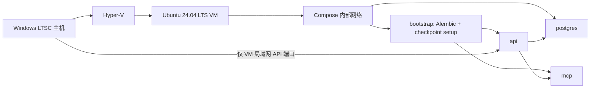

# OperCerta Docker/Linux 运行时与健康检查设计

**文档状态：** 用户已确认设计；尚未实施
**设计日期：** 2026-07-16
**适用范围：** 已完成的“库存不足 → 补货工单”后端纵向切片
**发布状态：** `OperCerta release gate: CLOSED`

## 1. 目标与边界

本设计把已在 Windows 原生 PostgreSQL 环境验证的库存补货后端，放入一个真实 Ubuntu Linux 虚拟机中的 Docker Compose 环境重复验证。交付物必须能从干净的 Ubuntu VM 构建镜像、启动当前必要服务、完成迁移/bootstrap、返回健康状态，并运行一条真实 API → MCP → PostgreSQL 补货 Smoke Test。

本阶段不实现 React、SSE、JWT/RBAC、设备场景、真实模型、Redis 业务使用、Caddy、Prometheus、GitHub Actions 或公开部署。它们仍是最终发布门禁的一部分，但不能被伪装为本阶段已完成。

## 2. 环境决策

当前主机为 Windows 10 Enterprise LTSC 2021，build `19044.5011`；`docker` 命令不存在，WSL 和 VirtualMachinePlatform 功能未启用。最新版 Docker Desktop 的 Windows 官方最低要求是 Windows 10 22H2 build `19045`，当前 LTSC build 不在支持范围。[Docker Desktop Windows 安装要求](https://docs.docker.com/desktop/setup/install/windows-install/)

因此采用下列环境，而不安装过期 Docker Desktop：

1. Windows 主机启用 Hyper-V，用户手动重启。
2. 使用 Hyper-V 创建 Ubuntu 24.04 LTS 虚拟机。
3. 在 Ubuntu VM 内从 Docker 官方 APT 仓库安装 Docker Engine、Buildx 和 Compose plugin。
4. 在 Ubuntu VM 内执行镜像构建、Compose 启动和证据命令。

主机 CPU 已观测到 BIOS 虚拟化和 SLAT 可用，Hyper-V 功能尚未启用。Windows 10 Enterprise 支持 Hyper-V；Ubuntu 24.04 LTS 是 Docker Engine 官方支持的 Ubuntu 版本。[Microsoft Hyper-V 安装说明](https://learn.microsoft.com/en-us/windows-server/virtualization/hyper-v/get-started/Install-Hyper-V) [Docker Engine Ubuntu 安装说明](https://docs.docker.com/engine/install/ubuntu/)

虚拟机的实际 CPU、内存、磁盘分配必须在创建时记录为观测事实；本设计不把推荐配置写成容量承诺。

## 3. 运行时拓扑



Compose 仅包含四个服务：

| 服务 | 职责 | 对宿主机暴露 |
| --- | --- | --- |
| `postgres` | 业务表和 `langgraph` Schema 的持久化存储 | 否 |
| `bootstrap` | 受控执行 Alembic `upgrade head` 和显式 checkpointer `setup()`，成功后退出 | 否 |
| `mcp` | 四个库存补货 MCP 工具及内部健康检查 | 否 |
| `api` | FastAPI 操作 API、启动恢复和健康检查 | 是，且仅供 Ubuntu VM 所在私有网络验证 |

PostgreSQL 与 MCP 不发布宿主机端口；API 在容器内监听 `0.0.0.0`，通过 `PORT` 配置端口。生产公网入口、TLS 和 Caddy 不属于本阶段。

## 4. 镜像、进程与初始化契约

- 使用一个固定 Python 3.12 Linux 基础镜像构建 API、MCP 和 bootstrap；依赖必须由现有 `uv.lock` 的 `uv sync --frozen --all-groups` 安装。
- 应用镜像以非 root 用户运行；不挂载 Docker Socket、不使用特权容器、不在运行时下载未锁定 Python 依赖。
- `bootstrap` 等待 PostgreSQL container healthcheck 成功后执行。它必须可重跑：已升级的 Alembic revision 和已创建的 checkpoint Schema 不得导致失败。
- API 与 MCP 只能在 bootstrap 成功退出后启动。API production lifespan 保持“不自动迁移、不自动 setup”的既有契约。
- 容器内数据库地址使用 Compose 服务名 `postgres`，不是 Windows 回环地址；密码仅通过未跟踪环境文件注入。
- Linux 运行使用 Uvicorn 的默认兼容事件循环；Windows 上曾需显式 Selector loop 的事实保留在证据中，但不得被误写为 Linux 已验证结论。

## 5. 健康检查契约

### 5.1 API liveness

`GET /health/live` 只证明 API 进程可路由，固定返回 HTTP `200`：

```json
{"status":"live"}
```

它不得连接数据库、MCP 或 checkpointer；依赖不可用时仍应返回 `200`，从而与 readiness 有明确区别。

### 5.2 API readiness

`GET /health/ready` 依次验证当前切片实际依赖：PostgreSQL 连接、LangGraph checkpointer 连接和 MCP 健康端点。三项均可用时固定返回 HTTP `200`：

```json
{"status":"ready","dependencies":{"database":"ready","checkpoint":"ready","mcp":"ready"}}
```

任何一项不可用时返回 HTTP `503`，只返回稳定的依赖状态名和 `not_ready`，不得返回 URL、密码、异常文本或 traceback。readiness 仅用于容器编排和本地验证，未来公网入口不得直接暴露细节。

### 5.3 MCP 内部健康

MCP ASGI 包装层提供内部 `GET /health/live` 与 `GET /health/ready`。MCP liveness 不访问数据库；MCP readiness 只验证自身数据库连接。该包装层继续把 Streamable HTTP MCP 路径固定为 `/mcp`，四个工具名称和现有契约不变。

### 5.4 Redis 的阶段边界

详细设计中的最终 readiness 包含 Redis，但当前代码没有缓存、限流、SSE 或 Redis 依赖注入。当前阶段不得新增一个未被业务使用的 Redis 容器来制造“已验证”印象。Redis 会在对应业务能力实现时加入 Compose、readiness 与发布门禁；这只是阶段顺序，不是删除最终要求。

## 6. 配置、安全与数据持久化

- 跟踪 `.env.compose.example`，只列出变量名和安全示例；真实 `.env.compose` 被 `.gitignore` 忽略。
- 变量至少包含 PostgreSQL 用户、密码、数据库名、`OPERCERTA_DATABASE_URL`、MCP 内部 URL、超时、审批 TTL、Mock 模式和 API `PORT`。不得把真实值写进 compose 文件、日志、测试快照或 Git。
- PostgreSQL 使用命名 volume 保存数据；数据清理只能通过显式、人工确认的 `docker compose down -v`，普通停止和重启不得删除 volume。
- 合成 JSON 种子仅从镜像只读文件提供；不挂载原单位材料、主机目录或 Docker Socket。
- Compose 网络只允许服务间需要的通信；本阶段无公网暴露和无 Caddy 反向代理。

## 7. TDD 与 Linux 验收

实现必须先为下列行为写测试：

1. API liveness 在依赖不可用时仍返回固定 `200`。
2. API readiness 对数据库、checkpoint、MCP 的任一失败返回安全 `503`，成功时返回精确依赖状态。
3. MCP liveness/readiness 与 `/mcp` 工具路径可共存，四个工具仍可列出。
4. bootstrap 不由 API lifespan 隐式替代；它完成后服务才开始依赖连接。
5. Compose 配置不发布 PostgreSQL/MCP 端口，容器不是 privileged，运行用户不是 root。

Ubuntu VM 中的验收顺序固定为：

1. 记录 Ubuntu、Docker Engine、Compose、Buildx、镜像 digest 和 Git commit。
2. 运行 `docker compose config -q`。
3. 从干净构建缓存状态执行 `docker compose up --build --wait`。
4. 验证 `bootstrap` 成功退出，其他长期服务健康。
5. 由 VM 外部 API 客户端调用 `/health/live`、`/health/ready`、创建 operation、查询 binding、批准、重复批准。
6. 在 `postgres` 容器内只查询目标 operation 的审批、工单和有序审计，断言一条审批、一条工单和正确终态事件。
7. 重启 API 与 MCP，重做至少一个审批等待后的恢复验证。
8. 运行现有 Pytest、Ruff、mypy，并将命令结果归档为 Linux/Compose 证据。

这些命令结果只证明本机 Ubuntu VM 的单节点演示环境，不构成高可用、性能、SLA 或公网发布声明。

## 8. 失败、回滚与证据

- 容器启动失败时先保留 `docker compose ps`、安全日志摘要、退出码和健康状态；不复制环境变量、URL 或密码。
- bootstrap 失败时 API/MCP 不得宣称 ready；修正原因后重新运行 bootstrap，而非手工修改数据库 revision。
- 普通回滚使用上一个 Git commit 重建镜像并 `docker compose up --build --wait`。删除 named volume 是破坏性数据操作，必须单独取得用户确认。
- 证据文档须记录环境版本、镜像 digest、Git commit、命令、结果、已验证不变量、未验证范围和回滚点。

## 9. 完成定义与下一边界

本设计完成时只代表“库存补货后端在 Ubuntu Docker Compose 单节点环境中可重复启动和验证”。它不打开发布门禁，也不允许开始 ForenTrail。

Docker/Linux 阶段通过后，仍按详细设计依次处理设备场景、身份与人工接管、前端/SSE、固定评测与安全回归、Redis、可观测性、CI/CD、Caddy/HTTPS 和公开演示。
