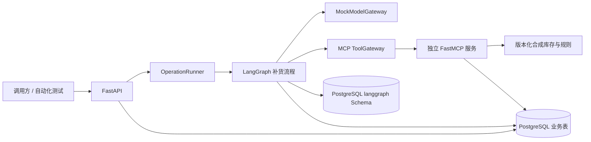
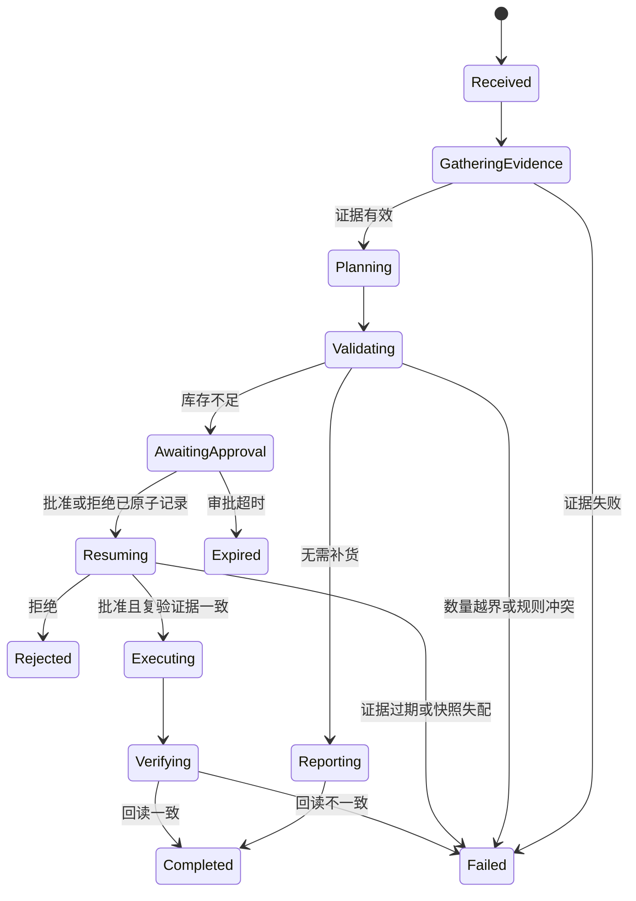

# OperCerta 库存不足到补货工单纵向闭环设计

**文档状态：** 用户已确认，实施计划已创建，待 TDD 执行

**设计日期：** 2026-07-16

**适用仓库：** `D:\CODEX\agent-portfolio\opercerta`

**前置基线：** 可靠性内核 Task 1–6，本地总门禁提交 `f5d2de7`

**发布状态：** `OperCerta release gate: CLOSED`

## 1. 目标

实现 OperCerta 的第一个可运行业务闭环：

```text
库存补货请求
  → 真实 MCP 库存与规则取证
  → 确定性库存计算
  → 结构化补货计划
  → 人工审批 interrupt
  → 真实 MCP 模拟工单写入
  → MCP 工单回读验证
  → PostgreSQL 审计与 API 结果
```

本闭环证明 Agent 能组织证据与计划，但不能修改业务事实、绕过规则、绕过审批或重复创建工单。

## 2. 已确认业务规则

### 2.1 库存不足判断

```text
available_quantity = on_hand_quantity - reserved_quantity
```

当 `available_quantity < reorder_point` 时判定库存不足。

建议补货量为：

```text
recommended_quantity = target_stock - available_quantity
```

库存数量、补货点、目标库存和建议补货量均由确定性 Python 代码计算。模型只能解释结果，不能修改数值。

### 2.2 正常库存

当 `available_quantity >= reorder_point` 时：

- 返回“当前无需补货”的证据报告；
- 不生成可执行补货计划；
- 不进入人工审批；
- 不创建工单；
- 写入正常完成审计并进入 `completed`。

### 2.3 强制审批

所有补货写操作均必须人工审批，不提供数量或金额免审批通道：

- 库存不足只允许系统提出建议；
- 审批前工单数必须为零；
- 批准后才允许调用 `work_order.create`；
- 拒绝、过期、重复审批或审批快照失配均不得创建工单。

### 2.4 证据安全关闭

库存或规则证据缺失、超时、格式错误、未知、过期或不可校验时：

- 不计算可执行补货量；
- 不生成可执行计划；
- 不进入审批；
- 不调用写工具；
- 保存稳定错误码和已有安全证据；
- 允许用户重新发起新的取证操作。

规则工具不可用时，写路径必须关闭。

### 2.5 审批绑定证据快照

审批对象必须绑定：

- 库存证据 ID；
- 规则证据 ID；
- 规则版本；
- 决策事实哈希；
- 计划哈希；
- 建议补货量。

批准后、写入前重新调用库存和规则只读工具。新证据 ID 可以不同，但决策相关事实必须与审批时一致。库存数量、预留数量、补货点、目标库存、规则版本或建议补货量发生变化时，旧批准不得执行，操作安全失败或重新取证，并要求新计划重新审批。

## 3. 实施范围

### 3.1 本轮包含

- 独立 FastMCP Streamable HTTP 工具服务；
- 四个真实 MCP 工具；
- 严格 Pydantic 工具输入和输出契约；
- 版本控制内的合成库存与规则种子；
- Mock 结构化模型网关；
- 库存补货 LangGraph；
- FastAPI 创建、查询和审批接口；
- evidence、审批绑定与操作结果数据库迁移；
- 正常库存、证据失败、批准、拒绝、过期、竞态、幂等和重启测试；
- 中文开发日志、实施证据和边界说明。

### 3.2 本轮不包含

- 设备查询和维修工单；
- `equipment.get_status`；
- React 前端；
- SSE；
- JWT、RBAC 和多租户隔离；
- 真实模型调用；
- Redis 缓存；
- OpenTelemetry、Prometheus 和性能评测；
- Docker/Linux 一致性验证；
- 公开部署。

这些能力仍属于 OperCerta 后续阶段。它们未完成时发布门禁保持关闭。

## 4. 方案选择

采用“真实 MCP 后端纵向切片”：

- FastAPI 和 LangGraph 通过 MCP 客户端访问独立 FastMCP 服务；
- 工具服务真实运行和校验协议，不用进程内函数冒充 MCP；
- 模型先使用确定性 Mock 网关，避免把模型网络故障与工具、数据库和恢复问题混在同一实施阶段；
- API 先完成可测试业务接口，React 和 SSE 后接。

未选择进程内模拟工具，因为它不能验证 MCP 传输、工具白名单和跨服务错误边界。未选择一次完成全栈，因为会同时引入模型、认证、前端和部署故障面。

## 5. 架构和职责



| 组件 | 负责 | 不负责 |
| --- | --- | --- |
| FastAPI | 请求校验、操作创建、结果查询、审批入口、稳定 HTTP 映射 | 库存计算、直接写工单 |
| OperationRunner | 运行到稳定边界、恢复操作、调用过期扫描 | 保存唯一业务真相 |
| LangGraph | 节点顺序、条件路由、interrupt、恢复 | 自行决定事实和权限 |
| Domain | 证据、规则、风险、计划、哈希和错误契约 | 网络和数据库会话 |
| MockModelGateway | 返回契约一致的意图和解释 | 改写事实、数量、规则、权限 |
| MCP ToolGateway | 固定 allowlist、超时、有限尝试、Pydantic 复验 | 动态接受模型提供的工具名 |
| FastMCP 服务 | 查询合成事实、幂等创建和回读模拟工单 | 解释自然语言、审批决策 |
| Repository | 事务、状态、证据、审批、工单、审计 | 流程路由 |

## 6. MCP 工具契约

首切片固定注册四个工具。客户端也固定同一 allowlist。

### 6.1 `inventory.get_snapshot`

输入：

```text
sku: 非空、长度受限、只允许已定义标识字符
```

输出：

```text
evidence_id
sku
on_hand_quantity
reserved_quantity
captured_at
source_version
```

约束：

- `on_hand_quantity` 和 `reserved_quantity` 为非负整数；
- 允许预留量大于在库量，此时可用库存为负数，代表超额预留；
- 时间必须包含时区；
- SKU 不存在返回 `inventory_not_found`。

### 6.2 `policy.list_constraints`

输入：

```text
action: 固定为 replenish_inventory
sku
```

输出：

```text
evidence_id
action
sku
reorder_point
target_stock
minimum_order_quantity
maximum_order_quantity
evidence_ttl_seconds
approval_required = true
rule_version
captured_at
```

约束：

- 所有数量为非负整数；
- `target_stock > reorder_point`；
- `minimum_order_quantity > 0`；
- `maximum_order_quantity >= minimum_order_quantity`；
- `evidence_ttl_seconds > 0`；
- 本闭环拒绝 `approval_required = false` 的规则。

若计算出的建议补货量不在允许上下限内，系统不得静默截断或扩大数量，返回 `replenishment_quantity_out_of_policy` 并关闭写路径。

### 6.3 `work_order.create`

输入：

```text
operation_id
sku
quantity
idempotency_key
approved_plan_hash
```

输出沿用 `WorkOrderWriteResult`，包含工单记录和 `replayed`。

工具服务必须复用现有 PostgreSQL `WorkOrderRepository` 语义：

- operation 必须存在；
- 必须有已批准决定；
- operation 必须处于允许写入状态；
- 幂等键为 `work-order:v1:{operation_id}`；
- 同键同参返回原工单；
- 同键异参返回冲突；
- 工单与 `work_order_created` 审计同事务提交。

### 6.4 `work_order.get`

输入为 `work_order_id`，输出完整工单事实。工作流必须比较 ID、operation_id、SKU、数量和 payload hash；创建响应本身不能作为完成证据。

### 6.5 传输边界

- MCP 服务仅绑定本机回环地址；公开部署阶段改为容器内网；
- 服务 URL 和超时来自环境配置，不进入 checkpoint；
- 每个工具调用有显式超时；
- 读工具和幂等工具最多两次传输尝试，第二次必须携带同一请求和幂等键；
- 未知工具在客户端 allowlist 层拒绝；
- MCP 原始异常只记录安全分类，不进入 API 响应或 checkpoint。

## 7. 合成数据

库存和规则种子采用仓库内版本化 JSON 文件，从零创建，不引用旧公司材料。FastMCP 服务启动时使用 Pydantic 完整校验，任何非法种子使 readiness 失败，不在请求中临时补默认值。

至少包含：

- 一个库存正常 SKU；
- 一个库存不足 SKU；
- 一个超额预留 SKU；
- 一个会触发数量越界的 SKU；
- 一个用于证据变化和审批快照失配的可控测试 SKU。

种子只支持演示和测试，不能表述为真实企业库存数据。

## 8. 模型边界

定义可替换的 `ModelGateway` 端口。本轮实现 `MockModelGateway`：

- 写请求必须提供 `requested_action=create_work_order`、`object_type=inventory` 和 SKU；
- `message` 仅用于展示和审计；
- Mock 网关返回契约化意图与简短计划说明；
- 动作固定在 allowlist；
- evidence IDs 必须来自已保存证据；
- 风险、补货量、审批要求、计划核心字段和工作单 payload 全部由确定性服务提供；
- Mock 模式在应用启动时固定，不能在单次请求失败后偷偷切换。

本轮不宣称完成自然语言理解或真实 LLM 效果评测。

## 9. 领域模型与哈希

新增或扩展严格、冻结、`extra="forbid"` 的模型：

- `InventoryEvidence`
- `PolicyEvidence`
- `EvidenceBundle`
- `InventoryPosition`
- `ReplenishmentAssessment`
- `ReplenishmentPlan`
- `ApprovalBinding`
- `OperationResult`
- `OperationError`

规范化哈希使用 UTF-8、键排序、紧凑分隔符和 `allow_nan=False` 的 canonical JSON，再计算 SHA-256。

`decision_facts_hash` 只包含会影响决定的稳定事实：

```text
sku
on_hand_quantity
reserved_quantity
reorder_point
target_stock
minimum_order_quantity
maximum_order_quantity
approval_required
rule_version
```

它不包含新取证时必然变化的 evidence ID 和采集时间。审批仍保存原 evidence IDs 供审计；执行前重新取证后使用 `decision_facts_hash` 判断业务事实是否变化。

`plan_hash` 至少包含：

```text
action
sku
recommended_quantity
decision_facts_hash
rule_version
```

## 10. 数据库设计

新增 Alembic revision `0002_inventory_replenishment`，不得修改已发布的 `0001_reliability_kernel`。

### 10.1 `evidence`

```text
id UUID primary key
operation_id UUID foreign key
evidence_id string
evidence_type string
source_tool string
source_version string
captured_at timestamptz
expires_at timestamptz
content JSONB
content_hash char(64)
created_at timestamptz
unique(operation_id, evidence_id)
```

每次工具返回均保存原始已校验内容。初次取证和执行前复验使用不同 evidence 行。

### 10.2 `operations` 扩展

新增：

```text
result_payload JSONB nullable
error_code string nullable
approval_expires_at timestamptz nullable
```

`request_payload` 继续保存 `schema_version=1` 的 JSON-only `OperationSnapshot`，在初始创建时使用空的 risk/plan/work_order payload，计划形成后通过仓储原子替换为完整快照。旧可靠性测试和历史快照无需重写。

### 10.3 `approvals` 扩展

新增：

```text
inventory_evidence_id string
policy_evidence_id string
rule_version string
decision_facts_hash char(64)
plan_hash char(64)
recommended_quantity bigint
```

审批提交命令携带客户端看到的 expected binding。Repository 在 operation 行锁内将它与当前快照比较；任何字段不一致返回 `approval_snapshot_mismatch`，不插入审批。

### 10.4 保留不变量

- 每个 operation 最多一条审批；
- 每个 operation 最多一条工单；
- 幂等键唯一；
- 每个 operation 内审计 sequence 唯一；
- 业务表位于 `public`，checkpoint 位于 `langgraph`；
- 所有状态变更与对应业务审计同事务提交。

## 11. 状态与数据流



主流程：

1. FastAPI 严格校验并持久化 operation；
2. runner 运行图到稳定边界；
3. 通过 MCP 并行取得库存和规则；
4. 工具输出经 Pydantic 复验后写入 evidence；
5. 确定性服务计算可用库存和补货量；
6. 正常库存直接报告完成；
7. 证据或规则问题安全失败；
8. 库存不足保存完整快照和审批绑定，设置过期时间并 interrupt；
9. 审批 Repository 原子写入决定和 `resuming`；
10. 拒绝进入 `rejected`；
11. 批准后重新取证并比较事实和计划；
12. 一致时调用 `work_order.create`；
13. 调用 `work_order.get` 回读；
14. 一致后进入 `completed`，否则进入 `failed`。

## 12. 审批过期

首切片实现持久化 `ApprovalExpiryService`：

- 审批请求写入 `approval_expires_at`；
- 审批提交前在同一 operation 行锁内检查当前时间；
- 已过期时原子进入 `expired` 并写 `approval_expired` 审计，不接受决定；
- 应用启动恢复扫描调用同一服务；
- OperationRunner 的本地周期扫描调用同一服务；
- 测试可以注入时钟，不能依赖真实等待。

该设计保证过期批准不能写工单。首切片只证明单 Worker 本地扫描与重启补偿，不宣称多 Worker 分布式调度或精确到秒的生产 SLA。

## 13. API 契约

### 13.1 `POST /api/v1/operations`

请求使用现有 `OperationRequest`。本闭环要求：

```text
requested_action = create_work_order
object_type = inventory
object_id = SKU
```

API 先持久化，再运行到 `completed`、`failed` 或 `awaiting_approval` 稳定边界，返回 `202`：

```text
operation_id
status
created_at
```

### 13.2 `GET /api/v1/operations/{operation_id}`

返回当前业务事实：

```text
operation_id
status
request
evidence[]
assessment
plan
approval
work_order
result
error
last_audit_sequence
```

数据库连接、traceback、内部 MCP URL、密钥和未脱敏原始异常不得返回。

### 13.3 `POST /api/v1/operations/{operation_id}/approval`

请求包含：

```text
approver_id
decision
reason
expected_inventory_evidence_id
expected_policy_evidence_id
expected_rule_version
expected_decision_facts_hash
expected_plan_hash
expected_recommended_quantity
```

Repository 先完成原子决定，再由 runner 恢复图。返回 `202` 和当前状态。重复决定、过期和快照失配返回 `409` 稳定错误。

本轮没有 JWT。`operator_id` 和 `approver_id` 仅是本地演示审计字段，不构成可信身份或 RBAC，README 和证据必须明确这一限制。

## 14. 稳定错误契约

| 错误码 | 语义 | 写工具是否允许 |
| --- | --- | --- |
| `inventory_not_found` | SKU 不存在 | 否 |
| `evidence_unavailable` | 库存或规则工具不可用 | 否 |
| `evidence_expired` | 决策或执行时证据过期 | 否 |
| `invalid_inventory_evidence` | 库存工具返回不合法 | 否 |
| `invalid_policy_evidence` | 规则工具返回不合法 | 否 |
| `replenishment_not_required` | 库存正常的成功结果 | 否 |
| `replenishment_quantity_out_of_policy` | 建议量超出规则上下限 | 否 |
| `approval_already_decided` | 已有决定或状态不允许再次审批 | 否 |
| `approval_expired` | 审批窗口已过期 | 否 |
| `approval_snapshot_mismatch` | 提交或执行时绑定事实变化 | 否 |
| `unknown_tool` | 工具名不在 allowlist | 否 |
| `work_order_conflict` | 同幂等键携带不同参数 | 否 |
| `work_order_verification_failed` | 创建后回读不一致 | 已存在的事实保留，不再新增 |

API 只返回稳定错误码和安全说明。内部异常通过异常链记录在本地结构化日志中，但不得包含连接密码或密钥。

## 15. 重启恢复

复用已验证的 RecoveryCoordinator 和恢复矩阵：

- 初次取证前无 checkpoint：从 operation 请求重建；
- 等待审批时重启：保持等待或在已过期时原子过期；
- 审批落库后重启：使用原决定恢复；
- 工单创建后重启：同一幂等键重放，返回原工单；
- 验证阶段重启：回读已有工单；
- 终态操作：no-op。

纵向闭环新增的 evidence 和审批 binding 均是业务事实。恢复不得从模型输出或 checkpoint 猜测缺失证据。

## 16. TDD 验收矩阵

### 16.1 单元测试

- 非法 SKU；
- 负数、非整数、NaN、无限值和非法时间；
- `target_stock <= reorder_point`；
- 非法上下限和 TTL；
- 正常库存判断；
- 负可用库存；
- 正确建议补货量；
- 数量越界拒绝而非截断；
- evidence、decision facts 和 plan canonical hash；
- ModelGateway 不得改写确定性字段；
- 未知工具拒绝；
- 稳定错误到 HTTP 的映射。

### 16.2 MCP 契约测试

- 四工具名称和 Schema；
- 合成 SKU 正常与短缺返回；
- 不存在 SKU；
- 非法工具输出被客户端复验拒绝；
- 超时与最多两次尝试；
- 未知工具不发送到服务端；
- `work_order.create` 未批准时拒绝；
- `work_order.get` 回读一致。

### 16.3 PostgreSQL 集成测试

- `0002` upgrade、downgrade、upgrade；
- evidence 唯一约束和 JSON 内容；
- 审批绑定原子写入；
- 十路审批竞态仍只有一个决定；
- 过期审批不能插入决定；
- 快照失配不能插入决定；
- 相同工单命令只产生一行和一条创建审计；
- 同键异参冲突；
- operation、审批、工单和审计状态一致。

### 16.4 Workflow 集成测试

- 正常库存：`completed`、零审批、零工单；
- 库存不足：正确数量并 interrupt；
- 证据缺失、过期、格式错误：`failed`、零工单；
- 拒绝：`rejected`、零工单；
- 超时：`expired`、零工单；
- 批准：复验证据、创建、回读、`completed`；
- 执行前事实变化：`approval_snapshot_mismatch`、零新工单；
- 回读不一致：`work_order_verification_failed`；
- 四个重启点和工单预写重放；
- checkpoint 只含 plain JSON。

### 16.5 API 集成测试

- 创建请求返回 `202`；
- 查询返回证据、计划、状态和审计序号；
- 正常、失败、等待、批准、拒绝响应；
- 重复审批、过期和快照失配返回 `409`；
- 未知 operation 返回 `404`；
- Pydantic 请求错误返回 `422`；
- 响应和日志扫描不包含数据库密码、连接 URL 或内部 traceback。

## 17. 完成门禁

本纵向切片只有在以下条件全部新鲜通过后才可标记完成：

- 四个真实 MCP 工具通过契约和传输测试；
- Mock 模型、领域计算、LangGraph 和 FastAPI 闭环可运行；
- 正常、证据失败、批准、拒绝、过期和快照变化路径通过；
- 审批前写入次数为零；
- 十路并发审批只接受一个决定；
- 并发或重启重放只保留一张工单；
- 创建后回读一致才完成；
- Alembic 升降级成功；
- 完整测试、Ruff、format、mypy 和凭据扫描通过；
- 结果证据记录真实命令和计数，不把设计阈值写成成绩。

通过本门禁只表示“库存不足到补货工单后端纵向切片已验证”，不表示 React、认证、真实模型、Docker/Linux 或公开发布完成。

## 18. 回滚与实施边界

- 规格前基线：`f5d2de7`；
- 数据库回滚：`alembic downgrade 0001_reliability_kernel`；
- 可靠性内核既有契约必须继续通过；
- 不修改或删除历史迁移；
- 不启动 ForenTrail 或其他项目；
- 不创建发布 tag，不填写虚构效果指标。

下一步只允许按 `docs/superpowers/plans/2026-07-16-inventory-replenishment-vertical-slice.md` 从 Task 1 的领域 RED 开始；不得跨 Task 抢跑。
