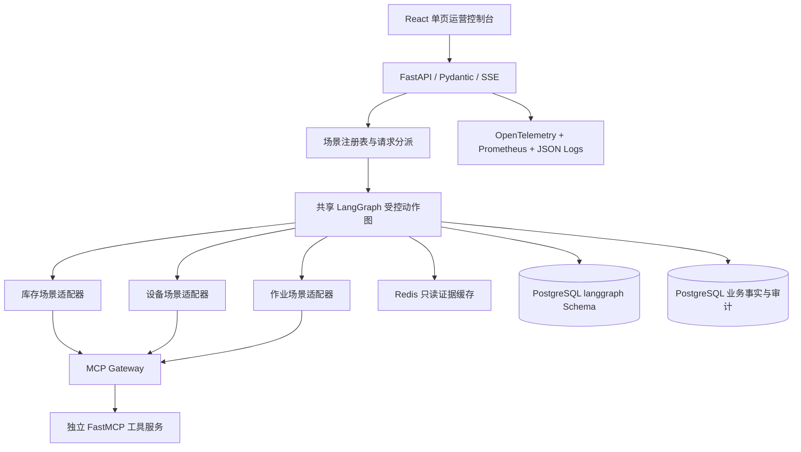

# OperCerta 三业务闭环与求职发布设计修订

> 状态：用户已于 2026-07-20 确认三业务方向；本文等待书面复核后进入实施计划
>
> 适用范围：OperCerta 主线收口、求职演示发布、学习与面试交付
>
> 修订关系：本文补充并修订 `docs/specs/2026-07-14-opercerta-design.md` 中未具体定义的“作业异常”范围，以及首版对象类型和 MCP 工具数量；未被本文明确修改的命名、组合、总体和 OperCerta 详细设计继续有效

## 1. 修订原因与当前事实

四份正式设计把 OperCerta 定位为面向库存、设备和作业异常的智能运营处置 Agent，但原详细设计只冻结了库存、设备两类对象以及补货、维修两类工单，没有给“作业异常”定义对象、证据、规则、工具和执行动作。当前代码又只完成了库存不足到补货工单的纵向闭环。

因此，继续实施前必须书面补齐第三业务，避免两种错误：一是把单一补货案例误报为完整 OperCerta；二是在代码中临时创造一个没有设计依据的场景。本修订选择“三个真实纵向业务 + 一套共享可靠性内核”，不增加自由对话型多 Agent，也不复制三套审批和恢复机制。

当前已经验证、必须保留的基础包括：FastAPI/Pydantic 契约、LangGraph interrupt 与 PostgreSQL checkpointer、审批绑定和原子竞态、幂等工单、FastMCP 独立服务、PostgreSQL 业务事实和审计、React/SSE 控制台、WSL2 Ubuntu Docker Compose、GitHub Actions、固定补货评测与公开静态专题。上述事实不自动证明新增业务已经完成。

## 2. 产品范围

### 2.1 三个业务闭环

| 业务 | 合成输入与证据 | 确定性判断 | 受控动作 | 典型终态 |
| --- | --- | --- | --- | --- |
| 库存异常 | SKU、在库量、预留量、采集时间、补货规则 | 可用量低于补货点且建议数量在策略范围 | 人工批准后创建补货工单 | completed、rejected、expired、failed、无需补货的 completed |
| 设备异常 | 设备状态、告警代码、严重度、最后心跳、维修规则 | 告警达到维修条件或心跳超过允许间隔 | 人工批准后创建维修工单 | completed、rejected、expired、failed、无需维修的 completed |
| 作业异常 | 作业任务状态、截止时间、最后进展时间、阻塞原因、重试次数、恢复规则 | 任务已阻塞或逾期且满足恢复工单条件 | 人工批准后创建异常恢复工单 | completed、rejected、expired、failed、无需恢复的 completed |

第三业务使用从零定义的合成“作业任务”，不采用原单位名称、编号、流程、规则值或接口。首版只处理任务阻塞和超时，不扩展到排班、财务、人员绩效、自动调度或真实设备控制。

### 2.2 三类只读查询

`query` 路径支持库存快照、设备状态和作业任务状态。只读请求完成取证、校验和证据化报告后直接进入 `completed`，不得创建审批或工单。查询结果必须包含证据 ID、采集时间、来源版本和已知限制。

### 2.3 三类模拟写入

`create_work_order` 路径根据 `object_type` 选择固定场景动作：

- `inventory` → `replenish_inventory`；
- `equipment` → `repair_equipment`；
- `task` → `recover_blocked_task`。

三类动作都必须经过证据新鲜度、确定性规则、计划 allowlist、RBAC、一次性审批、批准后事实重取、幂等写入和写后读验证。LLM 只能生成结构化解释，不能决定风险、审批要求、数量、严重度、超时阈值或数据库写入。

## 3. 架构设计

### 3.1 共享可靠性内核

共享图保留原详细设计的节点语义：解析请求、收集证据、确定性评估、生成解释、验证计划、等待审批、批准后重取事实、执行工单、回读验证和生成报告。场景适配器只负责本业务的类型化证据、规则计算、计划参数、审批绑定和工单命令。

场景接口必须至少表达以下能力，具体 Python 签名在实施计划中锁定：

- 校验目标对象和请求动作；
- 声明所需只读 MCP 工具；
- 把工具结果转换为严格证据模型；
- 运行不依赖 LLM 的确定性评估；
- 构建只允许一步动作的计划；
- 生成绑定证据、规则版本、事实哈希、计划哈希和关键参数的审批快照；
- 批准后重新取证并比较绑定事实；
- 生成类型化工单命令与终态结果。

不得为了复用而把所有场景塞入无约束 `dict`。公共外壳可以使用带判别字段的 Pydantic union，领域内部保留库存、设备、作业三个独立模型。

### 3.2 数据与迁移

现有 `operations`、`approvals`、`work_orders`、`audit_events` 和 JSON 快照具备跨场景基础，但现有仓储和验证代码包含补货专用模型。实施时通过新 Alembic 迁移扩展证据类型、对象类型和必要索引，不重写历史迁移，不删除已有补货证据。

业务表继续是审批、工单、审计和对外查询的权威事实；LangGraph checkpointer 只保存控制流快照。恢复语义继续是“节点可能至少执行一次、业务写入有效一次”，不得表述为 exactly-once。

### 3.3 MCP 工具修订

原详细设计固定五个 MCP 工具；本修订增加第三业务后固定为六个：

1. `inventory.get_snapshot`
2. `equipment.get_status`
3. `task.get_status`
4. `policy.list_constraints`
5. `work_order.create`
6. `work_order.get`

`policy.list_constraints` 接受受控 action、object type 和 object id；`work_order.create` 接受三种判别式命令之一。客户端和服务端都执行名称 allowlist 和 Pydantic 二次校验。MCP 不公开到互联网，只有 API/Workflow 通过 Docker 内网访问。

### 3.4 Redis 边界

Redis 必须从“已安装但未使用”变成真实、可删除的工程能力：只缓存只读证据，以对象、来源版本和参数哈希构造键，设置短 TTL，并记录命中/旁路。审批绑定、批准后重取事实和写入验证禁止使用缓存。Redis 不可用时核心流程旁路缓存继续从 MCP 取证；不得把 Redis 当业务真相。

### 3.5 模型边界

保留 Mock 模型用于 CI 和离线演示，同时实现 OpenAI-compatible Real adapter。真实模型只输出意图或计划解释的严格结构；写动作在模型失败时安全失败，不能动态切换到 Mock 继续执行。代表性真实模型样本必须在同一契约下运行并记录 provider、model、Prompt 版本、Token、延迟、重试和费用快照；没有实际密钥和真实运行结果前不得写成功指标。

## 4. API 与前端

API 保持原五类端点，不按业务复制路由。`OperationRequest` 增加 `task` 对象类型，并让 `query` 与 `create_work_order` 在三类对象上按注册表校验。错误继续使用稳定安全错误码，未知对象、动作/对象不匹配、证据缺失、规则不可用、审批冲突和恢复冲突必须失败关闭。

前端改为同一界面内的三张场景卡或等价选择器：

- 库存不足补货；
- 设备告警维修；
- 作业阻塞恢复。

每个场景提供合成示例、只读查询和写入演示入口。共享区域展示节点时间线、证据、确定性判断、模型解释、审批、工单、审计和限制。切换业务不能重载到伪造的静态完成数据；本地交互模式必须调用真实 API，公网静态专题继续明确展示与真实后端的边界。

## 5. 可观测性与安全

在已有 request ID、结构化日志和 Prometheus 指标上补充 OpenTelemetry：API 请求、LangGraph 节点、MCP 调用、PostgreSQL 操作和 Redis 缓存使用关联 span，统一携带 `request_id`、`operation_id`、`thread_id` 和 `tool_call_id`。不记录 JWT、密钥、完整 Prompt、隐藏思维链或未经脱敏的工具内容。

安全基线继续包括短期演示 JWT、角色权限、确切 CORS、速率/预算限制、Prompt Injection 回归、工具 allowlist、参数边界、非 root 容器、秘密不进 Git，以及公网不暴露 MCP、PostgreSQL、Redis、Prometheus 管理入口。

## 6. 测试与评测

所有新增行为遵循 RED → GREEN → REFACTOR。测试分层如下：

- 领域单元测试：三类证据、确定性规则、计划、审批绑定、过期和非法输入；
- MCP 契约测试：六工具名称、输入输出、超时、Schema 错误和安全错误码；
- 数据库集成测试：迁移升降级、证据写入、原子审批、工单唯一性和有序审计；
- LangGraph 集成测试：三场景查询、批准、拒绝、过期、失败，以及四个重启点；
- API/RBAC 测试：三对象、两动作、四角色、SSE 重连和稳定错误；
- 前端测试：三场景创建、详情、审批、冲突、审计和真实契约映射；
- Compose smoke：三业务成功路径、至少一条拒绝路径、重复审批、数据库断言、API/MCP 重启恢复；
- 安全测试：未知工具、越权、注入、超预算、恶意对象 ID 和秘密扫描。

保留现有 30 条补货评测，不为使结果好看而删除或修改失败样本；新增设备与作业用例后形成跨业务版本化套件。书面计划可以规定样本数量和覆盖要求，但通过率、时延、成本和错误率只能在真实运行后写入证据。

性能实验按原规格执行串行/并行工具 × Redis 关闭/开启的 2×2 对照，固定数据、模型、Prompt、环境、并发和预热。结果输出 P50、P95、错误率、工具调用数、缓存命中和 Token/费用；不得把 Mock 延迟写成真实模型性能。

## 7. 运行、部署与发布门禁

### 7.1 本地与 CI

WSL2 Ubuntu 是标准开发和演示运行时。Docker Compose 至少运行 PostgreSQL、Redis、bootstrap、MCP、API 和 Web/静态资源所需服务；健康检查区分进程存活和依赖就绪。Windows 原生 PostgreSQL 可保留为历史开发备选，但最终发布证据来自 WSL2/Linux Compose。

GitHub Actions 继续执行仓库安全、Python 静态检查、PostgreSQL 完整测试、前端测试/构建和 main Compose smoke。新增三业务后必须在干净 main 上重新取得全绿结果，不沿用仅覆盖补货的旧结论。

### 7.2 求职演示发布门禁

只有同时满足以下条件，才能把 OperCerta 标记为“求职演示已发布”：

1. 三个业务的查询、批准执行、拒绝/过期和关键失败终态都有自动化证据；
2. 三个业务共享审批、幂等、恢复和审计内核，不存在绕过路径；
3. 六个 MCP 工具、Redis 缓存、OpenTelemetry、FastAPI、PostgreSQL、React/SSE 和 WSL2 Compose 都有可重复运行证据；
4. 固定跨业务评测、2×2 对照实验和真实模型代表性样本有原始报告；
5. GitHub main CI 全绿，仓库公开，Release Tag、部署/回滚说明和已知限制齐全；
6. 作品集和项目专题状态、链接与实际能力一致；
7. 具有一条命令启动、五分钟完整演示和失败排查手册；
8. 学习与面试交付达到第 8 节标准。

公网交互后端仍属于原上线门禁。部署前单独选择主机或可验证的托管环境，使用 Caddy/HTTPS、演示账号、限流、数据重置和非公开内部依赖；购买资源或产生持续费用必须取得用户批准。静态专题可继续作为无需等待冷启动的简历入口，但不能替代交互后端验收。

### 7.3 生产边界

求职演示发布不等于企业生产上线。企业 SSO、完整多租户、真实 ERP/WMS/CMMS、持久任务队列、多 Worker 租约、高可用、跨区域容灾和生产 SLA 继续列为演进项。简历使用“按企业级约束设计并完成的可部署 MVP”和“单节点演示环境”，不使用“生产高可用”。

## 8. 学习与面试交付

代码完成只是第一阶段。OperCerta 在开始 ForenTrail 前必须形成以简体中文为主、保留原生专业名词的学习包：

- `docs/learning/OperCerta核心技术手册.md`：按请求数据流解释 Python、Pydantic、FastAPI、LangGraph、MCP/FastMCP、PostgreSQL、Redis、React/SSE、OpenTelemetry、Docker Compose、WSL2、Git 和 GitHub Actions；每项说明为什么需要、删除后失去什么、替代方案和当前限制。
- `docs/learning/OperCerta手动实验手册.md`：从 WSL2 启动环境、运行测试、执行三业务、提交审批、查询数据库、重启服务、观察恢复、制造 Redis/MCP/模型故障到清理环境的逐步命令与预期现象。
- `docs/learning/OperCerta面试讲解.md`：30 秒项目定位、3 分钟业务演示、10 分钟架构讲解、核心追问、真实故障案例和不能夸大的边界。
- 更新 `docs/development-log/interview-casebook.md`：持续记录实施中真实出现的问题、根因、错误尝试、修复和验证。

掌握标准不是“读过文档”或“复制过命令”，而是用户能够完成以下闭环：

1. 看架构图说出一次请求经过的组件和事实来源；
2. 不依赖 Codex 启动环境并跑通至少一个业务；
3. 修改一个合成规则并预测、观察结果变化；
4. 主动停止一个依赖，解释失败关闭或降级行为；
5. 查询 PostgreSQL 区分业务事实与 LangGraph 检查点；
6. 解释为什么使用 MCP、为什么不保证 exactly-once、为什么需要批准后重新取证；
7. 根据岗位要求选择最相关的项目证据，而不是背诵技术名词。

学习文档随实现增量记录，项目门禁前再统一整理，避免为了写长文阻塞每个 TDD 小步。所有简历话术必须能回到源码、测试、报告、部署和用户手动复现中的至少一项真实证据。

## 9. 实施顺序与加速原则

主线顺序固定为：

1. 把现有补货专用边界提炼为受测试保护的共享场景接口，保持补货行为不变；
2. 实现设备查询与维修纵向闭环；
3. 实现作业查询与异常恢复纵向闭环；
4. 扩展前端、跨业务评测和 Compose smoke；
5. 接入 Redis、OpenTelemetry 与 Real model adapter，并执行对照和代表性验证；
6. 完成本地总门禁、远程 CI、交互部署、Release 与学习包；
7. OperCerta 求职演示门禁通过后开始 ForenTrail。

加快速度的手段是复用可靠性内核、限制每个场景为一个动作、复用 API/前端时间线和只写有验收价值的文档。不得通过删除非法输入、审批竞态、幂等、恢复、安全、评测或业务终态测试赶工；不得同时启动 ForenTrail 造成上下文和基础设施分散。

## 10. 非目标

- 不增加库存 Agent、设备 Agent 等自由讨论角色；
- 不加入采购、财务、排班、真实 ERP/WMS/CMMS 或物理设备控制；
- 不实现任意工具发现、任意 Shell、任意 SQL 或任意 Python；
- 不为展示关键词加入没有业务用途的 Kafka、Milvus、Kubernetes 或多 Agent；
- 不复用旧公司数据、接口、表结构、截图、品牌或专有规则；
- 不预写三业务通过率、性能提升、成本下降或生产 SLA；
- 不把公开静态页面、Mock 模型或本地单节点验证描述成完整生产上线。

## 11. 设计一致性结论

本修订保留命名规格中的 OperCerta 固定品牌和中文副标题，保留组合设计的顺序开发、清洁室、企业级边界和面试差异化，落实总体设计对库存、设备、作业异常以及共同技术栈的要求，并补齐 OperCerta 详细设计未定义的第三业务。唯一明确修改的是：首版对象从库存/设备扩展为库存/设备/作业任务，MCP 工具从五个扩展为六个，评测从补货单域扩展为跨三业务；其余状态、审批、恢复、安全、真实性和发布原则不降低。

