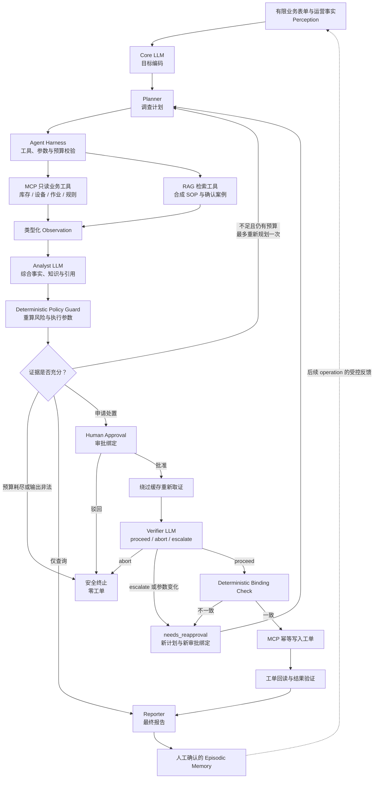

# OperCerta Agent 核心架构增强设计

> 状态：用户已于 2026-07-21 批准方案 B 与本文边界；尚未实施
>
> 适用范围：OperCerta 三业务的 Agent 能力、Memory、Tool Calling、Agent Trace 与控制台纠偏
>
> 修订关系：本文补齐 `docs/specs/2026-07-14-opercerta-design.md` 留白，并修订后续实现中“模型只生成说明文字”的降级；既有审批、幂等、恢复、安全和三业务规则继续有效

## 1. 修订原因与已核验事实

OperCerta 已完成库存补货、设备维修和作业异常恢复三条受控工单流程，并具备 FastAPI、LangGraph checkpoint/interrupt、FastMCP、PostgreSQL 原子审批、幂等工单、Redis、OpenTelemetry、React/SSE、Compose 和固定评测证据。上述能力证明了可靠工作流，但还不足以证明完整 Agent 闭环。

当前实现与原详细设计存在以下偏差：

- `OperationRequest.message` 由前端预置，API 同时要求前端直接给出对象、对象编号和动作，未形成独立 `IntentResult`；
- 真实模型只返回 `summary` 和 `rationale`，没有承担调查计划、受约束工具选择、证据综合或批准后复核；
- MCP 工具由 Python 图节点直接调用，而不是由模型提出受约束的只读 Tool Call；
- Prompt 以内联字符串存在，没有版本、角色、上下文预算和生命周期；
- Harness 的超时、重试、allowlist、验证和 Trace 分散在多个适配器中，没有统一运行契约；
- 没有知识检索或带引用的 RAG；
- OpenTelemetry span 和业务审计已存在，但控制台没有模型、工具、Observation、Guardrail 和恢复组成的 Agent Trace；
- `demo-admin` 原设计负责合成种子和评测，当前 API/UI 没有对应管理能力；
- 业务事实区没有完整呈现 evidence、plan、model explanation、binding、result 和失败依据。

因此，本次不是把传统工单页面改成聊天框，而是在可靠工单内核中补上受控 AI Agent 模块，使系统形成“感知 → 理解 → 规划 → 工具/记忆 → 执行 → 反馈”的可验证闭环。

发布门禁继续为 `CLOSED`。本文只定义批准设计，不声称新增 Agent 能力已经通过测试、真实模型、Compose 或公网验证。

## 2. 开源调研结论与技术选择

调研覆盖 LangGraph、LangChain Agent、LangChain Email Assistant、OpenAI Agents SDK、PydanticAI、Microsoft Agent Framework HITL、AWS Operational AI Agent、Azure Agent Starter、MCP Python SDK、AG-UI 和 Langfuse。可复用的共同模式是：

```text
Agent = Model + Instructions/Prompt + Typed Tools + Guardrails/Harness
      + Stateful Runtime + HITL + Trace + Evaluation
```

OperCerta 不复制这些仓库的代码、品牌、云资源或业务数据，只采用通用架构模式。具体选择如下：

1. **保留 LangGraph 作为唯一编排运行时。** OperCerta 需要低层状态控制、持久执行、HITL、条件路由和重启恢复，纯 LangChain Agent Loop 无法替代现有可靠性语义。
2. **选择性使用 LangChain 生态组件。** `langchain-core` 提供消息、Tool Schema 和结构化输出契约；Kimi OpenAI-compatible 契约探针通过后，`langchain-openai` 可作为模型适配器。不得引入 `langchain.create_agent`，不得在现有 `StateGraph` 内嵌第二套 Agent Loop，也不得为了简历关键词安装没有实际调用的顶层 `langchain` 包。LangGraph 仍是唯一状态、循环和恢复语义的所有者。
3. **实现 OperCerta 自有 Agent Harness。** 不新增 PydanticAI、OpenAI Agents SDK、CrewAI 或 Deep Agents 作为第二框架；它们只作为完整性参考。
4. **采用单 Agent Plan-and-Execute。** 不增加库存 Agent、设备 Agent、规则 Agent 等自由讨论角色；业务复杂度来自工具、状态、权限和恢复，不来自人格协作。
5. **使用 PostgreSQL + pgvector 作为语义记忆。** 不新增独立 Milvus/Qdrant 服务；准确库存、审批、工单和规则仍走 SQL/MCP 精确契约。
6. **自建面向业务用户的 Agent Trace。** OpenTelemetry 保留为工程观测；Agent Trace 是经脱敏的产品级解释数据。当前不引入 Langfuse 服务或迁移到 AG-UI 协议。

## 3. 产品边界与总体闭环

### 3.1 有限业务输入

控制台不提供自由聊天。operator 只能从合成目录选择：

- 场景：库存补货、设备维修、作业恢复；
- 对象：该场景允许的合成对象；
- 目标：查询状态或申请受控处置；
- 触发原因：场景预定义枚举；
- 期望处置：场景预定义动作；
- 可选优先级/说明：只能从受控选项生成，不接受任意 Prompt。

前端把选择提交为严格 `IntentEnvelope`。系统可以把它渲染为自然语言业务目标供用户阅读，但不得声称模型从自由文本中猜出了意图。

### 3.2 完整 Agent 闭环



图中的循环都是显式有界循环，而不是无限 ReAct：批准前最多重新规划一次；批准后任何动作、参数或对象变化都进入 `needs_reapproval` 并生成新计划、新 binding 和新审批；跨 operation 的虚线反馈只允许读取人工确认、脱敏和版本化的记忆。

### 3.3 安全不变量

- 模型可以建议，不能授予权限；
- 模型可以提出只读工具调用，不能直接调用写工具；
- 风险、数量、优先级、阈值、证据新鲜度和审批要求由确定性代码复算；
- `work_order.create` 只由批准后的确定性执行节点调用；
- 批准后 Verifier 只能返回 `proceed`、`abort` 或 `escalate`；
- Verifier 提出新动作、不同参数或不同对象时必须重新审批；
- RAG 内容不能覆盖结构化规则或业务事实；
- 任何依赖失败、输出非法、预算耗尽或事实不一致都失败关闭；
- 单个 operation 不允许无限模型/工具循环；批准前重新规划上限为一次；
- 不保存或展示模型隐藏 Chain-of-Thought。

## 4. 六层 Agent 架构

### 4.1 感知层 Perception

首版实现多源异构输入，而非图像/语音意义上的完整多模态：

- operator 的有限表单和可信 JWT 身份；
- MCP 返回的库存数量/预留量；
- 设备状态、告警和心跳；
- 作业状态、阻塞时间、截止时间和重试次数；
- 版本化规则、SOP 和人工审批反馈；
- 工单回读、失败码和恢复事实。

感知层输出 `PerceptionBundle`，只包含当前 operation 所需的类型化引用和紧凑摘要。图片、语音、视频、OCR 和任意附件解析不进入本次范围；后续只有出现明确仓储业务需求时才能另行设计。

### 4.2 语义理解与目标编码 Core LLM

`GoalEncoder` 接收 `IntentEnvelope`、角色、场景能力和可用只读工具摘要，输出严格 `GoalEncoding`：

- `goal`：有限目标枚举；
- `scenario` 和 `object_id`：必须与请求一致；
- `required_evidence`：允许证据类型子集；
- `success_condition`：有限成功条件；
- `uncertainties`：安全短文本列表。

模型不能改变场景、对象和目标动作。Harness 会用可信请求覆盖这些字段并拒绝冲突输出。

### 4.3 推理与规划 Reasoning & Planning

采用受控 Plan-and-Execute，而不是开放式无限 ReAct：

1. Planner 输出 `InvestigationPlan`；
2. Harness 校验工具名称、对象绑定、依赖顺序和预算；
3. Tool Executor 执行只读 MCP 调用；
4. Observation 以类型化摘要返回图状态；
5. Analyst 结合 Observation 与 RAG 引用输出 `AgentAnalysis`；
6. Policy Guard 复算业务参数并生成可信 `DecisionPlan`；
7. 缺少可补充证据时最多允许一次重新规划；
8. 非法工具、重复无效步骤或预算耗尽立即安全失败。

模型计划不是审批事实。只有经过 Policy Guard 验证并持久化的 `DecisionPlan` 才能生成审批绑定。

### 4.4 记忆体系 Memory / Retrieval

Memory 分为四类，不把“所有历史都进入向量数据库”当作架构：

#### Working Memory

LangGraph state 保存本 operation 的 `intent`、`goal`、`plan`、`tool_calls`、`observations`、`citations`、`analysis`、`decision`、`approval`、`verification` 和 `result`。PostgreSQL checkpointer 按 operation UUID/thread ID 持久化，用于 interrupt、恢复和故障重放。

#### Episodic Memory

PostgreSQL 精确表保存 operation、Agent Trace、工具调用、审批、工单、失败原因和恢复结果。它回答“过去实际发生了什么”，支持事务、序列和审计，不通过向量相似度判断事实。

#### Semantic Memory

PostgreSQL `pgvector` 保存从零编写的合成 SOP 和经人工确认的合成案例摘要。最小数据模型包括：

- `knowledge_documents`：文档 ID、场景、标题、版本、状态、checksum、来源类型；
- `knowledge_chunks`：chunk ID、document ID、序号、正文、embedding、metadata；
- 唯一约束：同一文档版本和 chunk 序号不可重复；
- 检索过滤：场景、文档状态、版本有效期；
- 返回：文档 ID、版本、chunk、得分和安全片段。

Embedding 通过 `EmbeddingGateway` 端口提供。CI 使用固定、可解释的测试向量夹具验证检索契约，不把它包装成真实语义质量；真实代表性验证必须选择有明确许可和官方版本的中文/多语言 embedding provider/model，并记录模型、维度、chunk 策略和实测结果。

准确库存、设备状态、作业状态、规则、审批和工单严禁从向量检索取得。RAG 只提供 SOP/案例上下文和可点击引用，不是 Agent 闭环成立的前提，也不掌握最终决策权。普通场景检索不可用时记录 `knowledge_unavailable`，由确定性 Policy Guard 判断是否仍有充分结构化事实继续；只有版本化业务规则明确要求 SOP 证据时才失败关闭，禁止静默伪造引用。

#### Procedural Memory

Prompt、Tool Schema、Policy Rule、预算和场景路由通过 Git 版本、Prompt Registry 和数据库版本管理。模型或单次用户反馈不能自动改写这些规则。

只有经人工确认、脱敏、Schema 校验和明确版本的案例摘要才能进入 Semantic Memory。原始模型输出、隐藏思维链、JWT、秘密、真实公司材料和未经确认的审批意见不得写入。

### 4.5 技能与工具 Skills / Tools

Agent Skills 是场景能力，不是可执行脚本目录：

- 库存调查、设备调查、作业调查；
- SOP 检索；
- 风险/建议生成；
- 审批后复核；
- 工单创建和验证；
- 终态报告。

MCP 工具从六个修订为七个：

1. `inventory.get_snapshot`
2. `equipment.get_status`
3. `task.get_status`
4. `policy.list_constraints`
5. `knowledge.search_sop`
6. `work_order.create`
7. `work_order.get`

Planner 只能看到与当前场景相关的 2–3 个只读业务工具和 `knowledge.search_sop`；不能看到 `work_order.create`。工具描述、输入 Schema 和输出 Schema 都纳入版本和契约测试。MCP Gateway 继续执行名称 allowlist、超时、有限传输重试、结构化输出二次验证和安全错误映射。

任意 Shell、任意 SQL、任意 Python、动态安装工具和发现未知 MCP server 不在范围内。

### 4.6 执行与反馈 Execution & Feedback

审批后流程固定为：

1. 使用原对象和审批绑定直连 MCP 重新取证，绕过 Redis；
2. Verifier 读取批准计划、原证据摘要、新证据摘要和相关 SOP，输出 `VerificationDecision`；除决策和安全理由外，可携带一个非权威 `proposed_plan` 用于显式暴露模型建议；
3. 确定性服务重算 binding/hash/参数并比较；
4. `abort` 进入安全终态，零工单；
5. `escalate` 进入 `needs_reapproval` 或等价显式状态，零工单；
6. 只有模型 `proceed`、确定性绑定完全一致，且可选 `proposed_plan` 未改变动作、对象或参数时才进入执行；任何模型提议都不能直接成为写入参数；
7. `work_order.create` 使用确定性 idempotency key；
8. `work_order.get` 回读比较 ID、operation、payload 和 hash；
9. Reporter 生成带证据和引用的用户报告；
10. 终态、Trace 和反馈持久化。

自我修正只允许发生在批准前的只读调查阶段，最多一次重新规划。批准后不能通过自我修正替换动作或参数。

## 5. Agent Harness

新增 `AgentHarness` 作为 Workflow 与 Model/MCP/Memory 之间的明确运行层，至少包含：

- `PromptRegistry`：按角色、节点、场景和版本加载 Prompt；
- `ContextBuilder`：只选当前节点所需字段，控制正文和历史长度；
- `ModelGateway`：Mock/Real、provider/model 元数据、结构化输出；
- `ToolPolicy`：每节点 allowlist、对象绑定、只读/写风险；
- `ToolLoop`：执行模型 Tool Call、返回 Observation、限制轮次；
- `RetrievalGateway`：向量检索、metadata filter、引用校验；
- `BudgetPolicy`：模型轮次、工具次数、Token、超时和重试；
- `OutputValidator`：Pydantic 严格验证和可信字段覆盖；
- `Guardrails`：Prompt Injection、越权工具、参数漂移和正文泄露；
- `TraceRecorder`：持久化产品级 Agent Trace；
- `Redactor`：移除秘密、JWT、完整 Prompt、原始证据正文和 traceback。

默认预算作为可配置安全值进入后续计划和测试，不在本文预写吞吐、费用或质量指标。CI 必须能使用 Mock 模型和固定 Tool Call 脚本完全离线运行；Real 模式失败不能在同一请求中切换 Mock 后继续写。

## 6. Prompt 与模型契约

Prompt 至少分为四个版本化角色：

- `planner-v1`：根据目标和工具目录生成调查计划/只读 Tool Call；
- `analyst-v1`：综合 Observation 与 SOP 引用生成建议和不确定性；
- `verifier-v1`：批准后输出 `proceed|abort|escalate`、安全理由，以及可选但不具执行权的结构化计划提议；提议与批准计划不一致时强制重新审批；
- `reporter-v1`：把可信终态事实生成用户可读报告。

Prompt 文件不包含秘密或真实公司材料。每次模型调用记录 `prompt_id`、版本/hash、provider、model、开始/结束、状态、重试、输入/输出 Token（provider 提供时）和错误类型；不保存完整原始 Prompt、隐藏 reasoning content 或未经脱敏的模型原文。

Moonshot Kimi K2 系列官方文档支持 OpenAI-compatible 多轮 Tool Calling，但当前服务商的 `kimi-k2.6` 必须单独做契约探针：

- 发送固定只读工具 Schema；
- 验证 `tool_calls`、函数名、JSON 参数和 tool result 续轮；
- 验证 thinking 关闭模式与结构化最终输出；
- 失败时不得手工解析任意文本并声称原生 Tool Calling；
- 若该 endpoint 不兼容，则 Planner 返回严格 `InvestigationPlan`，由 Harness 转为 MCP 调用，并在 UI/证据中诚实标注为“结构化计划执行模式”。

## 7. LangGraph 状态与节点

共享图扩展为以下逻辑节点；场景适配器仍负责三业务类型化差异：

```text
receive_intent
→ encode_goal
→ plan_investigation
→ validate_investigation
→ execute_read_tools
→ retrieve_knowledge
→ analyze_observations
→ calculate_policy_facts
→ validate_decision_plan
→ report_query | request_approval
→ interrupt
→ resume_decision
→ refresh_evidence
→ verify_after_approval
→ compare_approval_binding
→ execute_work_order
→ verify_work_order
→ build_final_report
→ terminal
```

图状态只保存 JSON 可序列化的结构化数据和引用。HTTP client、数据库 session、模型 client、embedding model、密钥和异常对象不进入 checkpoint。

恢复协调器必须覆盖新增节点：

- 模型调用前重启可以安全重放；
- 已保存 Tool Observation 不重复调用无必要的只读工具；
- 等待审批保持 interrupt；
- 审批已落库但 Verifier 未完成时恢复复核；
- 工单已写入但未回读时只回读/幂等重放；
- Trace event 使用确定性或唯一约束避免恢复产生重复业务事件。

## 8. 数据、Trace 与 API

### 8.1 数据迁移

使用向前 Alembic 迁移新增 pgvector 扩展/知识表、Agent run/trace 数据和必要索引；不重写历史迁移。若运行环境不能安全启用 vector extension，readiness 必须报告原因，知识入库失败关闭，检索结果明确返回 `knowledge_unavailable`，不得静默退化为伪检索。是否阻止当前业务 operation 由版本化 Policy Guard 根据该场景是否强制要求 SOP 证据决定。

建议的产品级 Trace 契约：

- `agent_runs`：operation、scenario、status、started/ended、model mode；
- `agent_trace_events`：run、sequence、event_type、actor_type、node、status、safe_input、safe_output、started/ended、prompt/tool/citation refs、error_code；
- 可选 `knowledge_citations`：operation、document/chunk、version、rank、score。

精确列、索引和迁移回滚在实施计划中以 TDD 锁定。

### 8.2 三类可观测事实

- **业务审计**：审批、工单、终态等合规事实；
- **Agent Trace**：模型、工具、Observation、RAG、Guardrail、HITL 和反馈；
- **OpenTelemetry**：API、节点、HTTP、Redis、SQL 的工程 span 和指标。

三者通过 request/operation/thread/trace ID 关联，但不互相冒充。SSE/API 向前端只返回脱敏 Agent Trace，不直接导出内部 OTel span。

### 8.3 API 扩展

保留现有 operation 路由，增加或扩展：

- 有限目录/表单选项读取；
- operation detail 中的 intent、goal、decision、citations 和 final report；
- Agent Trace 的 SSE/快照事件；
- auditor 可读取完整脱敏 Trace；
- demo-admin 的合成种子重置和固定评测只在本地/明确演示模式开放。

错误继续使用稳定 envelope。前端不得吞掉 401/403/409/422/503 的安全错误码，应给出用户可操作的中文说明。

## 9. React Agent 工作台

控制台从“操作/业务事实/审计三栏”重构为单页 Agent 工作台：

1. **角色与运行环境**：明确 operator、approver、auditor；demo-admin 放入独立本地实验入口；
2. **有限业务表单**：场景、对象、目标、触发原因和期望动作；
3. **结构化意图卡**：展示表单如何编码为 Agent Goal；
4. **Agent Trace**：按 Perception、LLM、Tool、RAG、Rule、Human、Execution 分类实时展开；
5. **证据与引用**：MCP 事实、新鲜度、SOP 文档/版本；
6. **调查计划与建议**：模型计划、确定性规则结果和差异；
7. **审批绑定**：审批人看到具体动作、参数、证据和计划 hash；
8. **执行与反馈**：批准后复核、幂等工单、回读和最终报告；
9. **业务审计/工程说明**：与 Agent Trace 分栏，不把 audit sequence 当成模型轨迹；
10. **边界**：Mock/Real、合成数据、发布门禁和失败原因始终可见。

UI 不显示隐藏思维链、不伪造逐字“思考”、不使用不可拖动 fixed 模块，不依赖聊天气泡证明 Agent。Trace 节点必须来自真实后端事件。

## 10. 角色修订

- `operator`：提交有限表单、启动 query/create、读取本人演示 operation 和最终结果；
- `approver`：读取证据、引用、模型建议、确定性计划和 binding，批准/驳回并填写受控原因；
- `auditor`：只读跨场景业务审计和脱敏 Agent Trace，不执行工具或审批；
- `demo-admin`：只在本地/演示管理入口重置合成种子、运行固定评测和查看模型模式，不参与业务审批。

角色切换必须保留当前 operation 上下文，并明确显示“下一步需要哪个角色”。实验手册中的完整业务必须能够从 operator 发起、approver 审批、auditor 复核连续完成。

## 11. RAG 与 Memory 质量边界

知识库只使用从零编写的合成材料。入库流程必须：

1. 校验文档 schema、场景和版本；
2. 规范化并按固定策略分块；
3. 生成 checksum，重复版本幂等；
4. 通过 EmbeddingGateway 获取向量；
5. 写入 pgvector 并保留正文/metadata；
6. 检索时先 metadata filter，再向量相似度；
7. 返回 top-k 与最小得分门槛；
8. Analyst 的每项知识性主张必须引用返回 chunk；
9. 无合格引用时明确 `knowledge_insufficient`；
10. 文档废弃后新 operation 不再召回旧版本。

首版不做 Hybrid Search、Reranker、GraphRAG、多租户知识隔离或在线自动学习；这些保留给 SiteVerum 或明确后续需求。不得用小规模合成语料声称企业知识准确率。

## 12. 测试、评测与发布门禁

所有实现遵循 RED → GREEN → REFACTOR。新增门禁至少覆盖：

### 12.1 单元/契约

- 六层领域契约的非法输入和可信字段覆盖；
- Prompt Registry 版本/hash 和缺失 Prompt；
- Tool Policy 的 allow/block、对象漂移、只读/写风险；
- Kimi Tool Calling 响应解析及结构化计划兼容模式；
- pgvector schema、chunk 幂等、metadata filter、引用校验；
- Trace 脱敏、序列、事件类型和禁止字段；
- Verifier 三种输出与新动作强制重新审批。

### 12.2 集成/重启

- 三业务的 Planner → MCP → Observation → Analyst → Policy Guard；
- query 零审批/零工单；
- create 进入审批，批准后重新取证；
- `proceed`、`abort`、`escalate` 三路径；
- 重复审批、事实变化、模型故障、MCP 故障，以及 RAG 可选降级/强制证据失败两种路径；
- Agent 节点各关键点的 checkpoint/restart；
- 工单有效一次和 Trace 不重复业务事实。

### 12.3 Agent 轨迹评测

固定评测新增：

- 目标编码是否与表单一致；
- 调查计划是否选择必要且允许的工具；
- 是否调用未知/越权/写工具；
- Observation 是否来自真实 MCP 结构化结果；
- RAG 是否引用正确场景和有效版本；
- 建议与确定性规则冲突时是否被 Guard 拦截；
- 批准后变化是否 abort/escalate；
- 工具/模型步数是否在预算内；
- Trace 是否完整且不泄露敏感字段。

不能只统计最终工单成功率。评测必须同时保留期望轨迹、实际工具、引用、终态、审批和数据库断言；Mock 套件与 Real 代表性验证分开报告。

### 12.4 发布条件

只有以下全部新鲜通过，才能把 Agent 增强标记为完成：

- 现有三业务可靠性、审批、幂等和恢复门禁无回退；
- 六层架构均有真实代码、自动化测试和 UI 证据；
- 至少一次受控真实 Kimi Tool Calling 或明确的结构化计划兼容验证；
- pgvector SOP 检索、引用和失效版本有数据库证据；
- Agent Trace 真实来自后端，且安全审查通过；
- 完整 Compose 与 API/MCP 重启恢复通过；
- GitHub main CI 全绿；
- 核心技术手册、手动实验手册、面试讲解和开发日志同步；
- 用户可以不依赖 Codex 跑通至少一个完整角色闭环并解释六层架构。

公网交互 HTTPS、生产 IAM/SSO、限流/防滥用、高可用、备份恢复和 Release Tag 仍属于原产品发布门禁，不能被本地 Agent 能力通过替代。

## 13. 实施分段

后续 writing-plans 应拆成可独立验证的连续 TDD 任务：

1. 领域契约、Prompt Registry 和 Harness 骨架；
2. Kimi Tool Calling 探针与 Model Gateway；
3. Planner/Tool Loop/Analyst 与三业务只读路径，先证明无 RAG 时 Agent 闭环成立；
4. Policy Guard、审批绑定和批准前 DecisionPlan；
5. 批准后 Verifier、重新审批、执行和恢复，先证明不依赖 RAG 的端到端 Agent 主闭环；
6. pgvector、知识入库、RAG MCP 工具与引用，再把知识上下文接入已通过的主闭环；
7. Agent Trace 持久化、API/SSE 与三角色权限；
8. React Agent 工作台和完整业务引导；
9. 轨迹评测、Compose、真实模型代表性验证和安全门禁；
10. 核心技术手册、实验手册、面试材料、发布证据和远程 CI。

每项先写失败测试，再做最小实现；未经实际运行不得填写新的通过数、时延、Token、费用或检索质量指标。

## 14. 非目标

- 不提供自由自然语言聊天或开放 Prompt；
- 不实现图像、语音、视频或 OCR；
- 不增加多 Agent 或角色讨论；
- 不增加任意代码、Shell、SQL 或动态工具执行；
- 不让模型直接调用写工具或修改已批准参数；
- 不使用真实公司材料、客户数据、接口、截图或规则；
- 不引入独立向量数据库、Langfuse 服务、AG-UI 迁移、GraphRAG 或 Reranker；
- 不实现跨用户人格记忆或未经人工确认的自动学习；
- 不把 Chain-of-Thought、完整 Prompt 或原始敏感工具结果展示给用户；
- 不因增加 Agent 能力而删除非法输入、审批竞态、幂等、恢复或安全门禁。

## 15. 官方与开源参考

- LangGraph overview: <https://docs.langchain.com/oss/python/langgraph/overview>
- LangGraph persistence/store: <https://docs.langchain.com/oss/python/langgraph/persistence>
- LangChain agents/tools/memory: <https://docs.langchain.com/oss/python/langchain/agents>
- MCP Python SDK: <https://github.com/modelcontextprotocol/python-sdk>
- LangChain Email Assistant HITL: <https://github.com/langchain-ai/agents-from-scratch-ts>
- OpenAI Agents SDK tracing concepts: <https://github.com/openai/openai-agents-python>
- PydanticAI type/tool/HITL reference: <https://github.com/pydantic/pydantic-ai>
- Microsoft Agent Framework tool approval: <https://github.com/MicrosoftDocs/semantic-kernel-docs/blob/main/agent-framework/workflows/orchestrations/sequential.md>
- AWS Operational AI Agent: <https://github.com/aws-samples/sample-operational-ai-agent>
- Azure Agent Starter: <https://github.com/Azure-Samples/get-started-with-ai-agents>
- AG-UI frontend interaction concepts: <https://github.com/ag-ui-protocol/ag-ui>
- Kimi K2 Tool Calling guidance: <https://github.com/MoonshotAI/Kimi-K2/blob/main/docs/tool_call_guidance.md>

## 16. 一致性结论

本文保持 OperCerta 的业务定位：在传统仓储/运营工单上增加 AI Agent 能力，而不是把系统改成通用聊天机器人。它恢复原详细设计中意图、计划、工具、Trace 的目标，补上 Prompt、Harness、RAG、Memory 和批准后模型复核，并继续让确定性规则、RBAC、HITL、审批绑定、PostgreSQL 事务和幂等写入掌握最终执行权。

六层架构全部落地，但深度与业务匹配：感知采用有限表单和运营事实，Core LLM 负责目标/计划/分析/复核，Planning 使用 LangGraph 管理的单 Agent Plan-and-Execute 有界循环，LangChain 只提供真实使用的模型/消息/Tool Calling 组件，Memory 使用 checkpoint + SQL episodic + pgvector semantic，Tools 使用受控 MCP，Execution 使用人审、绑定复核、幂等写入和反馈闭环。RAG 为 SOP/案例提供可引用的辅助知识，但不替代精确业务事实和确定性规则。该边界既能形成可展示、可测试、可讨论的 Agent 技术链路，也避免为简历关键词堆入无业务意义的多模态、多 Agent、重复 Agent Loop 和任意执行能力。
