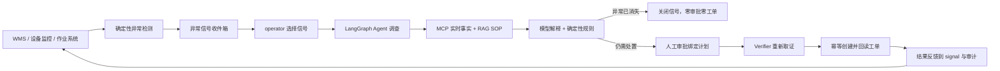

# OperCerta 异常信号收件箱与 Agent 触发链路设计

**日期：** 2026-07-25
**状态：** 用户已批准，进入 TDD 实施
**发布门禁：** `OperCerta production release gate: CLOSED`

## 1. 修订原因

现有控制台直接展示固定 `SKU-LOW-001`、`EQ-PUMP-001`、`TASK-BLOCKED-001`，operator 可以立即点击“创建处置”。后端实际上会先调用只读工具、计算规则并在需要时才进入审批，但前端没有展示异常由谁、何时、依据什么事实发现，导致用户像是预先知道结论后再启动 Agent，业务动机不完整。

本修订在现有 Agent 前增加确定性的异常发现层：传统业务系统或本地演示扫描先产生可审计 signal，operator 再把 signal 交给 Agent 调查。简单阈值判断不用 LLM；LLM 只处理证据组织、SOP 关联、解释与受控规划。

## 2. 目标业务闭环



### 2.1 三业务触发原因

| 场景 | 确定性检测条件 | signal | Agent 的新增价值 |
| --- | --- | --- | --- |
| 库存 | `on_hand - reserved < reorder_point` | `inventory_shortage` | 补充新鲜库存/规则证据、检索补货 SOP、解释与规划 |
| 设备 | 合法告警等级或心跳超过策略时限 | `equipment_attention` | 汇总设备状态、维护策略与 SOP，形成受控维修建议 |
| 作业 | 阻塞或超过宽限期且仍在策略范围内 | `task_blocked` | 汇总任务状态、恢复策略与 SOP，规划人工重排 |

检测逻辑复用现有 `assess_replenishment`、`assess_maintenance`、`assess_task_recovery`，不得复制一套不同规则。

## 3. 范围与非目标

### 3.1 本轮包含

- `operational_signals` PostgreSQL 表与 `0007_operational_signals` 迁移；
- 三个合成对象组成的版本化本地 watchlist；
- 通过真实 MCP 只读工具执行的确定性扫描；
- 扫描幂等、并发去重、signal 与 operation 原子绑定；
- signal 扫描、列表、启动调查 API 与 RBAC；
- React 异常信号收件箱，显示来源、检测时间、理由、关键事实和状态；
- operation/Agent Trace 中保留 `trigger_signal_id`，但不存储模型隐藏推理；
- 三业务、正常对象、重复扫描、并发启动、依赖失败和重启后的自动化证据。

### 3.2 本轮不包含

- Kafka、Celery、消息队列或流式 CDC；
- 真实 WMS、PLC、CMMS 或 WES 接入；
- 允许用户自由输入任意 SKU/设备/作业编号；
- 用 LLM 判断库存阈值、心跳是否过期或作业是否阻塞；
- 生产级分布式调度、告警抑制、租户路由或值班升级；
- 把本地合成 signal 数量表述为真实企业业务指标。

生产环境可将手动扫描端点替换为定时器或上游事件，但不能改变 signal、绑定和幂等契约。

## 4. Signal 领域契约

### 4.1 核心字段

`OperationalSignal` 必须是严格、冻结、`extra="forbid"` 的 Pydantic 模型：

```text
id: UUID
signal_type: inventory_shortage | equipment_attention | task_blocked
object_type: inventory | equipment | task
object_id: 受控标识符
source: demo_watchlist.v1
severity: low | medium | high
reason_code: 受控稳定码
facts_hash: 64 位小写 SHA-256
facts: 脱敏、结构化的决定相关事实
status: open | investigating | resolved | attention_required
operation_id: UUID | null
detected_at / updated_at / resolved_at
```

`facts` 只保存页面和审计需要的结构化决定事实，不保存密钥、连接串、工具异常正文、SOP 全文或模型推理。

### 4.2 幂等键

```text
signal:v1:{signal_type}:{object_id}:{facts_hash}
```

同一对象、同一异常类型、同一决定事实重复扫描返回原 signal；事实变化会产生新 signal。数据库唯一约束是最终并发裁决，不能依赖进程内锁。

### 4.3 状态约束

- 只有 `open` signal 可以首次绑定 operation；
- 同一 signal 最多绑定一个 operation；
- operation 与 signal 的 object type/id 必须一致；
- `investigating` 表示 Agent 已接管，不表示工单已创建；
- operation `completed/rejected` 后 signal 为 `resolved`；
- operation `failed/expired` 后 signal 为 `attention_required`；
- 查询动作不绑定 signal，也不改变 signal 状态。

## 5. 检测服务

`SignalDetectionService` 只依赖一个类型化只读网关、Signal Repository、时钟和版本化 watchlist。

扫描步骤：

1. 对每个 watch target 调用场景主体工具与策略工具；
2. 用现有领域函数计算 assessment；
3. 正常对象不创建 signal；
4. 需要处置时，从 assessment 生成 signal 草案；
5. Repository 使用幂等键插入或返回已有 signal；
6. 单对象失败收口为稳定 scan issue，不伪造 signal，也不阻断其他对象；
7. 返回 `signals + issues`，使 UI 能诚实展示部分成功。

Mock/Real LLM 模式都不影响检测结果。扫描阶段不调用模型、不检索 RAG、不写工单。

## 6. 数据库与原子绑定

迁移 `0007_operational_signals` 新建表，不修改 `0001`–`0006`：

```text
id UUID PK
dedup_key varchar(200) UNIQUE NOT NULL
signal_type varchar(32) NOT NULL
object_type varchar(16) NOT NULL
object_id varchar(64) NOT NULL
source varchar(64) NOT NULL
severity varchar(16) NOT NULL
reason_code varchar(64) NOT NULL
facts_hash char(64) NOT NULL
facts JSONB NOT NULL
status varchar(32) NOT NULL
operation_id UUID UNIQUE NULL REFERENCES operations(id)
detected_at timestamptz NOT NULL
updated_at timestamptz NOT NULL
resolved_at timestamptz NULL
```

`OperationRequest` 新增可选 `trigger_signal_id`。外部 API 的 `create_work_order` 必须通过 signal 调查入口发起；只读 `query` 不需要 signal。

Repository 创建 operation 时在同一数据库事务内：

1. `SELECT signal FOR UPDATE`；
2. 检查 signal 为 open、尚未绑定、对象一致；
3. 插入 operation 与 `operation_received` 审计；
4. 更新 signal 为 investigating 并绑定 operation；
5. 并发第二个请求返回固定冲突，不产生第二个 operation。

## 7. API 与权限

### 7.1 `POST /api/v1/signals/scan`

- 仅 operator；
- 执行一次本地可重复扫描；
- 返回 `signals` 和安全 `issues`；
- 不创建 operation、审批或工单。

### 7.2 `GET /api/v1/signals`

- operator、approver、auditor 可读；
- 默认返回 open、investigating、attention_required；
- 结果按 detected_at 倒序并有固定上限。

### 7.3 `POST /api/v1/signals/{signal_id}/investigate`

- 仅 operator；
- 由服务端根据 signal 构造受控 `OperationRequest`，客户端不能改 object id/action；
- 成功返回 `OperationAccepted`；
- signal 不存在返回 404，已绑定或状态冲突返回 409，依赖不可用返回 503。

### 7.4 既有 operations 入口

- `query` 保留为人工诊断；
- 外部直接提交 `create_work_order` 且没有 `trigger_signal_id` 时返回安全 422；
- 内部恢复和既有历史 operation 继续兼容。

## 8. React 控制台

控制区调整为：

1. 显示“业务异常信号”；
2. operator 点击“扫描业务异常”；
3. 展示 signal 卡片的来源、检测时间、对象、原因、关键事实与状态；
4. 选择 open signal 后点击“交给 Agent 分析”；
5. 进入现有 Goal、Trace、MCP/RAG、规则、审批、Verifier、工单链路；
6. “查询状态”作为次级诊断动作保留，不作为工单前置步骤；
7. 固定对象不再伪装成可选择业务输入。

页面文案不得暗示“点击即创建工单”，也不得把确定性扫描说成 LLM 发现异常。

## 9. 失败、安全与恢复

- MCP 或数据库不可用：本次扫描返回稳定 issue，零 signal 猜测、零 operation、零工单；
- 重复扫描：返回同一 signal；
- 并发调查：一个原子胜者，其他返回 409；
- signal 绑定后 API/Agent 失败：operation 按既有安全规则收口，signal 进入 attention_required；
- 服务重启：从 signal-operation 绑定和 operation 业务状态重建展示；
- 审批前仍为零工单，批准后仍必须 Verifier 重新取证；
- signal 不是审批证据替代品，审批仍绑定 Agent 调查得到的新鲜 evidence/plan。

## 10. TDD 门禁

### 10.1 领域与 Repository

- 非法 signal 类型、状态、哈希、对象、时间和 facts 被拒绝；
- 正常对象零 signal；三异常对象各一条 signal；
- 重复与十路并发扫描只有一行；
- signal-operation 对象失配、重复绑定和非 open 状态被拒绝；
- 十路并发调查只有一个 operation；
- `0006 → 0007 → 0006 → 0007` 迁移成功。

### 10.2 API

- RBAC、严格请求/响应、404/409/422/503；
- scan 零工单；investigate 进入现有受控 Agent；
- 直接无 signal 写请求被拒绝；query 保持可用；
- 响应不含内部异常、连接串、密钥或模型原文。

### 10.3 前端与 Compose

- 空、加载、部分失败、open、investigating、resolved 状态；
- signal 卡片到 operation 的真实绑定；
- 三业务通过 signal 进入 Agent；
- 审批、Verifier、幂等写、API/MCP 重启恢复继续通过；
- 完整 Pytest、Ruff、format、mypy、前端测试/build、仓库安全和 Mock release Compose 全绿。

## 11. 依赖、回滚与发布边界

- 本修订不新增 Python、Node、数据库扩展或容器依赖，继续使用当前锁文件；
- 代码回滚点：`d49577b`；
- 数据库回滚：`alembic downgrade 0006_agent_trace`；
- 未通过总门禁前 PR #8 保持 Draft，不合并、不打 tag、不发布公网可写后端；
- 只实施 OperCerta，不启动 ForenTrail。
