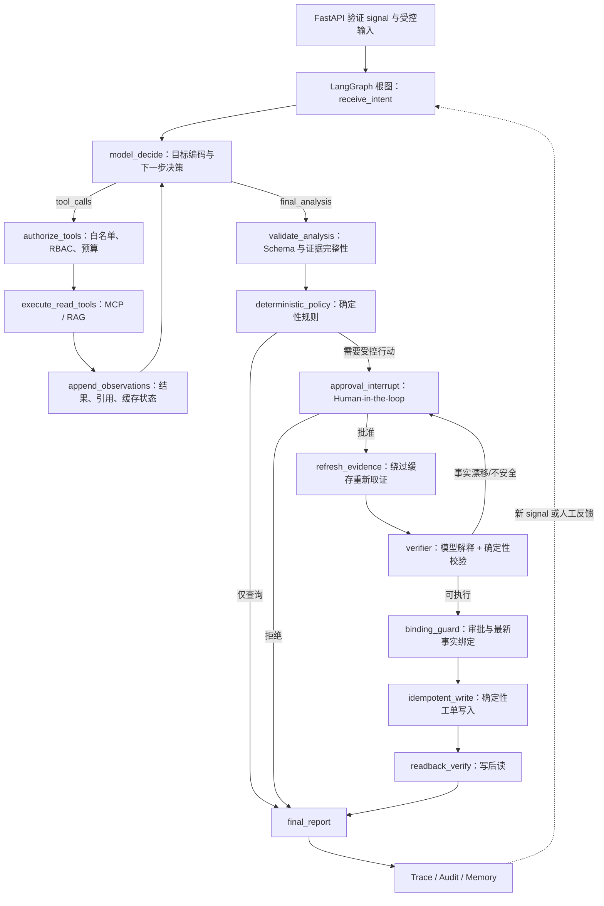

# OperCerta 单根 LangGraph Agent Loop 与业务对象工作台纠偏设计

> 日期：2026-07-26
> 状态：用户已批准，Task 0–11 本地实施完成；外部发布门禁待审批
> 发布门禁：`CLOSED`
> 适用工作树：`feat/agent-core-implementation`
> 保护基线：已提交基线 `d49577b`，并保留当前尚未提交的 signal 对账、successor 和首屏扫描修复成果

## 1. 本次纠偏的原因

用户在真实操作中发现两类原则性问题：

1. 后端看起来是“FastAPI 接收固定表单后串行业务代码”，LLM 没有处在观察、决策、调用工具、再观察的核心循环中；LangGraph 也像被作为普通步骤调用，而不是拥有完整生命周期的 Agent 运行时。
2. 前端把同一业务对象的历史 signal、successor signal 和关联 operation 平铺成多张卡片，点击一张卡片时又由全局详情状态驱动其他卡片，造成重复、串卡和业务谱系难以理解。

核对原始设计和 2026-07-21 Agent 核心增强设计后确认：问题不是用户临时增加需求，而是实现偏差。增强设计已经要求：

- LangGraph 是唯一编排运行时；
- `AgentHarness` 内存在真正的 ToolLoop；
- 模型读取工具观察结果后决定继续调用工具还是形成最终分析；
- 受控表单可以限制输入范围，但不能用后端预写结论冒充模型决策；
- 审批、规则、身份绑定、幂等写入仍由确定性内核掌权。

当前实现却采用“独立调查图 → Python 包装器 → 三个场景工作流图”的串联结构，工具调用也是“模型一次给出工具批次 → 代码全部执行 → 固定完整性判断”，没有形成单根图拥有的模型—工具观察循环。因此，本次工作属于规格一致性纠偏。

## 2. 设计继承关系

本规格修订 2026-07-21 Agent 核心架构设计中有关编排所有权、ToolLoop、缓存位置和工作台状态模型的实现解释，但不废弃以下已批准能力：

- 三业务边界：库存补货、设备维修、阻塞任务恢复；
- operational signal 扫描、认领、对账和 successor lineage；
- PostgreSQL 业务事实与 LangGraph checkpointer；
- RBAC、Human-in-the-loop 审批、审批事实绑定；
- 批准后重新取证、Verifier、安全终止或重新审批；
- 唯一键和幂等工单写入；
- FastMCP 工具服务、pgvector SOP RAG、Agent Trace；
- Redis 只读缓存失败时安全旁路；
- Mock 与 Real model 明确分离，禁止静默回退。

若本规格与旧实现细节冲突，以本规格为后续实现依据；若与可靠性不变量冲突，则可靠性不变量优先。

## 3. 不可妥协的架构原则

### 3.1 FastAPI 是入口，不是 Agent 大脑

所有 Web 请求在进入 Agent 前都必须先经过 FastAPI，因为 HTTP 连接、JWT、RBAC、Schema 校验、限流和错误映射属于传输与安全边界。正确关系不是“用户绕过 FastAPI 直接访问 LLM”，而是：

`React → FastAPI 安全边界 → LangGraph Agent Runtime → Model / Tools / Policy / HITL`

FastAPI 可以验证 `signal_id`、角色和枚举字段，但不得把固定结论拼成一段“自然语言任务”后冒充用户语义，也不得在路由层决定应该调用哪个业务工具。

### 3.2 单根 LangGraph 拥有完整生命周期

一次 operation 从收到受控意图，到工具调查、模型判断、规则评估、审批中断、批准后复核、幂等执行、写后读和最终报告，必须由同一个编译后的根 `StateGraph`、同一个 `thread_id` 和同一条 checkpoint 谱系拥有。

场景差异可以由普通策略函数或受根图管理的 subgraph 表达，但不得再由 Python 包装器依次调用“调查图”和“三个独立生命周期图”。subgraph 只能返回状态，不能拥有第二套审批、恢复或 operation 身份。

### 3.3 LLM 是认知决策者，不是安全与事务权威

LLM 必须真实负责：

- 把已验证的 signal 和受控调查偏好编码为目标；
- 根据当前观察选择下一项只读工具；
- 读取工具结果和 RAG 引用后继续调查或结束；
- 对证据冲突、缺失、超时和工具错误给出结构化处置建议；
- 在批准后读取新鲜事实并辅助 Verifier 解释；
- 形成面向 operator、approver 和 auditor 的脱敏报告。

LLM 不得负责：

- JWT/RBAC 授权；
- SQL、Shell、任意代码执行；
- 最终业务规则计算；
- 审批事实绑定；
- 直接创建工单或绕过幂等约束；
- 决定高风险写入一定执行。

### 3.4 工具结果必须返回模型

每次模型提出 Tool Call 后，系统按授权和 Schema 执行只读工具，把结构化 Observation 追加到 Agent 状态，再回到同一个 `model_decide` 节点。只有模型返回合规的 `final_analysis`，或达到显式预算/安全终止条件，循环才结束。

禁止“模型只列一次工具清单，后端执行完后不再把观察交回模型”的伪 ToolLoop。

### 3.5 受控输入，不做自由聊天

仓储运营场景中的可行动作有限。前端输入采用：

- 必选：异常 signal；
- 可选：调查重点，例如“库存可用量”“设备停机原因”“任务重试与依赖”；
- 可选：优先级和有限上下文枚举；
- 禁止直接输入 SQL、工具名、系统 Prompt 或任意执行指令。

界面可把结构化选择渲染成人类可读的目标句，但后端保存和传递的是可信结构字段，不是假装自由对话。

### 3.6 不展示 Chain-of-Thought

Trace 只展示结构化目标、计划摘要、Tool Call、Observation 摘要、引用、规则结果、审批、Verifier 和最终结论。不得保存或展示模型隐藏推理、完整 Prompt、敏感工具正文或凭据。

## 4. 目标 Agent 闭环



这是一条循环式 Agent 链路：感知进入状态，模型决策，工具行动形成新观察，观察再驱动决策；长期事实和经验被持久化，用于下一次 operation。审批和写入是闭环中的受控边界，而不是绕开 Agent 的外部补丁。

## 5. Agent 状态与回合契约

根图状态至少包含：

- `operation_id`、`thread_id`、`signal_id`、`object_type`、`object_id`；
- `trusted_intent`：由已验证结构字段组成；
- `messages`：脱敏、可恢复的模型消息与工具消息；
- `observations`：结构化工具观察；
- `citations`：SOP/RAG 引用元数据；
- `tool_budget`、`tool_call_count`、`replan_count`；
- `agent_turn`、`final_analysis`、`policy_facts`；
- `approval_cycle`、`approval_binding`；
- `verifier_result`、`work_order_result`、`final_report`；
- `trace_sequence`、`error_code`、`terminal_status`。

`AgentTurn` 是严格的互斥联合类型：

```text
AgentTurn = ToolDecision | FinalAnalysis

ToolDecision:
  tool_calls: [{call_id, tool_name, arguments, purpose}]

FinalAnalysis:
  finding, evidence_refs, missing_evidence,
  recommended_action, confidence_band, explanation
```

同一回合不能同时包含 `tool_calls` 和 `final_analysis`。未知工具、写工具、越权参数、重复 `call_id`、超出预算或不符合 Schema 的输出必须被安全拒绝并留下可审计错误码。

默认预算是有限循环，而非无限 ReAct：工具回合数和单回合调用数必须来自配置并有保守上限；达到预算后进入 `incomplete_evidence`，不得猜测结论。

## 6. 三业务策略

根图共享生命周期，三业务只提供以下策略：

| 场景 | 只读事实工具 | SOP/RAG | 确定性规则 | 受控写入 |
| --- | --- | --- | --- | --- |
| 库存补货 | 库存可用量、在途量、补货点 | 库存补货 SOP | 是否低于补货点、建议数量 | 创建补货工单 |
| 设备维修 | 设备状态、停机码、维护记录 | 设备异常 SOP | 是否需要维修、严重等级 | 创建维修工单 |
| 阻塞任务 | 任务状态、重试次数、依赖状态 | 任务恢复 SOP | 是否可重试、是否需升级 | 创建恢复/升级工单 |

模型可以决定先读取哪些授权事实以及是否补充 SOP；确定性规则根据完整结构化事实做最终计算。三业务不得复制三套审批、恢复和写入框架。

## 7. MCP、API 与 PostgreSQL 的边界

### 7.1 API

API 是供 React、脚本或外部系统使用的 HTTP 产品边界。它验证调用者身份、接收结构化输入、启动或恢复 LangGraph、返回 operation/case/trace 视图。

### 7.2 MCP

MCP 是 Agent Runtime 调用工具时使用的统一协议边界。工具内部可以再访问仓储 API 或 Repository，但模型只看到受控工具名、参数 Schema 和脱敏结果，不看到数据库连接或原始 SQL。

“MCP 事实”应改称“MCP 工具返回的业务事实观察”，避免把协议和事实来源混为一谈。

### 7.3 PostgreSQL

PostgreSQL 继续承担：

- 业务事实、signal、operation、审批、工单与审计的唯一真实来源；
- LangGraph 持久 checkpoint；
- Agent Trace 与引用元数据；
- pgvector SOP 长期知识检索。

业务表和 checkpoint 表保持逻辑分层；模型永远不直接访问数据库。

## 8. Redis 的正确位置

Redis 不是推理节点，也不是事实来源。它应作为 MCP 只读工具适配器的统一 cache-aside 层：

- 异常扫描和批准后刷新要求新鲜事实，强制绕过缓存；
- 一般调查可在 TTL 与 freshness policy 允许时使用缓存；
- Observation 明确记录 `cache_status=hit|miss|bypass|unavailable`；
- Redis 失败自动旁路到权威数据源，不改变业务判断；
- 不允许 Agent 调查路径和场景规则路径各读一次相同事实；同一 graph state 复用已验证 Observation。

这样 Redis 会在技术链路和 Trace 中真实可见，又不会被包装成不具备的 Agent 能力。

## 9. 业务对象工作台状态模型

### 9.1 一张卡片代表一个业务对象

前端主列表按 `(object_type, object_id)` 聚合为 `SignalCaseView`，例如 `inventory / SKU-LOW-001` 永远只有一张主卡片。主卡片包含：

- 当前异常状态和最近扫描时间；
- 当前 signal 与当前 operation；
- 当前 Agent 阶段、审批状态和工单状态；
- 历史 signal 数、successor 数和谱系入口；
- 本卡片自己的 loading/error 状态。

旧 signal、successor 和历史 operation 放入可展开的“处置历史与谱系”，不得平铺成新的主卡片。

### 9.2 扫描结果与历史记录分离

- “扫描业务异常”调用真实 scan API，显示本次扫描范围、命中、去重和时间；
- 页面首次进入不自动把数据库历史 signal 冒充本次扫描结果；
- “查看历史”是独立动作，通过 case projection 读取持续状态；
- 切换角色不触发业务扫描，也不改变已选 case。

### 9.3 显式选择和局部状态

页面维护 `selectedCaseKey` 和 `selectedOperationId`。详情、Trace、Audit 只绑定当前选择。点击一张卡片不能让其他卡片显示同样响应；全局 `isBusy` 改为按 case/action 管理的局部状态。

### 9.4 API 投影视图

新增：

`GET /api/v1/signal-cases`

返回按业务对象聚合的读模型。现有 `GET /api/v1/signals` 保留给 auditor、排障和兼容测试。scan 响应返回本次扫描统计及受影响的 `case_key`，调查/retry 响应返回 operation 与 case 关联，不要求前端自行拼接谱系。

## 10. 保留与替换边界

### 10.1 原样保留或只做适配

- Domain 规则和事实 hash；
- PostgreSQL migrations、Repository 和事务边界；
- signal 原子认领、对账和 successor 唯一性；
- 审批竞态、审批周期、绑定护栏；
- 幂等工单写入和写后读；
- MCP server、现有读工具、RAG 存储；
- Auth/RBAC、SSE、Audit、Trace 脱敏；
- Compose 与重启恢复契约。

### 10.2 必须替换

- Python `ControlledActionGraph` 对多个独立图的串联编排；
- 与完整业务生命周期分离的调查图；
- 三套重复的编译后场景生命周期图；
- 一次性工具批次执行而非 Observation 回到模型的伪 ToolLoop；
- Agent 与场景逻辑的重复事实读取；
- Redis 只包裹旧场景初读、Agent Tool Call 绕开缓存的接法；
- 前端 signal/operation 谱系平铺和全局详情/忙碌状态。

## 11. 迁移方式

1. 先冻结当前行为和数据库不变量，用测试记录现有可靠性基线。
2. 在内部 feature flag 下新增单根图，不立即删除旧图。
3. 先完成库存补货纵向切片：模型—工具循环、审批、恢复、幂等写入、case UI。
4. 库存切片通过后接入设备和任务策略，复用同一生命周期。
5. 新旧路径做事实、审批、工单和 Trace 一致性对照。
6. 三业务和重启门禁通过后切换默认路径，再删除旧编排代码。

预计不需要破坏性数据库迁移；如 Trace 或 case projection 缺字段，只允许增量迁移，并必须提供 downgrade。

## 12. TDD 验收门禁

### 12.1 Agent Loop

- RED：模型收到第一次工具 Observation 后确实再次被调用；
- RED：模型可分两轮选择不同工具，而不是后端固定调用全部工具；
- RED：未知工具、写工具、越权参数和预算超限安全失败；
- RED：RAG 结果作为 Observation 返回模型并产生 citation；
- RED：同一事实不会被 Agent 和后续场景代码重复读取；
- RED：缓存 hit/miss/bypass/unavailable 出现在 Trace；
- RED：批准后刷新一定绕过缓存。

### 12.2 单根状态与恢复

- 同一 operation 的调查、审批、复核、写入共享一个 `thread_id` 和 checkpoint 谱系；
- 在模型决策后、工具执行后、审批中断、数据库写入后四处重启均能恢复；
- 重放不会重复审批周期、Tool Call 结果或业务工单；
- 数据库提交成功但 checkpoint 未保存时，幂等与读回可收口。

### 12.3 三业务与安全内核

- 三业务规则结果、审批绑定和工单后置条件与现有可靠性契约一致；
- signal 只能由有权限用户认领，successor 保持唯一；
- 拒绝、事实漂移、工具失败和证据不足均安全终止或重新审批；
- 模型无法越过 Policy、RBAC、Verifier 和唯一约束。

### 12.4 前端

- 六条 lineage 行只形成三个业务对象主卡片；
- 点击库存卡片不会改变设备和任务卡片；
- 展开历史才显示 predecessor/successor；
- 首次登录可真实扫描，切换角色不伪造扫描；
- 详情、Trace、审批反馈均绑定明确 operation；
- 桌面和移动宽度无横向溢出、无固定遮挡、无卡片增殖。

### 12.5 模型门禁

- Mock 只用于确定性 CI 和故障注入，并明确标识；
- Real Kimi 至少完成三业务各一次调查，以及至少一次代表性批准写入闭环；
- 模型工具调用结果必须回送模型；
- 若使用结构化计划兼容层而非原生 Tool Calling，页面和证据必须如实标注；
- Real 模式失败不得静默回退 Mock。

测试通过数量、延迟、正确率和线上可用性只记录实际运行结果，本规格不预填指标。

## 13. 依赖与运行时核验

当前本地已核验的主要依赖为 Python 3.12、FastAPI 0.139.2、LangGraph 1.2.9、langchain-core 1.4.9、langchain-openai 1.3.5、langgraph-checkpoint-postgres 3.1.0、MCP 1.28.1、Redis client 8.0.1。现有版本足以实施本次纠偏，不需要为了重构先升级依赖。

依赖版本不是发布通过证据；后续仍须运行锁定、安全扫描、Compose 和真实模型门禁。

## 14. 非目标

- 不增加自由聊天、多 Agent、自主写 SQL、Shell 或代码执行；
- 不增加图像、语音等与当前三业务无实际数据来源的多模态包装；
- 不把 RAG、Redis、MCP 或 LLM 强行用于没有必要的步骤；
- 不启动 ForenTrail、SiteVerum 或 Federune；
- 不在本轮公开部署或声称生产可用；
- 不用新的 UI 动效掩盖业务链路问题。

## 15. 回滚与停止条件

- 旧路径在新路径达到事实和可靠性等价前保留；
- feature flag 可将本地运行切回旧路径用于对照，不作为发布逃生开关长期保留；
- 任何审批绑定、重启恢复或幂等回归失败，立即停止迁移并修复，不继续扩场景；
- Real Kimi 未通过严格门禁时保持 `CLOSED`，不得用 Mock 结果代替；
- 本规格已于 2026-07-26 获用户批准；后续仍按 TDD 门禁逐步实施。

## 16. 已批准的决策

1. 接受“单根 LangGraph + 有界 Model↔Tool Loop”作为唯一 Agent 编排；
2. 接受“LLM 负责认知决策，确定性内核负责授权、规则、审批和写入”的边界；
3. 接受“一业务对象一张主卡片，历史 signal/operation 进入可展开谱系”的工作台模型；
4. 接受先做库存纵向切片、通过门禁后复用到设备与任务，最后删除旧编排；
5. 本轮不升级依赖、不做破坏性数据库迁移、不提交或发布。

以上五项已由用户于 2026-07-26 确认。
